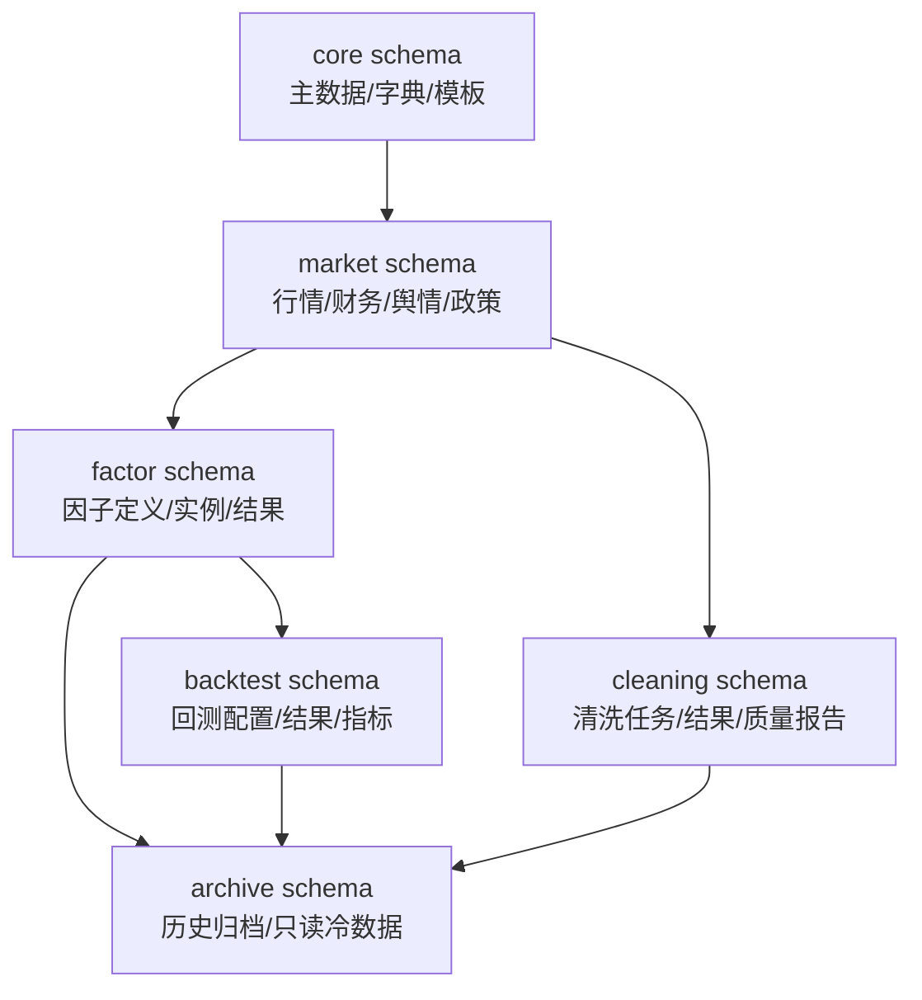
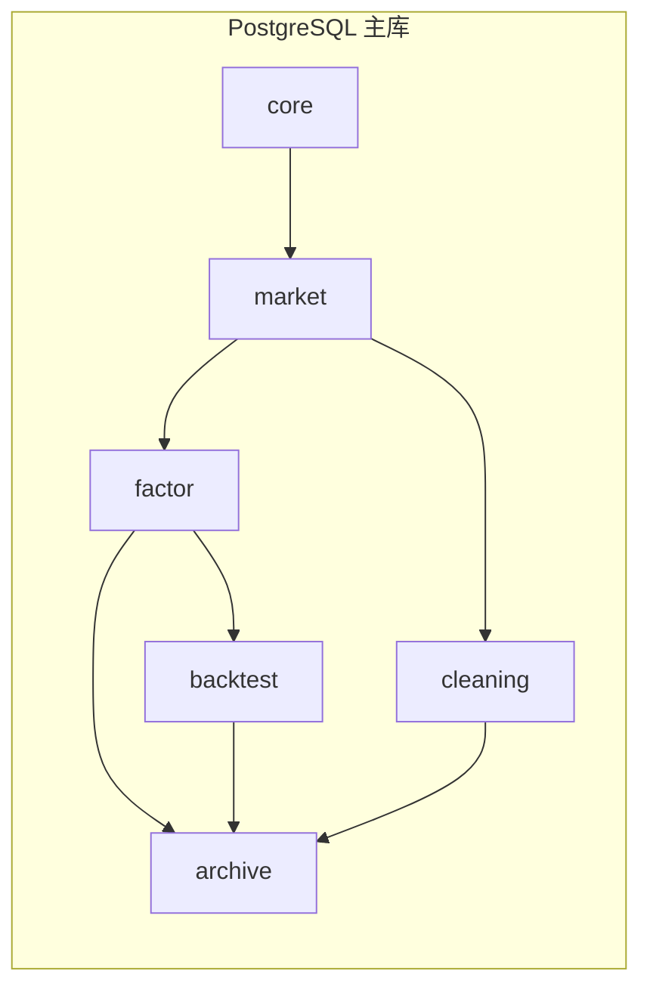

# PostgreSQL 目标库结构草案（2026-04-20）

## 1. 目标边界

本草案用于将 AStockQuantEngine 的数据库体系迁移到 PostgreSQL 18，并作为后续 schema 实施、数据迁移、字段校验和产品切换的基础。设计目标是：

- 统一主库，不再长期双库混用。
- 统一因子参数真源，不再依赖 `factor_params`。
- 统一行情时序主表，不再长期保留 `daily_bar` / `daily_bar_optimized` 双实表。
- 统一因子回测、策略回测、清洗与质量审计的结果域。
- 保留短期兼容视图，但不让业务核心逻辑依赖兼容层。

## 2. 分层架构

### 2.1 core schema

承载低频变化的主数据和字典：

- `symbol_info`
- `exchange_info`
- `industry_classification`
- `data_source_type`
- `factor_category`
- `factor_template`
- `factor_parameter`

### 2.2 market schema

承载高频时序和外部数据：

- `daily_bar`
- `minute_bar`
- `financial_indicator`
- `news_sentiment`
- `policy_data`
- `alternative_data`
- `derivatives_data`
- `index_constituents`

### 2.3 factor schema

承载因子元数据、运行时配置和结果索引：

- `factors`
- `factor_instance`
- `factor_tags`
- `factor_config_version`
- `factor_runtime_snapshot`

### 2.4 backtest schema

承载因子回测、策略回测和评估结果：

- `backtest_config`
- `backtest_result`
- `backtest_summary`
- `factor_group_result`
- `factor_icir_result`
- `factor_performance`

### 2.5 cleaning schema

承载清洗任务、清洗结果和质量监控：

- `cleaning_tasks`
- `cleaning_results`
- `data_quality_rule`
- `data_quality_report`
- `data_update_log`

### 2.6 archive schema

承载冷历史和迁移后的只读归档数据：

- 过期快照
- 历史回测结果
- 长期归档行情分区

## 3. 关键表职责

### 3.1 symbol_info

标的主索引。所有时序和结果数据都应通过 `symbol_id` 或 `symbol` 映射到该表。

建议约束：

- `symbol` 唯一
- `status` 明确标识存续状态
- 保留 `list_date` / `delist_date`

### 3.2 daily_bar

日线主事实表。建议作为行情主表的唯一正式入口。

建议字段：

- `symbol_id`
- `trade_date`
- `open/high/low/close/pre_close`
- `volume/turnover/change_pct/change_amt/amplitude/turnover_rate`
- `pe_ratio/pb_ratio/market_cap/circulating_market_cap`
- `data_source`
- `created_at/updated_at`

建议约束：

- `(symbol_id, trade_date)` 唯一
- 按年份分区
- 高频查询索引覆盖 `symbol_id`、`trade_date`

### 3.3 financial_indicator

财务快照主表。成长、质量、红利等因子都应通过它取财务字段。

建议字段：

- `symbol_id`
- `report_date`
- `report_type`
- `eps/bps/roa/roe/profit_margin`
- `debt_to_equity/current_ratio/quick_ratio`
- `operating_cash_flow/investing_cash_flow/financing_cash_flow`
- `total_revenue/net_profit/total_assets/total_liabilities/equity`

建议约束：

- `(symbol_id, report_date, report_type)` 唯一
- `report_date` 建索引

### 3.4 factor_instance

因子实例运行真源。`full_config` 应作为唯一运行配置来源。

建议字段：

- `instance_id`
- `factor_id`
- `full_config`
- `runtime_version`
- `status`
- `created_at/updated_at`

### 3.5 factor_runtime_snapshot

建议新增。记录一次因子运行的完整快照，避免未来参数和运行结果脱钩。

建议字段：

- `snapshot_id`
- `instance_id`
- `snapshot_type`
- `snapshot_payload`
- `config_version`
- `created_at`

### 3.6 backtest_result / backtest_summary

建议将结果拆成两层：

- `backtest_result`：逐日/逐笔/逐分组的结果明细
- `backtest_summary`：聚合后的统计摘要

### 3.7 cleaning_tasks / cleaning_results

清洗任务和结果必须保留任务链路，方便追踪输入、规则和输出。

建议新增：

- `data_quality_report`：用于记录质量校验结果和异常统计

## 4. PostgreSQL 推荐分 schema

## 5. 表设计边界

### 5.1 只保留一套主事实表

以下表不应同时长期作为主写表：

- `daily_bar` 和 `daily_bar_optimized`
- `factor_params` 和 `factor_instance.full_config`

最终建议：

- `daily_bar_optimized` 定位为迁移/性能过渡层或兼容视图的数据源。
- `factor_params` 定位为历史兼容，不再写入主业务链。

### 5.2 视图只做过渡

允许保留的视图：

- `v_daily_bar_compatible`
- `v_daily_bar_wide`
- 其他迁移期数据桥接视图

不建议保留：

- 为弥补旧字段命名而长期存在的业务视图

## 6. 索引与分区建议

### 6.1 行情表

- `daily_bar`：按年份分区，主键 `(symbol_id, trade_date)`。
- `minute_bar`：按 `trade_date` 或 `bar_time` 分区，并保留 `(symbol_id, timeframe, bar_time)` 唯一键。

### 6.2 财务表

- `financial_indicator`：按 `report_date` 建索引，保留 `(symbol_id, report_date, report_type)` 唯一键。

### 6.3 因子结果表

- 所有结果表建议保留 `instance_id` / `config_id` / `backtest_id` 索引。
- 结果明细和摘要分开，避免一张表承担两种访问模式。

## 7. 未来升级预留

1. 冷热分层。
2. 归档 schema。
3. 数据质量报告表。
4. 因子运行快照表。
5. 回测结果版本化。
6. 风控域独立 schema。

## 8. 实施顺序

1. 先建 `core`、`market`、`factor` 三个 schema。
2. 再建 `backtest`、`cleaning`。
3. 最后建 `archive`。
4. 先导 `symbol_info`、`daily_bar`、`financial_indicator`。
5. 再导 `factor_instance`、`factors`、`factor_tags`。
6. 然后迁移回测和清洗结果。
7. 旧 MySQL 仅保留迁移对账和回退窗口。
