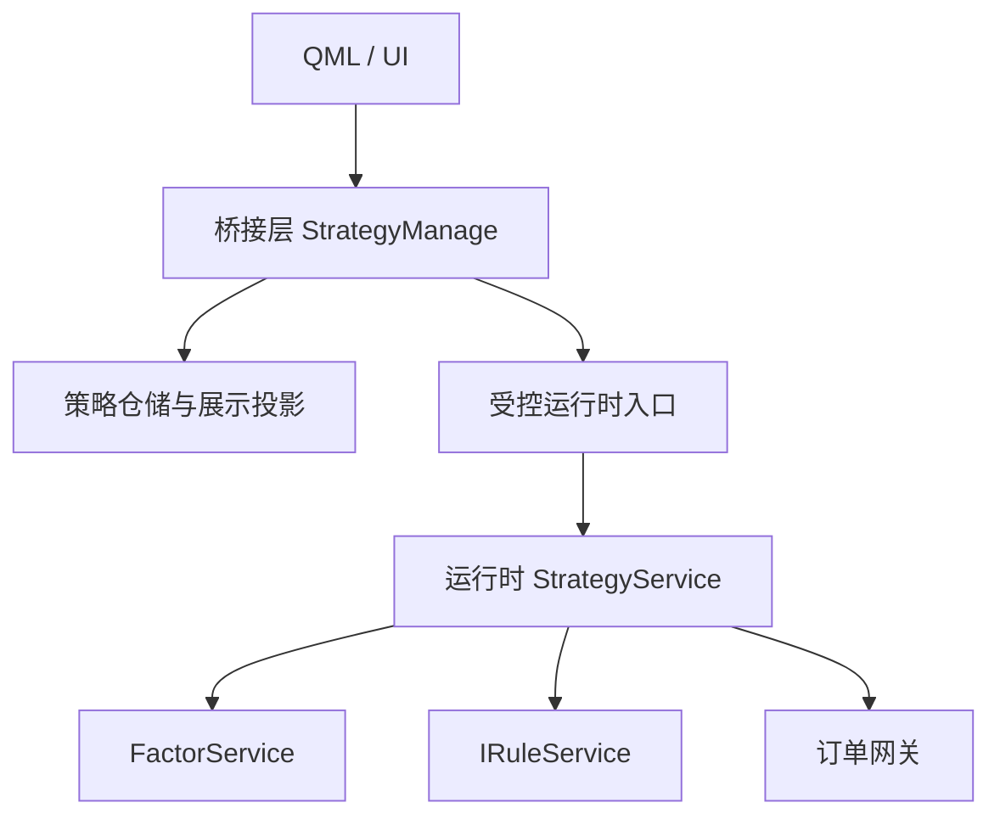

# StrategyService 与 StrategyManage 分层边界说明

## 1. 文档目的

本文档用于消除当前文档和后续实现中对 `StrategyService` 命名的歧义，明确区分两类不同角色：

1. 桥接层 StrategyManage。
2. 运行时 StrategyService。

本文档解决的问题只有一个：

同样叫 `StrategyService` 的两个概念，不能再被当成同一职责容器使用。

## 2. 结论先行

结论如下：

1. 桥接层 StrategyBridge 是 UI bridge 门面服务。
2. 运行时 StrategyService 是运行时同步编排服务。
3. 两者职责、输入、输出、依赖、生命周期都不同。
4. 两者不能合并到同一个类里，也不能通过兼容字段、模式开关或布尔参数共存。

如果后续继续混用这两个名字，结果只会是：

1. 桥接层重新吞并运行时对象图。
2. 运行时主链重新被 QVariant、QString 和页面语义污染。
3. 仓储、页面、运行时、规则和执行职责再次缠绕。

## 3. 两类服务的定位差异

### 3.1 桥接层 StrategyManage

桥接层 StrategyManage 的定位已经由现有合同冻结：它是 QML 与受控应用服务之间的单一门面。

它负责：

1. 接收桥接输入。
2. 规范化策略数据。
3. 协调仓储读写。
4. 生成展示投影。
5. 调用专职服务并把结果转回桥接层。

它不负责：

1. 因子更新。
2. 批量策略求值。
3. 规则引擎执行。
4. 订单主链推进。
5. 运行时对象图装配。

### 3.2 运行时 StrategyService

运行时 StrategyService 的定位是未来同步主链中的策略编排器。

它负责：

1. 在收到行情批次或单笔行情后调用 FactorService。
2. 组织多个策略实例读取共享因子并求值。
3. 把信号批次送入 IRuleService。
4. 把规则通过的结果转成订单请求并送往订单网关。

它不负责：

1. 页面桥接。
2. QVariantMap 规范化。
3. 仓储 schema 适配。
4. 列表展示投影。
5. 历史兼容字段回填。

## 4. 输入输出边界对比

| 维度     | 桥接层StrategyManage                    | 运行时 StrategyService                  |
| -------- | --------------------------------------- | --------------------------------------- |
| 主要输入 | QML 调用、QVariantMap、桥接参数         | MarketData 批次、共享因子视图、策略实例 |
| 主要输出 | 策略快照、展示投影、桥接结果、Qt signal | Signal 批次、规则请求、订单请求         |
| 输入语义 | 页面和应用入口语义                      | 运行时执行语义                          |
| 输出去向 | UI、ViewModel、桥接调用方               | RuleService、订单网关、运行时诊断       |
| 合同类型 | 允许桥接层载荷，内部要收束              | 应直接是 typed-only 运行时合同          |

核心差异：

1. 桥接层面对的是“人和页面”。
2. 运行时面对的是“批次数据和执行链”。

这两个边界天然不应进入同一类。

## 5. 依赖边界对比

### 5.1 桥接层 StrategyManage 可依赖什么

可以依赖：

1. Repository。
2. ViewModel 或桥接投影器。
3. Runtime evaluator 或 execution service 的受控接口。
4. Trading、Risk、Position 等专职服务。

不得直接依赖：

1. 因子共享缓冲。
2. 运行时策略批处理器。
3. 规则执行主链内部对象。
4. 订单主链的组合根。

### 5.2 运行时 StrategyService 可依赖什么

可以依赖：

1. FactorService。
2. IRuleService。
3. 订单发送接口。
4. 策略实例集合。

不得直接依赖：

1. QML。
2. QVariantMap。
3. Repository。
4. ViewModel。
5. 页面展示字符串投影。
6. 不得使用 QString 做类型判断，QString 仅允许用于调试输出。

结论：

桥接层 StrategyManage 依赖的是“应用和桥接边界服务”，运行时 StrategyService 依赖的是“执行主链服务”。两者依赖树完全不同。

## 6. 生命周期差异

### 6.1 桥接层生命周期

桥接层 StrategyManage 的生命周期通常与应用启动、页面存在期、桥接单例或服务容器一致。

它的特征是：

1. 长生命周期。
2. 允许持有缓存快照和展示态。
3. 以页面交互和服务协调为主要触发方式。

### 6.2 运行时生命周期

运行时 StrategyService 的生命周期应与运行时执行会话、行情主链、策略执行管线绑定。

它的特征是：

1. 围绕执行链存在。
2. 强调热路径、批处理和稳定延迟。
3. 不应承担展示缓存和桥接状态保管。

## 7. 为什么不能合并

如果把两者合并，会立即出现以下问题：

1. 桥接层为了页面方便继续引入 QVariantMap、QString、展示别名字段，污染运行时主链。
2. 运行时为了性能需要 typed-only、批处理、连续内存和固定边界，但这些约束会被页面入口打破。
3. 仓储读取、策略编辑、展示投影和实时行情处理会挤在同一类中，最终形成新的巨型 service。
4. 一旦需要回测、实时运行、预览、编辑器并存，同一个类会被迫维护多套上下文和分支开关。

换句话说，合并不是“复用”，而是重新制造跨层耦合。

## 8. 推荐分层关系

建议的稳定分层如下：

这里的关键点不是“两个服务都叫 StrategyService”，而是：

1. 上层桥接服务不直接落到热路径实现细节。
2. 运行时服务不反向承担桥接输入归一化和展示职责。
3. 中间应通过显式 typed 入口连接，而不是共享内部状态对象。

## 9. 命名建议

为了降低误用概率，建议后续实现采用“管理服务”和“运行时服务”双命名。

建议口径：

1. 桥接层统一命名为 `StrategyManage`。
2. 运行时编排层统一命名为 `StrategyService`。
3. 文档中不再把桥接层写成 `StrategyService`，避免混淆。

这样做的原因很直接：

1. `Manage` 一眼可见这是桥接管理职责。
2. `Service` 保留给运行时主链，更符合执行语义。

## 10. 实施准则

后续任何涉及 `StrategyService` 的设计或编码，都应先判断自己落在哪一层：

1. 如果需求涉及页面输入、策略 CRUD、桥接投影、仓储协调，就是桥接层。
2. 如果需求涉及行情触发、因子更新、策略求值、规则校验、订单生成，就是运行时层。
3. 如果一个需求同时碰到了两边，先拆层，再实现，不允许继续堆在一个类里。

禁止事项：

1. 不允许桥接层直接持有运行时全量对象图。
2. 不允许运行时层直接读取 QVariantMap 或页面字符串字段。
3. 不允许为了快速接线引入混合类或双职责 façade。
4. 不允许通过兼容字段、旧入口或布尔开关维持双口径。
5. 不允许使用 QString 做类型判断，QString 仅允许用于调试输出。
6. QVariantMap 仅允许作为 QML 输入参数和返回到 QML 的输出载荷。
7. 返回到 QML 的桥接输出对象名统一为 `StrategyManage`。

## 11. 总结

桥接层 StrategyManage 和运行时 StrategyService 虽然都属于服务，但它们代表的是完全不同的层：一个负责桥接管理，一个负责执行；一个面向页面和仓储，一个面向因子、规则和订单；一个允许桥接边界载荷，一个必须保持 typed-only 热路径。

后续实现应把这两个概念彻底拆开：桥接层用 `StrategyManage`，运行时层用 `StrategyService`，避免职责再次回流和混淆。

## 补充规则

1. 不允许使用 QString 做类型判断，QString 仅允许用于调试输出。
2. QVariantMap 仅允许作为 QML 输入参数和返回到 QML 的输出载荷，桥接输出对象名统一为 StrategyManage。
