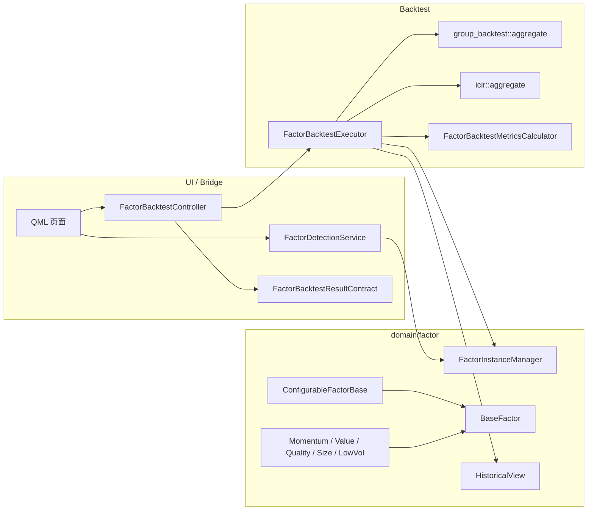
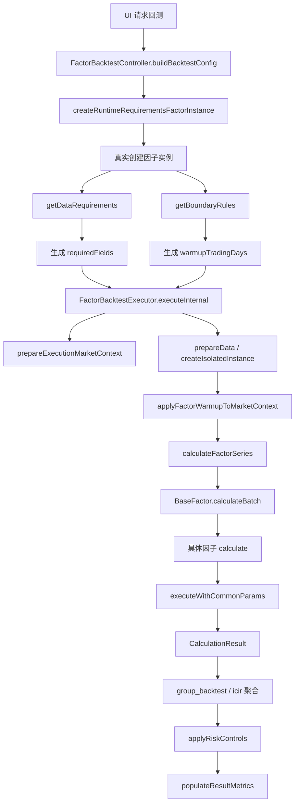
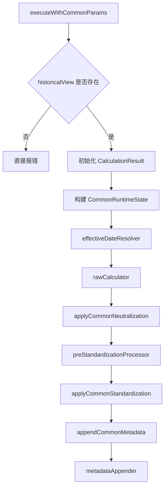
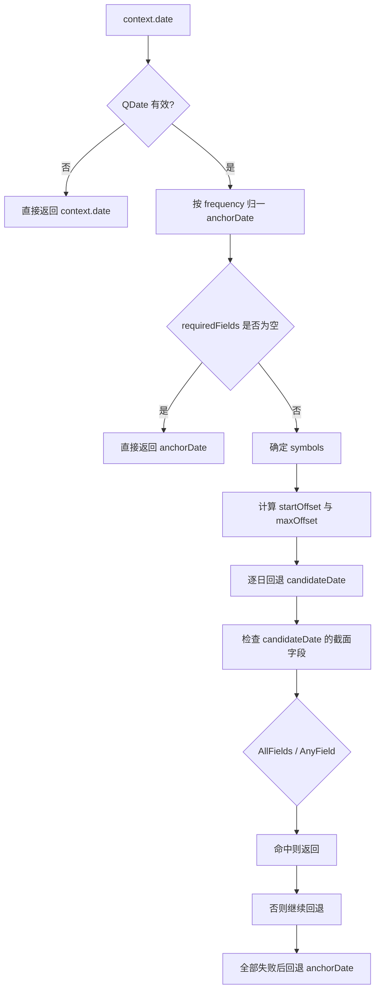

# 当前因子引擎真实结构与参数计算图谱

归档状态：已归档到 doc/archive

更新日期：2026-05-22

## 1. 归档说明

本文是基于 2026-05-22 当天仓库真实源码整理出的归档总册，目的不是继续承载日常迭代，而是保留一份当时可直接对照源码的结构与参数图谱。

本文只记录当前代码里真实存在的路径，不补画已经删除的旧链路，也不沿用历史设计假设。

## 2. 核心范围

本文覆盖四个层面：

1. 因子回测主链的真实模块边界。
2. support-map 预检链与正式回测链的真实执行顺序。
3. 通用参数如何影响 effectiveDate、中性化、标准化、warmup。
4. 经典因子与 ConfigurableFactor 各分支的字段需求、取数方式与计算口径。

## 3. 关键源码锚点

1. [src/ui/bridge/src/FactorBacktestController.cpp](../../src/ui/bridge/src/FactorBacktestController.cpp)
2. [src/ui/bridge/src/FactorDetectionService.cpp](../../src/ui/bridge/src/FactorDetectionService.cpp)
3. [src/domain/factor/src/FactorInstanceManager.cpp](../../src/domain/factor/src/FactorInstanceManager.cpp)
4. [src/domain/factor/src/BaseFactor.cpp](../../src/domain/factor/src/BaseFactor.cpp)
5. [src/domain/factor/src/ConfigurableFactorParams.cpp](../../src/domain/factor/src/ConfigurableFactorParams.cpp)
6. [src/domain/factor/include/FactorMetricConfig.h](../../src/domain/factor/include/FactorMetricConfig.h)
7. [src/domain/factor/src/FactorBacktestExecutor.cpp](../../src/domain/factor/src/FactorBacktestExecutor.cpp)
8. [src/domain/factor/src/MomentumFactor.cpp](../../src/domain/factor/src/MomentumFactor.cpp)
9. [src/domain/factor/src/ValueFactor.cpp](../../src/domain/factor/src/ValueFactor.cpp)
10. [src/domain/factor/src/QualityFactor.cpp](../../src/domain/factor/src/QualityFactor.cpp)
11. [src/domain/factor/src/SizeFactor.cpp](../../src/domain/factor/src/SizeFactor.cpp)
12. [src/domain/factor/src/LowVolFactor.cpp](../../src/domain/factor/src/LowVolFactor.cpp)
13. [src/domain/factor/src/ConfigurableFactorGrowth.cpp](../../src/domain/factor/src/ConfigurableFactorGrowth.cpp)
14. [src/domain/factor/src/ConfigurableFactorLiquidity.cpp](../../src/domain/factor/src/ConfigurableFactorLiquidity.cpp)
15. [src/domain/factor/src/ConfigurableFactorTechnical.cpp](../../src/domain/factor/src/ConfigurableFactorTechnical.cpp)
16. [src/domain/factor/src/ConfigurableFactorDividend.cpp](../../src/domain/factor/src/ConfigurableFactorDividend.cpp)
17. [src/domain/factor/src/ConfigurableFactorMacro.cpp](../../src/domain/factor/src/ConfigurableFactorMacro.cpp)
18. [src/domain/factor/src/ConfigurableFactorIndustry.cpp](../../src/domain/factor/src/ConfigurableFactorIndustry.cpp)
19. [src/domain/factor/src/ConfigurableFactorSentiment.cpp](../../src/domain/factor/src/ConfigurableFactorSentiment.cpp)
20. [src/domain/factor/src/ConfigurableFactorCustom.cpp](../../src/domain/factor/src/ConfigurableFactorCustom.cpp)
21. [src/ui/bridge/src/FactorBacktestResultContract.cpp](../../src/ui/bridge/src/FactorBacktestResultContract.cpp)

## 4. 一句话结论

当前因子引擎已经收敛到一条明确的 C++ 主链：UI bridge 负责收参、预检、编排和结果映射，domain/factor 负责实例创建、HistoricalView runtime 计算和回测执行，通用参数负责统一 effectiveDate / 中性化 / 标准化 / warmup 语义，个性化参数负责真实字段映射、序列或截面取数以及最终打分逻辑。

## 5. 总体结构图



## 6. 回测主链

### 6.1 从配置到回测的真实流程



### 6.2 requiredFields 与 warmup 的真实决定点

1. Controller 先创建真实因子实例，而不是只读静态 schema。
2. requiredFields 主要来自 getDataRequirements。
3. warmupTradingDays 主要来自 max(1, boundaryRules.minDataPoints)。
4. neutralizationEnabled 为 true 时，会额外补 industry_code 和 market_cap。
5. Executor 再基于这些结果裁剪 tradeDates 并构造 HistoricalView runtime。

### 6.3 warmup 的真实含义

当前 warmup 不是因子内部偷偷补历史，而是 Executor 按 BoundaryRules.minDataPoints 先裁掉最前面的交易日。因子内部仍可能继续用 lookbackWindow、window、skipRecent 向更早历史取序列。

## 7. executeWithCommonParams 公共模板

### 7.1 执行顺序



### 7.2 真实职责边界

1. BaseFactor 只统一做运行时框架，不负责每个因子的业务公式。
2. rawCalculator 负责字段取数和原始打分。
3. 中性化发生在原始值之后、标准化之前。
4. 标准化由 CommonMetricParams.standardization 统一控制。
5. metadataAppender 负责把具体因子自己的参数和状态写回 metadata。

### 7.3 CommonMetricParams 当前真实字段

| 字段 | 当前作用 |
| --- | --- |
| frequency | 先归一 anchorDate |
| lookbackWindow | effectiveDate 最大回溯天数 |
| standardization | 统一标准化口径 |
| neutralizationEnabled | 是否尝试行业市值中性化 |
| neutralizationMethod | 当前主要作为配置语义存在 |
| lagEnabled | 是否从 offset>=1 开始回溯 |
| lagMode | 当前主要作为配置语义存在 |
| lagPeriods | lag 起始偏移 |

## 8. effectiveDate 解析

### 8.1 真实算法



### 8.2 真实口径

1. Weekly 会回到前一个周五。
2. Monthly 会回到上月月末。
3. Quarterly 会回到上季度季末。
4. Yearly 会回到上一年年末。
5. AllFields 要求所有字段同日有截面数据。
6. AnyField 只要求任一字段有截面数据。
7. lag 的真实效果是把搜索起点改成更早日期，而不是直接修改因子值。

## 9. 经典因子

### 9.1 Momentum

参数主键：window、type、adjustPriceType、useVolume、skipRecent、lookbackWindow、lagEnabled、frequency、standardization、neutralizationEnabled。

字段需求：close、adjustFactor 字段，useVolume=true 时额外需要 volume。

真实计算：

1. 先根据 adjustPriceType 决定 pre_adjust_factor 或 post_adjust_factor。
2. close 与 adjustFactor 逐日相乘形成 adjustedSeries。
3. SIMPLE 用 TA_ROCP。
4. RANK 先算 SIMPLE 再做截面排名。
5. NORMALIZED 先算 SIMPLE 再做截面标准化。
6. EXPONENTIAL 用 TA_EMA 偏离度。
7. useVolume=true 时再乘成交量确认倍率。

### 9.2 Value

参数主键：valuationMetrics、bpWeight、epWeight、dividendYieldWeight、cfPWeight。

字段需求按 metric 动态决定：pb_ratio、pe_ratio、dividend_yield、market_cap、operating_cash_flow。

真实计算：

1. 先把 valuationMetrics 去重成 selectedMetrics。
2. effectiveDate 解析要求 AllFields 命中。
3. CFP 走 computeCFPContribution。
4. 其他指标走 computeStandardContribution。
5. 单指标得分按权重聚合。
6. 聚合后先做 winsorizeTopBottom5Percent，再进入公共标准化。

### 9.3 Quality

参数主键：metric、qualityThreshold。

字段需求：roe、roa、gross_margin、operating_margin，或 net_profit + operating_cash_flow。

真实计算：

1. qualityThreshold 大于 1 时先除以 100。
2. EARNINGS_QUALITY 用 operating_cash_flow / net_profit。
3. 其他指标直接读单字段截面。
4. 只保留正值且高于阈值样本。
5. 样本足够时做 5% / 95% 分位裁剪。

### 9.4 Size

参数主键：sizeMetric、logTransform。

字段需求：market_cap、circulating_market_cap、total_assets 中的一列。

真实计算：

1. selectedColumn 决定真实字段。
2. 只保留正值样本。
3. logTransform=true 时取 -log(rawValue)，否则取 -rawValue。

### 9.5 LowVol

参数主键：window、benchmarkSymbol、components、volatilityWeight、drawdownWeight、betaWeight。

字段需求：close，且 Beta 分支还要求 benchmark close 序列。

真实计算：

1. VOLATILITY 用收益率序列的 TA_STDDEV。
2. DRAWDOWN 用收盘价序列计算最大回撤。
3. BETA 用 symbol 与 benchmark 的收益率序列计算 TA_BETA。
4. 各组件先做 inverse normalized score，再按权重合成。

## 10. ConfigurableFactor

### 10.1 loadConfig 的真实装配顺序

```mermaid
flowchart TD
    A[ConfigurableFactorBase.loadConfig] --> B[BaseFactor::loadConfig]
    B --> C[重置 commonParams_]
    C --> D[按 factorType_ 重置 specificParams_]
    D --> E[commonParams_.fromJson(calculation)]
    E --> F[specificParams.fromJson(calculation)]
    F --> G[dataRequirements_ = getDataRequirements()]
    G --> H[boundaryRules_ = getBoundaryRules()]
```

### 10.2 Growth

参数主键：growthMetrics、growthWeights。

真实约束：必须同时提供且等长，不允许重复指标。

真实计算：REVENUE_GROWTH / NET_PROFIT_GROWTH 走同比，DELTA_ROE 走差分，SUE 走惊喜值，单指标结果再按 growthWeights 聚合。

### 10.3 Liquidity

参数主键：metric、window、lag。

真实计算：

1. 批量拉取 close / volume / metric 序列。
2. VOLUME 取均量。
3. AMPLITUDE 取窗口均值后再取负号。
4. AMIHUD_ILLIQUIDITY 用收益绝对值除以成交量，再做窗口平均后取负号。
5. 其他 liquidity metric 直接做窗口均值。

### 10.4 Technical

参数主键：technicalIndicators、technicalCombinationMode、各指标窗口、technicalPriceType、turnoverStabilityMetric。

真实计算：

1. 按指标需求拼 requestedFields。
2. 用 getBatchTimeSeries 一次性拉回多字段历史。
3. 支持 RSI、MACD、MA、EMA、BOLL、KDJ、ATR、OBV、VWAP、VOLUME_RATIO、TURNOVER_STABILITY。
4. 单指标分数再按 combinationMode 聚合并 clamp 到 -1 到 1。

### 10.5 Dividend

参数主键：dividendMetrics、minDividendYield。

真实约束：不再接受 legacy metric，必须显式提供 dividendMetrics。

真实计算：

1. 同日批量取多个红利字段截面。
2. 若 DIVIDEND_YIELD 低于最小阈值则直接排除。
3. 通过筛选的指标值用 safeMean 聚合。

### 10.6 Macro

参数主键：macroDimensions、macroIndicators、macroFrequency、macroWindow、benchmarkSymbol、priceType。

真实计算：

1. 不是直接读宏观表，而是计算股票收益对宏观代理序列的敏感度。
2. 股票 priceField 先转收益率矩阵。
3. benchmark 指标序列转 benchmarkReturns。
4. 再做相关性和方向加权，最后用 tanh 压缩。

### 10.7 Industry

参数主键：industryMetric、sectorType。

真实计算：

1. 先读当天行业字段截面。
2. 再读 window 长度历史序列。
3. 有序列时用 safeFiniteMean(series) 替代当天值。
4. 最后乘 sectorWeight。

### 10.8 Sentiment

参数主键：metric、sentimentSource。

真实约束：当前要求 sourceTable 为 NEWS_SENTIMENT。

真实计算：优先用 window 序列均值，序列无效时再回退到当天 direct cross section。

### 10.9 Custom

参数主键：expression、variables。

真实约束：不允许 defaultValue 兜底。

真实计算：

1. expression 转 RPN。
2. extractVariables 提取变量。
3. 每个变量映射到真实 sourceField。
4. 批量拉取字段截面并逐 symbol 组装 variableMap。
5. evaluateRpn 得到最终值。
6. effectiveDate 解析会真正试跑表达式，而不是只看某个字段是否存在。

## 11. 与策略回测链的边界

当前打开的 [src/ui/bridge/include/StrategyBacktestResultConfigBuilder.h](../../src/ui/bridge/include/StrategyBacktestResultConfigBuilder.h) 不属于因子引擎 runtime 主链。

它更偏向策略回测结果快照层，负责把 ruleProfileSnapshot、executionPolicySnapshot、backtestAssumptionsSnapshot、strategyScopeContextSnapshot、factorOverlaySnapshot 这些语义写入策略回测结果配置，而不是驱动当前因子实例执行或因子回测执行器本体。

## 12. 与旧文档的关系

本文和这些文档互补：

1. [因子回测统一架构设计_2026-04-17.md](../因子回测统一架构设计_2026-04-17.md)
2. [因子检测独立化设计_2026-05-20.md](../因子检测独立化设计_2026-05-20.md)

区别是：

1. 旧文档偏设计过程与改造目标。
2. 本文偏当日代码实况、真实调用链和真实参数计算口径。

## 13. 归档结论

如果后续要排查“为什么这个因子在回测里算成这样”，优先沿这条链看：

calculation JSON -> common / specific params -> getDataRequirements / getBoundaryRules -> effectiveDateResolver -> rawCalculator -> neutralization -> standardization -> aggregation

## 14. 补充规则

1. 不允许使用 QString 做类型判断，QString 仅允许用于调试输出。
2. QVariantMap 仅允许作为 QML 输入参数和返回到 QML 的输出载荷，桥接输出对象名统一为 StrategyManage。
