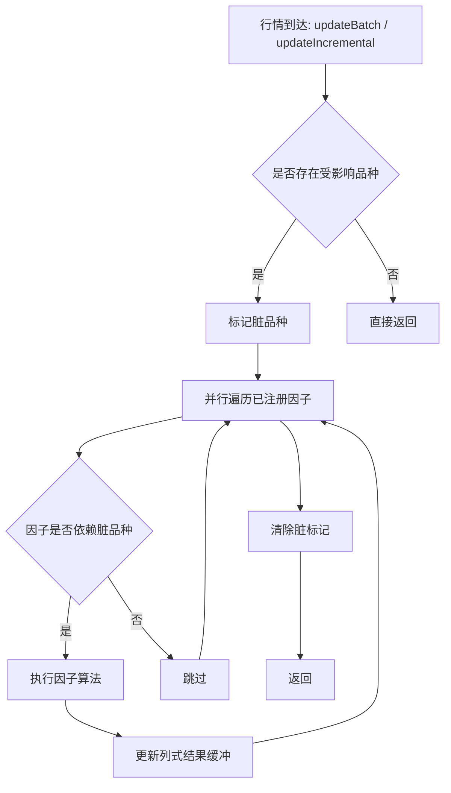
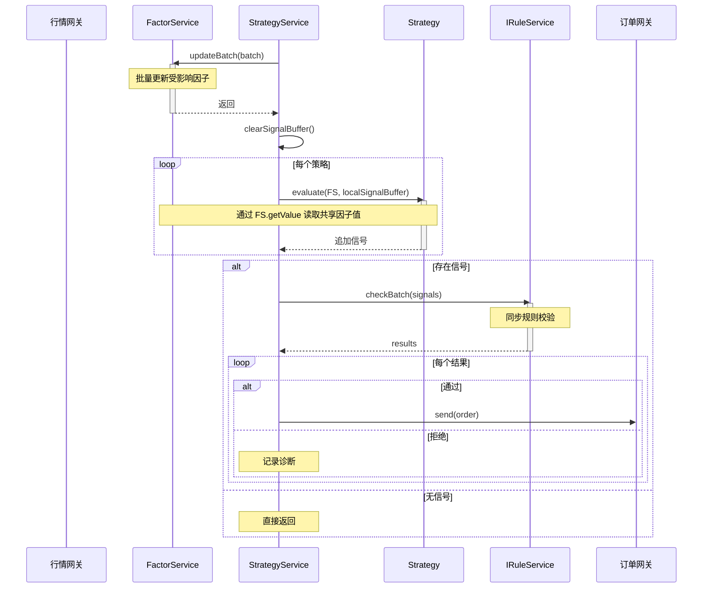
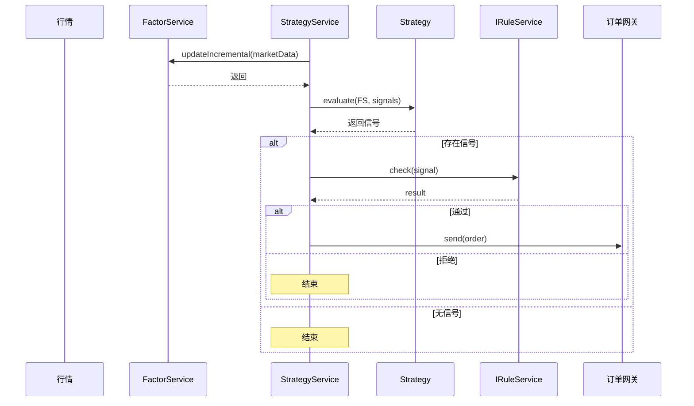

# 三系统内部流程与协作设计

## 1. 文档目的

本文档定义未来运行时内部三套核心系统的协作方向：

1. FactorService
2. StrategyService
3. IRuleService

本文档聚焦以下内容：

1. 三系统内部流程。
2. 三系统之间的同步调用协作模型。
3. 面向高吞吐场景的 C++ 实现约束。

本文档暂不引入 EventBus，不讨论异步消息总线，不讨论 UI bridge 页面交互。

## 2. 作用域边界

本文档描述的是未来运行时内部服务协作模型，不等同于当前桥接层的 StrategyService 合同。

边界说明：

1. 当前桥接层 StrategyManage 仍以页面入口、规范化、仓储协调和结果投影为主。
2. 本文档中的 StrategyService 指未来运行时内部的策略编排服务，负责在同步调用模型下组织因子更新、策略求值和规则校验。
3. 两者不能混为一个类，也不能通过兼容方式塞进同一职责壳中。

## 3. 架构定位与交互契约

整体调用方向如下：


交互约束如下：

1. 行情进入后，先更新 FactorService，再由 StrategyService 发起后续流程。
2. StrategyService 直接持有 FactorService 和 IRuleService 的受控引用。
3. StrategyService 管理多个策略实例，但不持有订单网关内部状态。
4. 整条主链采用高性能同步调用模型，不在主流程中引入事件广播。

## 4. 接口草案

以下接口仅用于说明协作方向，不代表最终冻结合同。考虑到引擎主链的 typed-only 约束，最终实现应优先落到强类型键和显式 ID，而不是字符串主键。

```cpp
struct InstrumentId final {
    std::uint32_t value{0};
};

enum class FactorKey : std::uint32_t {
    Invalid = 0,
    MovingAverage = 1,
    Momentum = 2,
    Volatility = 3,
};

struct MarketData final {
    InstrumentId instrumentId;
    double lastPrice{0.0};
    double volume{0.0};
};

struct Signal final {
    InstrumentId instrumentId;
    double score{0.0};
};

struct RuleCheckResult final {
    bool passed{false};
    Signal modifiedSignal;
};

class FactorService {
public:
    void registerFactor(FactorKey key);
    void updateIncremental(const MarketData& marketData);
    void updateBatch(std::span<const MarketData> batch);
    double getValue(FactorKey key, InstrumentId instrumentId) const;
};

class Strategy {
public:
    virtual ~Strategy() = default;
    virtual std::span<const FactorKey> requiredFactors() const = 0;
    virtual void evaluate(const FactorService& factorService,
                          std::vector<Signal>& outputSignals) = 0;
};

class IRuleService {
public:
    virtual ~IRuleService() = default;
    virtual RuleCheckResult check(const Signal& signal) = 0;
    virtual std::vector<RuleCheckResult> checkBatch(std::span<const Signal> signals) = 0;
};
```

## 5. FactorService 内部流程

FactorService 的核心职责是维护共享因子结果，并在行情更新后以最小必要范围刷新受影响数据。

流程如下：



实现约束：

1. 每个因子结果以连续数组存储，索引与 `InstrumentId` 对齐。
2. 容器必须预分配并可按容量增长，避免批处理中频繁 realloc。
3. `updateBatch` 优先按因子维度并行，不按对象树递归分派。
4. 只对受影响的品种和相关因子做最小刷新，不允许每次全量重算。
5. 依赖图必须显式存在；缺失依赖图时直接失败，不做隐式推断。

建议的数据布局：

1. 因子结果使用列式 `std::vector<double>`。
2. 脏标记使用位图或紧凑布尔数组。
3. 因子元信息与结果缓冲分离，避免热路径上读取冷元数据。

## 6. StrategyService 内部流程

StrategyService 是三系统协作的编排核心，主入口建议统一收口到 `onMarketDataBatch(...)`。

流程如下：

```mermaid
flowchart TD
    A[onMarketDataBatch(batch)] --> B[调用 factorService.updateBatch(batch)]
    B --> C[清空信号缓冲]
    C --> D[遍历已注册策略]
    D --> E[调用 strategy.evaluate(factorService, signalsBuf)]
    E --> F{是否还有下一条策略}
    F -->|是| D
    F -->|否| G{signalsBuf 是否为空}
    G -->|是| H[直接返回]
    G -->|否| I[调用 ruleService.checkBatch(signalsBuf)]
    I --> J[遍历规则结果]
    J --> K{结果是否通过}
    K -->|是| L[生成订单并发送到订单网关]
    K -->|否| M[记录诊断并丢弃]
    L --> J
    M --> J
    J --> N[结束]
```

职责约束：

1. 只负责编排，不承担因子算法实现。
2. 只负责组织策略求值，不承担具体规则逻辑。
3. 只负责把通过规则校验的结果送往订单网关，不吞并网关状态机。

实现要点：

1. 批处理模式下先更新因子，再统一跑策略，避免策略间交错触发重复更新。
2. 信号缓冲必须显式复用和容量预留，避免每批次重新分配。
3. 若后续启用策略并行，必须采用每策略局部缓冲再归并，不能并发写同一 `std::vector`。
4. 当没有信号时，应直接短路，不进入规则服务。

## 7. IRuleService 内部流程

当前方向允许 IRuleService 保持抽象接口，具体实现可以是本地规则引擎，也可以是受控的 Python 规则服务适配器。

流程如下：

```mermaid
flowchart TD
    A[checkBatch(signals)] --> B{signals 是否为空}
    B -->|是| C[返回空结果]
    B -->|否| D[批量编码请求]
    D --> E[同步调用规则实现]
    E --> F{是否在超时时间内完成}
    F -->|是| G[解码为 RuleCheckResult 数组]
    F -->|否| H[按 fail-fast 或受控拒绝策略处理]
    G --> I[返回]
    H --> I
```

实现约束：

1. 规则输入必须批量化，减少边界切换开销。
2. 外部规则调用必须有明确超时。
3. 超时后的处理策略必须预先定义，不允许运行时随意降级。
4. 若后续增加本地快速规则层，应作为规则服务内部优化，不改变上层调用合同。

## 8. 三系统协作时序

### 8.1 批量高吞吐模式



### 8.2 单笔低延迟模式



## 9. 性能约束

主链实现必须满足以下高性能约束：

1. 因子结果按品种 ID 连续存储，保证缓存友好。
2. 因子更新优先批量并行，避免按策略重复计算。
3. 主链调用以同步函数为主，不引入额外调度层开销。
4. 批量信号和批量规则结果必须显式复用缓冲。
5. 跨边界规则调用必须批量化，避免单信号多次往返。
6. 后续若启用策略并行，必须保证局部输出缓冲隔离。

## 10. 扩展方向

后续扩展建议按以下顺序推进：

1. 因子依赖图。
说明：显式管理衍生关系、更新顺序和最小重算范围。
2. 策略并行安全信号收集。
说明：每策略使用局部缓冲，批次结束后归并。
3. 本地规则短路层。
说明：把资金检查、涨跌停检查等快规则前置到 C++ 主链中，减少远端规则调用量。
4. 回测适配。
说明：保持 Strategy 接口稳定，仅替换 FactorService 的数据提供方式和 IRuleService 的实现。
5. 热加载。
说明：支持运行期动态注册、注销策略与参数刷新，但不破坏主链同步模型。

## 11. 实施注意事项

1. 不允许把当前桥接层 StrategyManage 与未来运行时 StrategyService 直接混为同一实现。
2. 不允许使用 QString 做类型判断，QString 仅允许用于调试输出。
3. QVariantMap 仅允许作为 QML 输入参数和返回到 QML 的输出载荷。
4. 返回到 QML 的桥接输出对象名统一为 `StrategyManage`。
2. 不允许为了临时接通流程引入字符串主键回退。
3. 不允许在缺少 typed 合同时私自补写默认结构。
4. 不允许在规则超时后做无约束降级；必须显式定义失败语义。
5. 不允许让批处理链路退化成每条行情都全量扫描全部策略和全部因子。

## 12. 总结

未来三系统的合理方向，是以 C++ 同步调用模型建立一条清晰、低开销、可批处理的运行时主链：FactorService 负责共享计算，StrategyService 负责编排，IRuleService 负责规则校验。只要职责收口清楚、typed 合同稳定、批量缓冲和数据布局控制到位，这套模型可以在不引入事件总线的前提下支撑高吞吐和低延迟场景。

## 补充规则

1. 不允许使用 QString 做类型判断，QString 仅允许用于调试输出。
2. QVariantMap 仅允许作为 QML 输入参数和返回到 QML 的输出载荷，桥接输出对象名统一为 StrategyManage。
