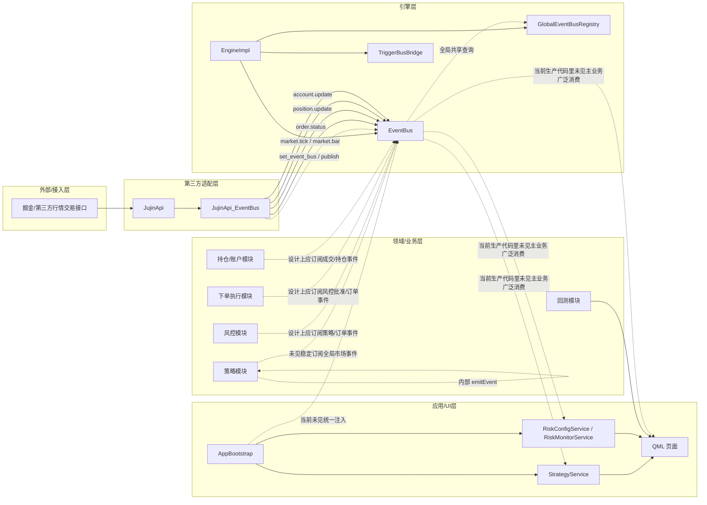
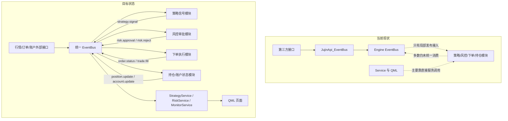
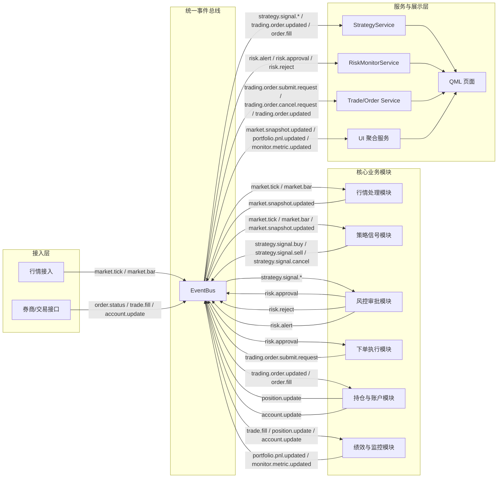

# 事件系统与模块交互现状图

这张图描述的是当前仓库代码里已经确认存在的事件系统接线关系，反映现状，不是理想目标架构。

## 说明

- 已确认接入的部分：引擎层 EventBus 底座、全局注册表、第三方适配层事件发布。
- 已存在但未完全打通的部分：策略、风控、下单执行、持仓/账户与 EventBus 的主业务消费链路。
- 当前应用层更多还是通过 Service 直接驱动 UI，而不是通过统一事件总线更新。

## 对应代码位置

- 引擎创建并注册全局 EventBus：src/engine/src/EngineImpl.cpp
- 全局注册表：src/engine/src/GlobalEventBusRegistry.cpp
- 掘金适配层事件发布：src/thirdParty/src/JujinApi_EventBus.cpp
- 应用启动初始化：src/app/src/AppBootstrap.cpp
- 策略内部事件示例：src/domain/strategies/src/MovingAverageStrategy.cpp

## 现状 vs 目标对比图

### 差异总结

- 当前已经具备事件底座和外部事件发布能力，但业务消费端没有全面接到总线上。
- 目标状态应该是所有关键模块都只通过统一事件主题交互，而不是页面或服务之间大量直接调用。
- 下单执行、风控审批、持仓回流是当前最缺的三段事件链。

## 理想目标交互图

### 推荐主题划分

- 行情类：market.tick, market.bar, market.snapshot.updated
- 策略类：strategy.signal.buy, strategy.signal.sell, strategy.signal.cancel
- 风控类：risk.approval, risk.reject, risk.alert
- 下单类：trading.order.submit.request, trading.order.cancel.request, trading.order.updated
- 成交类：trade.fill
- 账户持仓类：position.update, account.update
- 展示与监控类：portfolio.pnl.updated, monitor.metric.updated

## 补充规则

1. 不允许使用 QString 做类型判断，QString 仅允许用于调试输出。
2. QVariantMap 仅允许作为 QML 输入参数和返回到 QML 的输出载荷，桥接输出对象名统一为 StrategyManage。