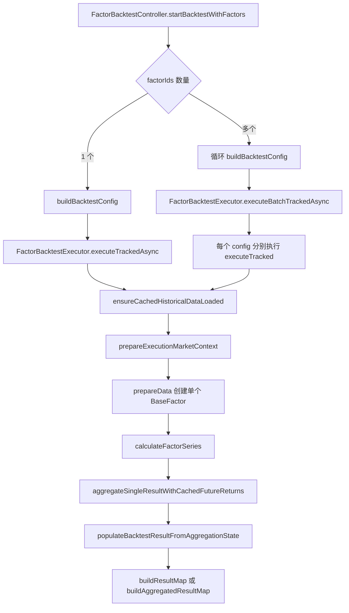
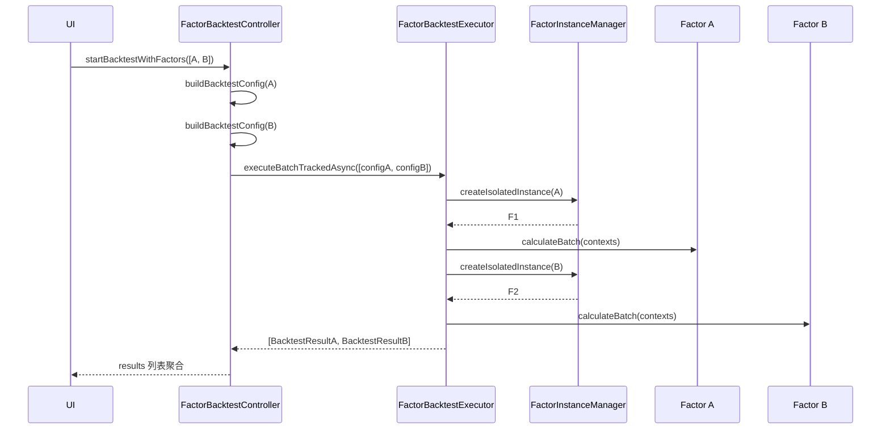
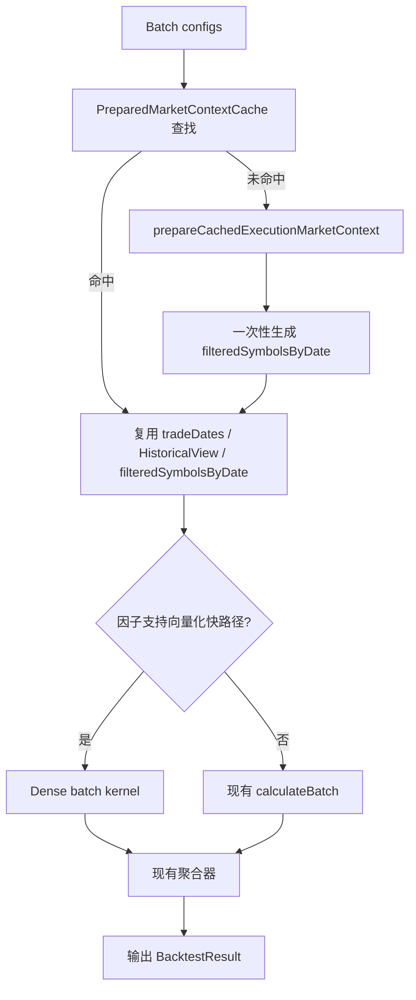
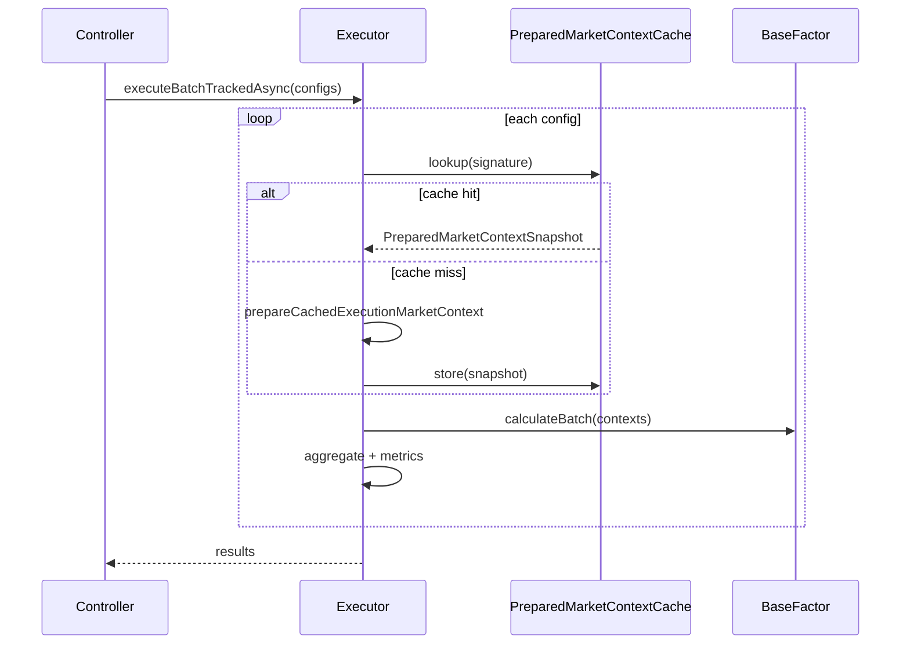
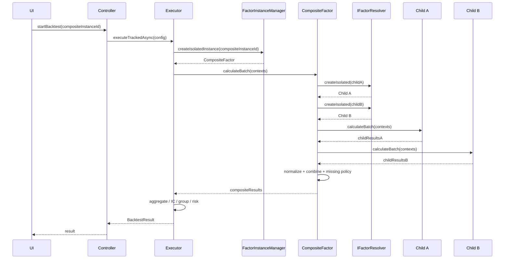
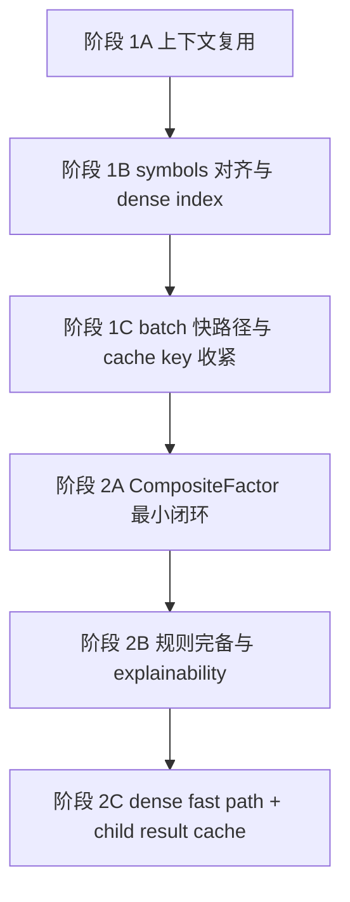
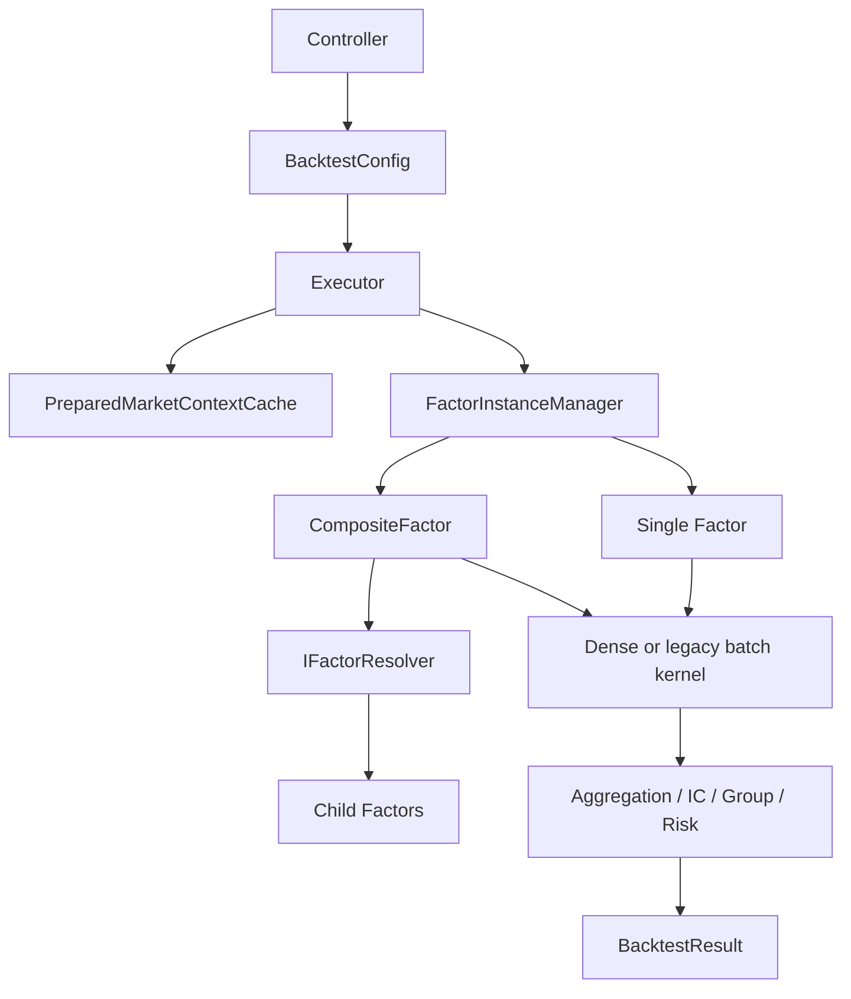

# 因子回测引擎优化与组合因子回测设计

## 1. 目标与结论

本文给出两套方案，但两者不是并列关系，而是前后依赖关系：

1. 第一阶段：不改变当前任何功能流程与结果语义的性能优化方案。
2. 第二阶段：新增组合因子回测能力的 C++ 设计方案。

本文的核心判断不是“先优化，后扩展”这么简单，而是：

- 第一阶段本质上是在为第二阶段准备基础设施。
- 如果没有第一阶段，第二阶段可以做出功能，但很容易在性能、结果对齐、缓存复用和可解释性上失败。
- 因此第一阶段不是可选优化，而是组合因子回测落地前的引擎地基。

当前引擎结论：

- 已支持单因子回测。
- 已支持多因子批量回测，但语义是“批量执行多个单因子配置”，不是“先合成组合因子，再执行一次回测”。
- 已支持单个因子内部的多指标组合，例如价值因子内部多估值指标加权、技术因子内部多技术指标组合。
- 尚未支持跨多个因子实例的真正组合因子回测。

## 2. 当前引擎现状分析

### 2.1 入口与配置构建

当前 UI/Bridge 入口在 [src/ui/bridge/src/FactorBacktestController.cpp](src/ui/bridge/src/FactorBacktestController.cpp#L1265)。

现有行为：

- 传入多个 factorIds 后，会先做去重与批量状态初始化。
- 随后为每个因子实例分别构建一个 BacktestConfig。
- 最终交给批量执行器执行一组独立配置。

对应批量配置构建循环在 [src/ui/bridge/src/FactorBacktestController.cpp](src/ui/bridge/src/FactorBacktestController.cpp#L2331)。

这意味着当前多因子选择的语义是：

- 多选因子 = 多次单因子回测
- 不是 = 一个组合因子实例的一次回测

### 2.2 执行器职责

执行器主入口在 [src/domain/factor/src/FactorBacktestExecutor.cpp](src/domain/factor/src/FactorBacktestExecutor.cpp#L1869)。

当前执行链路：

1. 载入或复用缓存历史数据。
2. 构建 ExecutionMarketContext。
3. 通过 FactorInstanceManager 创建单个 BaseFactor 实例。
4. 基于交易日切片调用 factor.calculateBatch。
5. 将 CalculationResult 流式聚合为分组收益、IC/IR、多空序列与风控结果。

关键点：

- 执行器的核心单位仍然是单个 instanceId，见 [src/domain/factor/include/FactorBacktestExecutor.h](src/domain/factor/include/FactorBacktestExecutor.h#L646)。
- prepareData 只创建一个因子实例，见 [src/domain/factor/src/FactorBacktestExecutor.cpp](src/domain/factor/src/FactorBacktestExecutor.cpp#L2110)。
- calculateFactorSeries 针对一个 BaseFactor 做批量日期计算，见 [src/domain/factor/src/FactorBacktestExecutor.cpp](src/domain/factor/src/FactorBacktestExecutor.cpp#L2147)。

### 2.3 市场上下文与数据准备

市场上下文准备在 [src/domain/factor/src/FactorBacktestExecutor.cpp](src/domain/factor/src/FactorBacktestExecutor.cpp#L2575)。

当前数据路径特点：

- 入口可以是 cachedBars 或 preparedArrowData。
- 执行时统一收敛到 HistoricalView。
- 动态指数股票池通过 allowedStockCodesByDate 注入到 ExecutionMarketContext。
- 每个交易日会调用 resolveSymbolsForTradeDate 做交易日股票池过滤，见 [src/domain/factor/src/FactorBacktestExecutor.cpp](src/domain/factor/src/FactorBacktestExecutor.cpp#L2725)。

当前这条路径已经具备较好的扩展性：

- 因子逻辑只依赖 CalculationContext。
- 股票池过滤与因子计算解耦。
- Arrow 与 row cache 在执行层统一抽象成 HistoricalView。

### 2.4 因子实例创建模型

实例加载入口在 [src/domain/factor/src/FactorInstanceManager.cpp](src/domain/factor/src/FactorInstanceManager.cpp#L376)。

当前事实：

- 因子实例配置来自 factor_instance.full_config。
- 因子类型由 full_config 里的 factorType 解析。
- 创建分派表位于 [src/domain/factor/src/FactorInstanceManager.cpp](src/domain/factor/src/FactorInstanceManager.cpp#L18) 到 [src/domain/factor/src/FactorInstanceManager.cpp](src/domain/factor/src/FactorInstanceManager.cpp#L123)。
- 当前没有 COMPOSITE 或 MULTI_FACTOR 类型。

### 2.5 当前已存在的“组合”能力边界

当前只存在两类局部组合：

1. 同一个因子内部的多指标组合。
   - 例如价值因子内部按多个估值指标加权，见 [src/domain/factor/src/ValueFactor.cpp](src/domain/factor/src/ValueFactor.cpp#L482)。
   - 例如技术因子内部按 technicalCombinationMode 组合多个技术指标，见 [src/domain/factor/src/ConfigurableFactorTechnical.cpp](src/domain/factor/src/ConfigurableFactorTechnical.cpp#L118)。

2. 多因子批量回测。
   - 仅仅是执行器批量跑多个 BacktestConfig，见 [src/domain/factor/src/FactorBacktestExecutor.cpp](src/domain/factor/src/FactorBacktestExecutor.cpp#L1732)。
   - 最终结果是 results 列表聚合，见 [src/ui/bridge/src/FactorBacktestController.cpp](src/ui/bridge/src/FactorBacktestController.cpp#L2185)。

3. 策略侧的因子叠加与权重配置。
    - 当前策略配置页已经提供 factorOverlay 入口，带 allocations / weight_percent / minimumCompositeScore / targetPositionCount，见 [src/app/Qml/components/Strategy/Creation/StrategyParamConfig.qml](src/app/Qml/components/Strategy/Creation/StrategyParamConfig.qml#L63)。
    - 该入口服务的是策略执行期候选股票打分与筛选，不是因子回测引擎里的组合因子实例，见 [src/domain/backtest/src/BacktestExecutionRuntime.cpp](src/domain/backtest/src/BacktestExecutionRuntime.cpp#L475)。

因此，当前不存在真正的“组合因子实例”。

同时需要冻结一个产品边界：

- 策略页已有的 factorOverlay 不再承担“组合因子回测配置器”的角色。
- 组合因子回测的编辑与调整界面，应收敛到当前因子回测页，而不是继续挂在策略配置页。
- 原因不是技术不能复用，而是产品语义已经重复：策略侧已经有“引入因子 + 权重”的独立入口，再让组合因子回测复用同一入口，会把“策略执行组合”和“研究回测组合”混成一套 UI，后续合同会持续漂移。

## 3. 当前引擎流程图

### 3.1 当前单因子/批量单因子回测流程



### 3.2 当前批量回测不是组合因子回测



## 4. 方案一：不改变任何功能流程的优化方案

### 4.1 目标

这一阶段的角色要重新定义：

- 表面目标是“优化现有单因子/批量单因子回测”。
- 实际目标是“构建组合因子回测所必需的执行基座”。

也就是说，第一阶段所有优化都要满足两个条件：

1. 对当前功能零语义扰动。
2. 对未来组合因子形成直接复用的基础能力。

约束：

- 不改变任何输入合同。
- 不改变任何结果字段。
- 不改变任何回测语义。
- 不把批量单因子变成组合因子。
- 所有优化都限定为内部执行效率与资源利用率优化。

目标：

- 降低批量单因子回测的总耗时。
- 降低重复构建市场上下文与重复过滤股票池的开销。
- 提高 calculateBatch 热路径吞吐。
- 降低 map/string 主导的 CPU 开销与临时内存分配。
- 为组合因子准备统一的上下文复用、dense symbol 对齐、批量结果缓存和快路径接口。

### 4.1.1 第一阶段与第二阶段的基础设施映射

第一阶段每一项优化，对第二阶段的作用都应该是明确可追踪的：

| 第一阶段能力 | 当前收益 | 对组合因子的基础作用 |
| --- | --- | --- |
| PreparedMarketContextCache | 减少 batch configs 重复准备市场上下文 | 多个子因子必须共享完全一致的 tradeDates、HistoricalView 与股票池过滤口径 |
| filteredSymbolsByDate | 减少每个交易日反复过滤 symbols | 组合因子需要在完全相同的 symbol 空间上对齐各 child 结果 |
| dense symbol index | 降低字符串哈希开销 | 组合阶段要把多 child 截面结果按同一索引位做线性合成 |
| 批量向量化协议 | 提高单因子 calculateBatch 吞吐 | 组合因子必须依赖 child.calculateBatch 的高吞吐，否则 child 数量一多立即退化 |
| 共享 Arrow / warmup / future-return cache | 降低批量回测总耗时 | 组合因子与其子因子必须共用同一套历史视图、warmup 和 forward return 对齐基准 |

因此第一阶段的评价标准不能只看“单因子快了多少”，还必须看它是否真的能作为组合因子的稳定底座。

### 4.2 当前性能热点

根据当前实现，热点主要在以下位置：

1. 每个交易日构造 CalculationContext 并重复收集 symbols。
   - 见 [src/domain/factor/src/FactorBacktestExecutor.cpp](src/domain/factor/src/FactorBacktestExecutor.cpp#L2250)。

2. resolveSymbolsForTradeDate 每次都要按 allowedSymbolsByDate 做字符串过滤。
   - 见 [src/domain/factor/src/FactorBacktestExecutor.cpp](src/domain/factor/src/FactorBacktestExecutor.cpp#L2725)。

3. 大量因子仍然以 unordered_map<string,double> 作为截面结果表达，导致组合、排序、聚合时 string/hash 开销高。

4. BaseFactor::calculateBatch 默认只是循环调用 calculate。
   - 见 [src/domain/factor/src/BaseFactor.cpp](src/domain/factor/src/BaseFactor.cpp#L121)。

5. 批量回测时，不同 BacktestConfig 之间仍然会重复进入 prepareExecutionMarketContext 和 per-date symbol 过滤。

### 4.3 优化方案设计

#### 4.3.1 引入批次级 MarketContext 复用缓存

新增建议抽象：

- BacktestMarketContextKey
- PreparedMarketContextSnapshot
- PreparedMarketContextCache

设计原则：

- key 由 datasetId、marketDataCacheKey、startDate、endDate、allowedStockCodesByDate hash、forwardDays 组成。
- 对于同一批 batch configs，只要市场数据与股票池过滤条件一致，就直接复用已准备好的 tradeDates、HistoricalView、allowedSymbolsByDate 索引。
- 这不改变任何语义，只减少重复准备。

介入点：

- [src/domain/factor/src/FactorBacktestExecutor.cpp](src/domain/factor/src/FactorBacktestExecutor.cpp#L2575)

收益：

- 批量单因子回测时，避免 N 次重复准备市场上下文。

#### 4.3.2 引入按日期的已过滤 symbol 列表缓存

当前 resolveSymbolsForTradeDate 会反复做字符串集合过滤。

新增建议抽象：

- ExecutionMarketContext.filteredSymbolsByDate

构建策略：

- 在 prepareCachedExecutionMarketContext 阶段一次性根据 allowedSymbolsByDate 生成每个 tradeDate 的最终 symbols 列表。
- calculateFactorSeries 内部只读这个最终列表，不再每次动态过滤。

介入点：

- [src/domain/factor/src/FactorBacktestExecutor.cpp](src/domain/factor/src/FactorBacktestExecutor.cpp#L2597)
- [src/domain/factor/src/FactorBacktestExecutor.cpp](src/domain/factor/src/FactorBacktestExecutor.cpp#L2725)

收益：

- 大幅减少交易日循环中的 hash 查询和 string 比较。

#### 4.3.3 扩展 BaseFactor 的批量向量化协议

当前默认 calculateBatch 是串行 calculate。

新增建议抽象：

- IBatchFactorKernel
- DenseCrossSectionView
- DenseBatchCalculationResult

兼容策略：

- 保持 BaseFactor 现有接口不变。
- 新增可选快路径接口，只有支持向量化的因子才实现。
- 执行器检测到因子支持快路径时走向量化，否则走现有 calculateBatch。

优先接入因子：

- ValueFactor
- SizeFactor
- QualityFactor
- MomentumFactor
- LowVolFactor

原因：

- 这些因子横截面与时序访问模式相对规整，最容易批量化。

#### 4.3.4 稠密 symbol 索引替代字符串热路径

新增建议抽象：

- SymbolIndexDictionary
- DenseSymbolSlice

思路：

- 在 marketContext 准备好后，将当次回测符号空间映射成连续索引。
- 因子结果内部先以连续数组表示，只有在最终生成 CalculationResult 时再转回 symbol -> value。
- 这样不改变对外结果合同，但热路径从 hash-map merge 变成顺序内存扫描。

#### 4.3.5 批量回测的共享 Warmup 与共享 Arrow 视图

当前 controller 已经会构建 preparedArrowData，但不同 config 仍可能重复构建相同的可复用中间态。

优化点：

- 对 batch configs 先做 runtime signature 分组。
- 同组共享 preparedArrowData、tradeDates、future-return cache。
- 这与现有 batch executor reuse 兼容，不改变外部功能流程。

#### 4.3.6 为组合因子预留的子因子结果缓存协议

虽然第一阶段不实现组合因子，但建议现在就把缓存键模型设计成可扩展到 child result cache。

建议新增预留抽象：

- FactorSeriesCacheKey
- FactorSeriesSnapshot

cache key 至少应包含：

- instanceId
- marketDataCacheKey
- startDate / endDate
- allowedStockCodesByDate signature
- warmup signature
- marketEnvironmentProfile
- benchmarkSymbol
- rebalanceDays / forwardDays 中影响 future return 对齐的参数

原因：

- 第二阶段的 CompositeChildResultCache 本质上就是把“单因子序列输出”缓存起来复用。
- 如果第一阶段的 key 设计过窄，第二阶段会因为缓存污染或口径错配而返工。

### 4.4 方案一流程图



### 4.5 方案一时序图



### 4.6 方案一实施顺序

建议顺序：

1. 先做 PreparedMarketContextCache。
2. 再做 filteredSymbolsByDate 预计算。
3. 再做稠密 symbol index。
4. 最后给高频因子接入向量化快路径。

这样每一步都可独立回归，不会改变现有功能流程。

## 5. 方案二：组合因子回测方案

### 5.1 目标

把“多个因子实例组合成一个新的因子实例”纳入 domain/factor 核心执行模型。

设计原则：

- 必须是 C++ 域模型，不允许把组合逻辑放在 UI 或桥接层拼结果。
- 组合因子在回测引擎里表现为一个普通 BaseFactor。
- 执行器只回测一个组合因子实例，不回测多个单因子再外部合并。
- 对于性能，组合计算必须复用同一批 contexts 和 HistoricalView。
- 必须严格建立在第一阶段基础设施之上，不允许为功能先落地而绕开上下文复用、对齐索引和缓存边界。
- 创建新类与新接口时不做兼容层、不保留旧口径回退、不引入双路径并存；组合因子按纯新 C++ 合同直接落地，旧语义若不满足新合同则直接失败。

### 5.2 组合因子介入当前引擎的位置

#### 介入点 1：FactorType

当前 [src/domain/factor/include/factor_enums.h](src/domain/factor/include/factor_enums.h#L10) 没有组合因子类型。

需要新增：

- FactorType::COMPOSITE

#### 介入点 2：FactorInstanceManager

当前因子实例创建由 creator 表驱动，见 [src/domain/factor/src/FactorInstanceManager.cpp](src/domain/factor/src/FactorInstanceManager.cpp#L18)。

需要新增：

- createCompositeFactorEntry
- 将 CompositeFactor 注册到 creator 表

#### 介入点 3：BaseFactor 批量接口

组合因子必须复用现有 calculateBatch 接口，见 [src/domain/factor/include/BaseFactor.h](src/domain/factor/include/BaseFactor.h#L203)。

原因：

- 执行器已经围绕 calculateBatch 构建。
- 组合因子最自然的落点就是一个新的 BaseFactor 子类。

#### 介入点 4：实例配置存储

当前实例配置从 factor_instance.full_config 读取，见 [src/domain/factor/src/FactorInstanceManager.cpp](src/domain/factor/src/FactorInstanceManager.cpp#L376)。

因此组合因子配置应直接写入 full_config，不需要另起一张专用表作为第一版前提。

### 5.3 建议的核心 C++ 抽象

#### 5.3.1 因子解析接口

建议新增：

```cpp
class IFactorResolver {
public:
    virtual ~IFactorResolver() = default;
    virtual std::shared_ptr<BaseFactor> createIsolated(const std::string& instanceId) = 0;
    virtual FactorInstanceInfo getInfo(const std::string& instanceId) = 0;
};
```

原因：

- CompositeFactor 不能自己依赖数据库细节。
- 它只应该依赖“解析子因子实例”的能力。
- 这比把整个 FactorInstanceManager 硬塞进 CompositeFactor 更干净。

#### 5.3.2 组合因子配置

建议新增：

```cpp
enum class CompositeCombineMode : uint8_t {
    WeightedAverage,
    WeightedSum,
    RankAverage,
    Vote,
    MaxScore,
    MinScore,
    Unknown
};

enum class CompositeNormalizeMode : uint8_t {
    None,
    ZScore,
    Rank,
    Percentile,
    WinsorizedZScore,
    Unknown
};

enum class CompositeMissingPolicy : uint8_t {
    DropSymbol,
    RenormalizeWeights,
    FillNeutral,
    RequireMinCoverage,
    Unknown
};

struct CompositeChildSpec {
    std::string instanceId;
    double weight{1.0};
    bool ascending{true};
    CompositeNormalizeMode normalizeMode{CompositeNormalizeMode::ZScore};
};

struct CompositeFactorParams {
    std::vector<CompositeChildSpec> children;
    CompositeCombineMode combineMode{CompositeCombineMode::WeightedAverage};
    CompositeMissingPolicy missingPolicy{CompositeMissingPolicy::RenormalizeWeights};
    double minimumCoverageRatio{0.5};
};
```

#### 5.3.3 组合因子类

建议新增：

```cpp
class CompositeFactor final : public BaseFactor {
public:
    static std::shared_ptr<CompositeFactor> create(const FactorInstanceInfo& info,
                                                   std::shared_ptr<DataAvailabilityChecker> dataChecker,
                                                   std::shared_ptr<IFactorResolver> resolver);

    CalculationResult calculate(const CalculationContext& context) override;
    std::vector<CalculationResult> calculateBatch(const std::vector<CalculationContext>& contexts) override;
    DataRequirements getDataRequirements() const override;
    BoundaryRules getBoundaryRules() const override;

private:
    CompositeFactorParams params_;
    std::shared_ptr<IFactorResolver> resolver_;
};
```

#### 5.3.4 建议新增文件清单

为了避免组合因子实现散落到现有类中，建议直接新增以下文件：

- [src/domain/factor/include/CompositeFactor.h](src/domain/factor/include/ConfigurableFactor.h)
- [src/domain/factor/src/CompositeFactor.cpp](src/domain/factor/src/ConfigurableFactor.cpp)
- [src/domain/factor/include/IFactorResolver.h](src/domain/factor/include/FactorInstanceManager.h)
- [src/domain/factor/include/CompositeFactorConfig.h](src/domain/factor/include/FactorConfigAccess.h)
- [src/domain/factor/src/CompositeFactorConfig.cpp](src/domain/factor/src/FactorInstanceManager.cpp)

说明：

- 这里文档中的链接只是为了对照现有目录结构，当前文件尚未创建。
- 组合因子的配置解析、域模型、实例解析接口应拆文件，不要塞回现有 ConfigurableFactor 或 FactorInstanceManager 里做大杂烩扩展。

#### 5.3.5 建议的 IFactorResolver 头文件草案

```cpp
#pragma once

#include <memory>
#include <string>

namespace factor {

class BaseFactor;
struct FactorInstanceInfo;

class IFactorResolver {
public:
    virtual ~IFactorResolver() = default;

    virtual std::shared_ptr<BaseFactor> createIsolated(const std::string& instanceId) = 0;
    virtual FactorInstanceInfo getInfo(const std::string& instanceId) = 0;
};

} // namespace factor
```

实现约束：

- 这不是兼容层，而是组合因子对子因子解析的正式依赖抽象。
- 组合因子只认 IFactorResolver，不直接认数据库对象，不直接认 SQL。

#### 5.3.6 factor_enums.h 建议扩展

建议在 [src/domain/factor/include/factor_enums.h](src/domain/factor/include/factor_enums.h#L10) 中做以下正式扩展：

```cpp
enum class FactorType : uint8_t {
    VALUE = 0,
    MOMENTUM = 1,
    SIZE = 2,
    QUALITY = 3,
    GROWTH = 4,
    DIVIDEND = 5,
    TECHNICAL = 6,
    LIQUIDITY = 7,
    MACRO = 8,
    INDUSTRY = 9,
    SENTIMENT = 10,
    CUSTOM = 11,
    LOW_VOLATILITY = 12,
    COMPOSITE = 13,
    UNKNOWN = 255
};

enum class CompositeCombineMode : uint8_t {
    WeightedAverage = 0,
    WeightedSum = 1,
    RankAverage = 2,
    Vote = 3,
    MaxScore = 4,
    MinScore = 5,
    UNKNOWN = 255
};

enum class CompositeNormalizeMode : uint8_t {
    None = 0,
    ZScore = 1,
    Rank = 2,
    Percentile = 3,
    WinsorizedZScore = 4,
    UNKNOWN = 255
};

enum class CompositeMissingPolicy : uint8_t {
    DropSymbol = 0,
    RenormalizeWeights = 1,
    FillNeutral = 2,
    RequireMinCoverage = 3,
    UNKNOWN = 255
};
```

约束：

- 不复用旧枚举去偷语义。
- 组合因子专属语义必须使用专属枚举。
- 不允许把组合模式塞进 CUSTOM 或 TECHNICAL 的旧字段里伪装实现。

#### 5.3.7 CompositeFactorConfig.h 建议草案

```cpp
#pragma once

#include "factor_enums.h"

#include <string>
#include <vector>

namespace factor {

struct CompositeChildSpec {
    std::string instanceId;
    double weight{1.0};
    bool ascending{true};
    CompositeNormalizeMode normalizeMode{CompositeNormalizeMode::ZScore};
};

struct CompositeFactorParams {
    std::vector<CompositeChildSpec> children;
    CompositeCombineMode combineMode{CompositeCombineMode::WeightedAverage};
    CompositeMissingPolicy missingPolicy{CompositeMissingPolicy::RenormalizeWeights};
    double minimumCoverageRatio{0.5};
    bool enableCompositeNeutralization{false};
};

} // namespace factor
```

说明：

- 不直接把配置细节塞进 CompositeFactor 私有匿名结构里。
- 配置对象单独成头文件，便于测试、序列化和后续迁移工具复用。

#### 5.3.8 CompositeFactor.h 建议正式草案

```cpp
#pragma once

#include "BaseFactor.h"
#include "CompositeFactorConfig.h"

#include <memory>
#include <string>
#include <unordered_map>
#include <vector>

namespace factor {

class IFactorResolver;

class CompositeFactor final : public BaseFactor {
public:
    CompositeFactor();
    ~CompositeFactor() override = default;

    static std::shared_ptr<CompositeFactor> create(
        const FactorInstanceInfo& info,
        std::shared_ptr<DataAvailabilityChecker> dataChecker,
        std::shared_ptr<IFactorResolver> resolver);

    CalculationResult calculate(const CalculationContext& context) override;
    std::vector<CalculationResult> calculateBatch(const std::vector<CalculationContext>& contexts) override;
    DataRequirements getDataRequirements() const override;
    BoundaryRules getBoundaryRules() const override;

private:
    struct ChildRuntime {
        CompositeChildSpec spec;
        FactorInstanceInfo info;
        std::shared_ptr<BaseFactor> factor;
    };

    CompositeFactorParams params_;
    std::shared_ptr<IFactorResolver> resolver_;

    void loadConfig(const foundation::json::JsonFacade& config) override;
    std::vector<ChildRuntime> resolveChildrenOrThrow() const;
    static DataRequirements mergeDataRequirements(const std::vector<ChildRuntime>& children);
    static BoundaryRules mergeBoundaryRules(const std::vector<ChildRuntime>& children);
};

} // namespace factor
```

设计解释：

- calculate 仍然保留，但正式热路径应走 calculateBatch。
- resolveChildrenOrThrow 明确为失败即抛，不做回退。
- mergeDataRequirements 和 mergeBoundaryRules 用显式静态函数，便于单测，不要混进 calculateBatch 里做隐式逻辑。

#### 5.3.9 CompositeFactor.cpp 建议职责拆分

建议 cpp 内部至少拆成以下函数，不要把所有逻辑堆进 calculateBatch：

```cpp
namespace {

CompositeFactorParams compositeParamsFromJson(const foundation::json::JsonFacade& json);

void validateCompositeParamsOrThrow(const CompositeFactorParams& params);

void validateAcyclicChildrenOrThrow(const CompositeFactorParams& params,
                                    const IFactorResolver& resolver);

std::vector<CalculationResult> calculateChildBatchOrThrow(
    BaseFactor& factor,
    const std::vector<CalculationContext>& contexts);

std::vector<double> normalizeChildValues(
    const CalculationResult& childResult,
    const std::vector<std::string>& symbols,
    const CompositeChildSpec& spec);

CalculationResult combineCompositeResult(
    const std::string& date,
    const std::vector<std::string>& symbols,
    const CompositeFactorParams& params,
    const std::vector<std::vector<double>>& normalizedChildScores,
    const std::vector<std::vector<uint8_t>>& validityMask);

}
```

硬约束：

- 每一步都必须是显式阶段函数。
- 不要把“标准化 + 缺失值处理 + 合成 + metadata 回填”揉成一个 500 行函数。
- 任一验证失败直接抛异常，不做 fallback。

#### 5.3.10 FactorInstanceManager 接线建议

当前 [src/domain/factor/src/FactorInstanceManager.cpp](src/domain/factor/src/FactorInstanceManager.cpp) 使用 creator 表分派。建议按同样模式增加组合因子，但不修改外部调用合同。

建议新增：

```cpp
class FactorResolverAdapter final : public IFactorResolver {
public:
    explicit FactorResolverAdapter(FactorInstanceManager& manager)
        : manager_(manager) {}

    std::shared_ptr<BaseFactor> createIsolated(const std::string& instanceId) override {
        return manager_.createIsolatedInstance(instanceId);
    }

    FactorInstanceInfo getInfo(const std::string& instanceId) override {
        return manager_.getInstanceInfo(instanceId);
    }

private:
    FactorInstanceManager& manager_;
};
```

同时新增 creator：

```cpp
std::shared_ptr<BaseFactor> createCompositeFactorEntry(
    const FactorInstanceInfo& info,
    std::shared_ptr<DataAvailabilityChecker> dataChecker,
    FactorInstanceManager& manager)
{
    return CompositeFactor::create(
        info,
        std::move(dataChecker),
        std::make_shared<FactorResolverAdapter>(manager));
}
```

注意：

- 这里不建议做“如果不是组合因子就走旧逻辑，如果是组合因子走特殊路径”的分叉扩散。
- 正确做法是把 resolver 作为组合因子创建所需依赖，仍然通过 creator table 统一进入。

#### 5.3.11 FactorInstanceManager.h 建议最小改动

为了不引入兼容层，建议直接把 createFactorFromInfo 扩成可感知 manager 自身：

```cpp
std::shared_ptr<BaseFactor> createFactorFromInfo(
    const std::string& instanceId,
    const FactorInstanceInfo& info);
```

实现时允许在 createFactorFromInfo 内部为 COMPOSITE 构造 resolver 并直接创建 CompositeFactor。

不建议：

- 额外保留一个 legacy createFactorFromInfoV1。
- 额外加一个 createCompositeFactorFromInfo 特殊出口供外部单独调用。

#### 5.3.12 组合因子 JSON 合同建议

建议 full_config 最小合同如下：

```json
{
  "factorType": 13,
  "factorName": "quality_value_composite",
  "calculation": {
    "combineMode": 0,
    "missingPolicy": 1,
    "minimumCoverageRatio": 0.5,
    "children": [
      {
        "instanceId": "quality_roe_core",
        "weight": 0.6,
        "ascending": true,
        "normalizeMode": 1
      },
      {
        "instanceId": "value_bp_core",
        "weight": 0.4,
        "ascending": true,
        "normalizeMode": 1
      }
    ]
  },
  "boundaryRules": {
    "minDataPoints": 1
  }
}
```

解释：

- 不做字符串枚举兼容；枚举继续走数值口径，与当前系统一致。
- children 为空、weight 非有限值、instanceId 为空、normalizeMode 非法，直接失败。
- 不做旧字段别名兼容。

#### 5.3.13 组合因子元信息合同建议

建议组合因子在每个 CalculationResult.metadata 中至少写入：

```cpp
metadata.set("composite", true);
metadata.set("combineMode", ...);
metadata.set("missingPolicy", ...);
metadata.set("childCount", ...);
metadata.set("children", ...);
metadata.set("minimumCoverageRatio", ...);
metadata.set("effectiveWarmupTradingDays", ...);
```

其中 children 建议是数组对象，每项包含：

- instanceId
- weight
- ascending
- normalizeMode
- effectiveSymbolCount
- coverageRatio

这样 UI 和调试工具都可以直接读取，不需要再反推组合配置。

#### 5.3.14 组合因子实现文件改动面建议

第二阶段最小闭环建议只动这些文件：

- [src/domain/factor/include/factor_enums.h](src/domain/factor/include/factor_enums.h#L10)
- [src/domain/factor/include/FactorInstanceManager.h](src/domain/factor/include/FactorInstanceManager.h)
- [src/domain/factor/src/FactorInstanceManager.cpp](src/domain/factor/src/FactorInstanceManager.cpp#L18)
- 新增 CompositeFactor.h / CompositeFactor.cpp
- 新增 IFactorResolver.h
- 新增 CompositeFactorConfig.h / CompositeFactorConfig.cpp
- 测试文件 [tests/test_factor_backtest_regression.cpp](tests/test_factor_backtest_regression.cpp)

第一版不建议碰：

- FactorBacktestExecutor 主流程
- FactorBacktestController 主流程
- UI/QML 交互层

原因：

- 第二阶段最小闭环的目标是“让执行器在完全不理解组合语义的前提下跑通组合因子”。
- 所以主改动应该收敛在 domain/factor。

#### 5.3.15 建议的回归测试分组

建议新增以下测试组：

1. CompositeFactorConfigTest
   - 配置解析
   - 非法字段直接失败
   - child 空列表直接失败

2. CompositeFactorRuntimeTest
   - WeightedAverage
   - RenormalizeWeights
   - Direction flip
   - Warmup merge
   - Metadata completeness

3. CompositeFactorBacktestRegressionTest
   - 真正接入 FactorBacktestExecutor 的 cached 回测
   - 动态指数 allowedStockCodesByDate 下结果正确
   - dense path 与 legacy path 一致

#### 5.3.16 第二阶段最小闭环的开工标准

只有满足以下条件，第二阶段最小闭环才建议开工：

1. 第一阶段的 PreparedMarketContextCache 设计已经冻结。
2. symbols 对齐方式已经冻结为统一顺序索引。
3. FactorSeriesCacheKey 已经至少定义完成。
4. 明确决定 V1 不支持嵌套组合因子。
5. 明确决定 V1 只支持数值枚举合同，不做字符串兼容。

否则第二阶段实现过程中很容易因为基础设施抽象还在变而返工。

#### 5.3.17 UI 收敛与复用边界

这里需要补一个明确的 UI 决策，否则第二阶段落地时会在策略页和因子回测页之间反复摇摆。

产品决策：

- 策略页的 factorOverlay 继续只服务策略执行。
- 组合因子回测的配置界面放在当前因子回测页。
- 不再把“组合因子回测”挂到策略页去伪装成某种策略组合。

原因：

- 当前策略页已经具备“选择因子 + 编辑权重”的独立入口，见 [src/app/Qml/components/Strategy/Creation/StrategyParamConfig.qml](src/app/Qml/components/Strategy/Creation/StrategyParamConfig.qml#L1420)。
- 该入口对应的是策略运行时的 factor overlay，而不是 BaseFactor 域模型。
- 如果组合因子回测继续复用策略页入口，会造成同一套因子权重编辑 UI 同时服务两套合同：
    - 一套是策略执行合同。
    - 一套是组合因子回测合同。
- 这会直接违背本文“研究口径与执行口径显式拆开、不做双语义兼容”的原则。

因此建议：

1. 复用当前 [src/app/Qml/components/FactorWorkbench/Backtest/FactorSelectorDialog.qml](src/app/Qml/components/FactorWorkbench/Backtest/FactorSelectorDialog.qml#L121) 作为子因子选择器。
2. 在 [src/app/Qml/components/FactorWorkbench/Backtest/FactorBacktestPage.qml](src/app/Qml/components/FactorWorkbench/Backtest/FactorBacktestPage.qml#L1720) 新增 child allocations 编辑区。
3. 当前因子回测页原本的 selectedFactorIds 语义，需要分裂为：
     - 单因子/批量单因子模式下的 selectedFactorIds。
     - 组合因子模式下的 compositeChildAllocations。
4. 策略页 factorOverlay 的字段名和存储结构，不直接挪用为组合因子 full_config。

推荐的回测页最小交互模型：

- 选择子因子。
- 编辑每个 child 的 weight。
- 编辑每个 child 的 ascending。
- 编辑每个 child 的 normalizeMode。
- 编辑组合层的 combineMode / missingPolicy / minimumCoverageRatio。
- 一键均权。
- 一键开始组合因子回测。

这里必须强调：

- “当前的因子+权重界面”可以借用交互样式和局部组件思想。
- 但它不能继续被定义成“策略组合界面”。
- 在组合因子方案里，它应被重命名并收编为“组合因子回测调整界面”。

#### 5.3.18 因子回测页 UI 改造清单

为了让第二阶段能够直接落地到当前回测页，这里把改造面明确到属性、函数和布局块级别。

当前回测页的关键锚点：

- 当前因子选择状态集中在 [src/app/Qml/components/FactorWorkbench/Backtest/FactorBacktestPage.qml](src/app/Qml/components/FactorWorkbench/Backtest/FactorBacktestPage.qml#L1222)。
- 当前“已选因子 + 验证状态”卡片区在 [src/app/Qml/components/FactorWorkbench/Backtest/FactorBacktestPage.qml](src/app/Qml/components/FactorWorkbench/Backtest/FactorBacktestPage.qml#L1731)。
- 当前回测按钮区在 [src/app/Qml/components/FactorWorkbench/Backtest/FactorBacktestPage.qml](src/app/Qml/components/FactorWorkbench/Backtest/FactorBacktestPage.qml#L2173)。
- 当前 startBacktest 调用单一路径 startBacktestWithFactors，在 [src/app/Qml/components/FactorWorkbench/Backtest/FactorBacktestPage.qml](src/app/Qml/components/FactorWorkbench/Backtest/FactorBacktestPage.qml#L3098)。

当前问题：

- 整个页面默认只有一种提交语义：selectedFactorIds -> startBacktestWithFactors。
- 这会把“批量单因子回测”和“组合因子回测”强行塞进同一套状态变量。
- 如果继续沿用这条状态链，组合因子模式只能靠隐式分支挂进去，后续一定继续漂移。

因此这里要直接做状态拆分，不做兼容映射。

##### 5.3.18.1 页面状态拆分

建议在回测页新增以下根属性：

```qml
property int backtestEntryMode: 0 // 0=single_or_batch, 1=composite
property var compositeChildAllocations: []
property int compositeCombineMode: 0
property int compositeMissingPolicy: 1
property real compositeMinimumCoverageRatio: 0.5
property bool compositeDraftDirty: false
property string compositeDraftName: ""
```

约束：

- selectedFactorIds 继续只表示单因子/批量单因子模式，不再承载组合模式。
- compositeChildAllocations 只表示组合因子 child 列表，不回写 selectedFactorIds。
- 两套状态互不镜像，不做自动双向同步。

建议的 child 结构：

```qml
{
    instanceId: "quality_roe_core",
    displayName: "质量-ROE核心",
    weight: 0.4,
    ascending: true,
    normalizeMode: 1
}
```

##### 5.3.18.2 页面函数拆分

当前函数里耦合最重的是：

- canStartBacktest，见 [src/app/Qml/components/FactorWorkbench/Backtest/FactorBacktestPage.qml](src/app/Qml/components/FactorWorkbench/Backtest/FactorBacktestPage.qml#L706)
- startBacktest，见 [src/app/Qml/components/FactorWorkbench/Backtest/FactorBacktestPage.qml](src/app/Qml/components/FactorWorkbench/Backtest/FactorBacktestPage.qml#L3098)
- refreshFactorSupportMap / runSupportMapRefresh，见 [src/app/Qml/components/FactorWorkbench/Backtest/FactorBacktestPage.qml](src/app/Qml/components/FactorWorkbench/Backtest/FactorBacktestPage.qml#L749)

建议直接拆成：

```qml
function canStartSingleOrBatchBacktest()
function canStartCompositeBacktest()
function startSingleOrBatchBacktest()
function startCompositeBacktest()
function compositeChildIds()
function rebalanceCompositeChildWeights()
function removeCompositeChild(instanceId)
function updateCompositeChildWeight(instanceId, rawWeight)
function updateCompositeChildAscending(instanceId, ascending)
function updateCompositeChildNormalizeMode(instanceId, normalizeMode)
```

再保留一个总入口：

```qml
function startBacktest() {
    if (backtestEntryMode === 1) {
        startCompositeBacktest()
        return
    }
    startSingleOrBatchBacktest()
}
```

硬约束：

- 不允许在 startBacktest 内用“selectedFactorIds.length === 1 且有权重字段”这种猜测式分支判定是否为组合模式。
- 组合模式必须由显式状态位决定。

##### 5.3.18.3 支持图与预检逻辑拆分

当前 support map 逻辑是按 factorIds 做缓存集检查，这一套可以保留，但输入源要分裂：

```qml
function factorIdsForSupportCheck(includeAllFactors) {
    if (backtestEntryMode === 1) {
        return compositeChildIds()
    }
    ...
}
```

但只这样还不够。组合因子还需要第二层预检：

1. child 级预检
   - 每个 child 在当前缓存集上是否可算。
2. composite 级预检
   - child 数量是否合法。
   - weight 是否有效。
   - normalizeMode 是否完整。
   - missingPolicy / minimumCoverageRatio 是否完整。

因此控制器侧还需要新增组合草稿预检接口，而不是继续复用单因子 failure 列表口径。

##### 5.3.18.4 因子选择区域改造

当前“选择因子”按钮和“已选 N 个因子”文案默认对应 selectedFactorIds，见 [src/app/Qml/components/FactorWorkbench/Backtest/FactorBacktestPage.qml](src/app/Qml/components/FactorWorkbench/Backtest/FactorBacktestPage.qml#L1720)。

建议改成两段式：

1. 顶部增加模式切换条
   - 单因子/批量因子回测
   - 组合因子回测

2. 下方因模式切换展示不同编辑器
   - 单因子/批量模式：保留现有 selectedFactorIds 卡片。
   - 组合模式：展示 compositeChildAllocations 卡片列表。

组合模式下每个 child 卡片至少包含：

- displayName
- instanceId
- weight 输入框
- ascending 开关
- normalizeMode 下拉框
- 删除按钮
- child 级 support 状态

卡片区顶部增加：

- 选择子因子
- 一键均权
- 清空 child
- 当前 child 数量

##### 5.3.18.5 参数区改造

当前参数区只有 group、数据源、缓存集、运行参数。组合模式下要追加组合层参数块，位置建议放在“回测参数”右侧或下方独立面板。

建议新增控件：

- combineMode 下拉框
- missingPolicy 下拉框
- minimumCoverageRatio 输入框
- compositeDraftName 输入框

V1 不建议在 UI 里暴露太多高级项：

- 不暴露嵌套深度。
- 不暴露组合层二次中性化。
- 不暴露表达式型组合。

##### 5.3.18.6 启动按钮区改造

当前启动按钮只关心 canStartBacktest，并统一显示“开始回测”，见 [src/app/Qml/components/FactorWorkbench/Backtest/FactorBacktestPage.qml](src/app/Qml/components/FactorWorkbench/Backtest/FactorBacktestPage.qml#L2173)。

建议改成：

- 单因子/批量模式文案：开始回测
- 组合模式文案：开始组合因子回测

按钮可用条件也分裂：

- 单因子/批量模式使用 canStartSingleOrBatchBacktest。
- 组合模式使用 canStartCompositeBacktest。

组合模式最小启用条件：

1. compositeChildAllocations.length >= 2
2. 所有 child 通过 child 级 support 检查
3. 所有 weight 为正且有限
4. 缓存集已选定
5. combineMode / missingPolicy 已设置

##### 5.3.18.7 结果展示区改造

当前结果展示默认假定 backtestResult.results 可能包含多条结果，因此提供结果切换 ComboBox，见 [src/app/Qml/components/FactorWorkbench/Backtest/FactorBacktestPage.qml](src/app/Qml/components/FactorWorkbench/Backtest/FactorBacktestPage.qml#L2694)。

组合模式下不应再展示“多结果选择器”作为主语义，而应展示：

- 单个组合因子结果摘要
- child 列表与权重摘要
- 组合参数摘要
- metadata 中的 effectiveWarmupTradingDays / coverage 信息

因此建议：

- 结果选择器只在单因子/批量模式下显示。
- 组合模式下改为 child breakdown 摘要条。

##### 5.3.18.8 控制器接口改造

当前控制器公开的是：

- selectedFactorIds
- startBacktestWithFactors
- buildFactorSupportMap

这不足以承载组合草稿。

建议最小新增以下 Q_INVOKABLE：

```cpp
Q_INVOKABLE QVariantMap validateCompositeDraft(
    const QVariantMap& compositeDraft,
    const QString& startDate = "",
    const QString& endDate = "",
    const QVariantMap& cacheSnapshot = QVariantMap());

Q_INVOKABLE void startCompositeBacktest(
    const QVariantMap& compositeDraft,
    const QString& groupText,
    const QString& startDate = "",
    const QString& endDate = "",
    const QVariantMap& cacheSnapshot = QVariantMap());
```

其中 compositeDraft 最小结构建议为：

```json
{
  "name": "quality_value_composite",
  "combineMode": 0,
  "missingPolicy": 1,
  "minimumCoverageRatio": 0.5,
  "children": [
    {
      "instanceId": "quality_roe_core",
      "weight": 0.6,
      "ascending": true,
      "normalizeMode": 1
    }
  ]
}
```

硬约束：

- 不把 compositeDraft 偷偷拆成 selectedFactorIds 再走 startBacktestWithFactors。
- 不为组合模式新增“兼容 selectedFactorIds + 可选权重字段”的混合入口。
- 组合回测入口单独存在，失败直接报组合合同错误。

##### 5.3.18.9 最小实施顺序

UI 层建议按以下顺序实施：

1. 先加 backtestEntryMode 与 compositeChildAllocations 两套状态。
2. 再把因子选择区切成“单因子/批量”和“组合”两种面板。
3. 再新增控制器 compositeDraft 预检与启动接口。
4. 最后改结果区，让组合模式显示单结果摘要而不是 results 选择器。

这样改动路径最短，而且不会把现有批量单因子回测先打碎。

### 5.4 组合因子的数量与类型细节

这是组合因子能不能落地的关键，不应该只停在“支持多个因子”这种空表述。

#### 5.4.1 子因子数量建议

建议分三层限制：

1. 第一版软建议：2 到 8 个子因子。
2. 第一版硬上限：16 个子因子。
3. 引擎级保护上限：32 个子因子，超过直接失败。

理由：

- 2 到 8 个最符合实际研究场景。
- 超过 16 个后，标准化、缺失处理、元信息回传、解释性都会迅速恶化。
- 组合因子不是策略树，不应无限堆叠。

#### 5.4.2 子因子类型建议

第一版建议只支持“实例引用型子因子”：

- 每个 child 直接引用一个已有 factor_instance.instance_id。

先不支持：

- inline factor definition
- 嵌套组合因子无限递归
- 非线性表达式脚本型组合

递进建议：

1. V1：只支持普通子因子实例。
2. V2：支持组合因子嵌套组合因子，但限制最大递归深度为 2。
3. V3：才考虑表达式型非线性组合。

#### 5.4.3 标准化策略

组合因子如果直接把不同子因子的原始值做加权，结果通常不可比。

因此每个 child 必须显式声明 normalizeMode。

推荐默认值：

- normalizeMode = ZScore
- ascending = true

这样能统一到可比较的截面尺度。

#### 5.4.4 缺失值处理策略

建议第一版必须支持这四种：

1. DropSymbol
   - 任一子因子缺失即整只股票剔除。

2. RenormalizeWeights
   - 对有效子因子重归一权重。
   - 推荐作为默认策略。

3. FillNeutral
   - 缺失子因子按中性值 0 或 0.5 填补。

4. RequireMinCoverage
   - 要求有效权重占比达到 minimumCoverageRatio，否则剔除。

#### 5.4.5 边界规则合并

组合因子必须定义如何从子因子继承 BoundaryRules。

建议合并规则：

- minDataPoints 取所有子因子的最大值。
- handleNewStock 取最严格策略。
- handleSuspended 取最严格策略。
- handleDelisted 取最严格策略。
- handleOutliers 由组合因子自己的配置显式决定；若未配置，则取最严格策略。

原因：

- 否则组合因子会在某些日期上使用尚未满足 warmup 的子因子值，结果失真。

#### 5.4.6 数据需求合并

组合因子的 DataRequirements 需要取子因子需求并集。

建议规则：

- requiredFields 取并集。
- optionalFields 取并集。
- alternativeFields 取并集。
- sourceTable 若存在多个来源，组合因子声明为 UNKNOWN，由 HistoricalView 统一提供。

#### 5.4.7 因子方向与排序口径

组合因子不能只存 weight，必须显式考虑方向。

每个 child 至少要定义：

- ascending：true 表示值越大越好。
- ascending：false 表示值越小越好。

原因：

- ROE、成长、动量这类因子通常是正向。
- 波动率、估值分位、风险暴露这类因子常常是反向。
- 如果不把方向合同显式化，后续标准化后加权很容易出现“高风险因子被正向奖励”的错误。

建议：

- 在标准化前先做方向统一，所有 child 输出先转成“越大越好”的统一语义。

#### 5.4.8 标准化、去极值与中性化的执行顺序

组合因子必须冻结一个统一的执行顺序，否则不同 child 的输出不可比较。

推荐顺序：

1. child 原始结果
2. 缺失值处理
3. 去极值
4. 标准化
5. 如配置要求，再做组合层中性化
6. 加权合成

必须明确不允许的模糊状态：

- 有的 child 已经做过标准化，有的没有，但组合层又默认全部当作已标准化。
- child 已经做过行业中性化，但组合层再默认做一次行业中性化而没有声明。

建议：

- 组合因子 metadata 里记录每个 child 的 normalizeMode、outlier policy、neutralization 状态。

#### 5.4.9 Warmup 与起算日期语义

组合因子的 warmup 必须按所有 child 的最大需求统一提升。

需要明确：

- child 的 minDataPoints 不一致时，组合因子的实际回测起点取最严格者。
- 不能因为部分 child 已有值就提前开始回测。
- 组合层必须把实际 warmup 裁剪结果回传到 metadata，便于解释开始日期变化。

如果不这样做，会出现：

- child A 有值，child B 仍在 warmup，组合层却错误开始输出结果。

#### 5.4.10 股票池、动态指数与日期对齐

组合因子必须完全继承当前执行器的股票池过滤口径，不能自己再定义第二套 universe。

必须明确：

- child contexts 使用完全相同的 symbols 列表。
- symbols 列表必须来自同一个 ExecutionMarketContext。
- allowedStockCodesByDate、动态指数历史窗口、warmup 扩展后的 union symbols 都只能在执行器侧统一决定。

组合因子不能做的事：

- 某个 child 私自补 symbol。
- 某个 child 私自缩 universe。
- 某个 child 对停牌/退市处理与父组合口径不一致。

#### 5.4.11 基准、市场环境与 forward return 语义

组合因子虽然只影响因子值，不直接定义收益计算，但它必须继承父级 BacktestConfig 的所有收益语义：

- marketEnvironmentProfile
- execution lag
- forwardDays
- benchmarkSymbol
- rebalanceDays

因此组合因子缓存与 child result cache 的 key 也必须包含这些信息中会影响未来收益对齐和有效样本的字段。

#### 5.4.12 递归、循环依赖与深度限制

组合因子一旦支持 child 引用，就必须显式做 DAG 校验。

必须检查：

- child 不能直接引用自己。
- child 不能间接回环引用父组合。
- 组合因子嵌套深度要有上限。

建议：

- V1 直接禁止 child 为 COMPOSITE。
- V2 若开放嵌套，深度上限固定为 2。
- 任一循环依赖在实例创建阶段直接失败，不进入执行器。

#### 5.4.13 explainability 与元信息合同

组合因子如果不能解释每个 symbol 的分数构成，研究和调试成本会很高。

建议 metadata 至少记录：

- child instanceId 列表
- child 权重
- child normalizeMode
- child 是否反向
- 每个 symbol 的有效 child 数量
- 组合层 missing policy
- 实际 warmup 起点

建议诊断模式下可附加：

- top K symbol 的 child contribution breakdown

#### 5.4.14 回测结果合同与 UI 展示边界

组合因子回测结果仍应保持单个 BacktestResult 语义，不应退化成 results 列表。

需要明确：

- result.instanceId 对应组合因子实例。
- result.metadata 中保存 child 列表与组合参数。
- UI 若要展开查看 child 贡献，应读取 metadata，而不是把组合因子拆回多个结果页签。

#### 5.4.15 测试矩阵必须覆盖的细项

组合因子相关回归至少应覆盖：

1. 方向相反的两个 child 合成后排序正确。
2. 缺失值在 RenormalizeWeights 下正确重归一。
3. RequireMinCoverage 在覆盖率不足时剔除 symbol。
4. max minDataPoints 会正确抬升 warmup 起点。
5. 动态指数 allowedStockCodesByDate 下 child contexts 完全对齐。
6. child 中一个失败时组合因子报错语义明确。
7. child 引用回环会在创建阶段失败。
8. 组合因子结果 metadata 完整。
9. dense fast path 与 legacy path 数值一致。

### 5.4.16 组合因子审查清单

以下问题在设计冻结前必须全部过一遍：

| 类别 | 必须冻结的问题 |
| --- | --- |
| child 引用 | child 是否只允许 instanceId；是否允许嵌套；最大深度是多少 |
| 因子方向 | ascending 如何表达；方向统一发生在标准化前还是后 |
| 标准化 | 每个 child 是否单独标准化；组合层是否允许再次标准化 |
| 去极值 | 由 child 负责还是组合层负责；双重去极值是否允许 |
| 缺失值 | DropSymbol / RenormalizeWeights / FillNeutral / RequireMinCoverage 的合同是否互斥 |
| warmup | 组合起点是否总取 max(minDataPoints)；结果里如何暴露实际起点 |
| 股票池 | symbols 是否保证 100% 来自同一 ExecutionMarketContext |
| 动态指数 | allowedStockCodesByDate 是否完全沿用父回测配置 |
| 缓存键 | 哪些 BacktestConfig 字段必须进入 key，避免错复用 |
| 解释性 | metadata 是否足够解释 child 贡献与缺失情况 |
| 回归 | legacy 路径与 dense 路径是否有一致性回归 |

### 5.5 组合因子回测的执行流程

#### 核心思想

执行器不需要理解“组合”这个词。

它只需要像今天一样：

- createIsolatedInstance(instanceId)
- factor.calculateBatch(contexts)

差异只在于：

- 当 instanceId 对应的是 CompositeFactor 时，factor.calculateBatch 内部会调用多个子因子并合成最终分数。

这保证了执行器层改动最小。

### 5.6 组合因子方案流程图

```mermaid
flowchart TD
    A[FactorBacktestController.buildBacktestConfig] --> B[BacktestConfig.instanceId = composite instance]
    B --> C[FactorBacktestExecutor.prepareData]
    C --> D[FactorInstanceManager.createIsolatedInstance]
    D --> E[CompositeFactor]
    E --> F[resolver.createIsolated child factors]
    F --> G[child.calculateBatch(contexts)]
    G --> H[child result normalization]
    H --> I[weight combine + missing policy]
    I --> J[Composite CalculationResult]
    J --> K[现有聚合器与指标计算]
    K --> L[BacktestResult]
```

### 5.7 组合因子方案时序图



### 5.8 组合因子的性能设计

如果组合因子只是简单地把多个 unordered_map 做 merge，会很慢。

因此建议直接按以下方式实现：

#### 第一阶段：功能优先但不退化太多

- 对每个 child 批量调用 calculateBatch。
- 每个日期把 child 的 CalculationResult 转成 dense array。
- dense array 使用当前 context.symbols 顺序对齐。
- 在组合阶段直接线性扫描数组，不做多层 map merge。

#### 第二阶段：高性能快路径

新增可选接口：

```cpp
class IDenseBatchFactor {
public:
    virtual ~IDenseBatchFactor() = default;
    virtual DenseBatchCalculationResult calculateDenseBatch(const DenseBatchCalculationInput& input) = 0;
};
```

当子因子支持 dense 接口时：

- CompositeFactor 直接使用 dense score buffer。
- 避免 map<string,double> 到 dense array 的中间转换。

#### 第三阶段：共享子因子结果缓存

当多个组合因子在同一批回测中引用相同子因子时，可引入：

- CompositeChildResultCache

cache key 建议由以下内容组成：

- child instanceId
- marketDataCacheKey
- date range
- allowedSymbolsByDate signature
- warmup signature

这样批量组合因子回测时可复用子因子结果。

### 5.8.1 为什么第一阶段必须先于这一节落地

组合因子的性能设计并不是独立成立的，它严格依赖第一阶段：

- 没有 PreparedMarketContextCache，child 之间无法可靠共享上下文。
- 没有 filteredSymbolsByDate，child 结果很难保证在同一 universe 上逐位对齐。
- 没有 dense symbol index，组合阶段只能退回多层 unordered_map merge。
- 没有批量向量化协议，child 数量一上来就会把 calculateBatch 拖慢。

因此第二阶段的性能版不是“优化增强包”，而是第一阶段基础设施的直接兑现。

### 5.9 组合因子实施顺序

建议严格分阶段：

#### 阶段 1：最小闭环

- 新增 FactorType::COMPOSITE
- 新增 CompositeFactor
- 新增 CompositeChildSpec / CompositeFactorParams
- FactorInstanceManager 支持创建 CompositeFactor
- 仅支持 WeightedAverage + ZScore + RenormalizeWeights
- 仅支持子因子实例引用

#### 阶段 2：规则完备

- 增加 RankAverage / Vote / MaxScore / MinScore
- 增加 DropSymbol / FillNeutral / RequireMinCoverage
- 增加边界规则合并回归测试
- 增加 DataRequirements 并集回归测试

#### 阶段 3：性能版

- 增加 dense batch kernel
- 增加组合子因子结果缓存
- 批量组合因子回测共享 child results

## 6. 两套方案的合并落地建议

建议不要把两套方案混成一次大改动，但也不能把它们当成两条独立路线。

更准确的说法是：

- 第一阶段负责把当前引擎改造成“可承载组合因子”的形态。
- 第二阶段负责把组合因子真正接入这套形态。

因此两阶段关系是“基础设施阶段 -> 能力接入阶段”。

推荐顺序：

1. 先落方案一。
    - 因为不改变语义，回归成本最低。
    - 但更重要的是，它要先把 market context 缓存、dense symbol 对齐、批量快路径这些基础能力做好。

2. 再落方案二的最小闭环。
   - 先只支持 WeightedAverage 组合。
   - 先只支持 2 到 8 个子因子。
   - 先只支持实例引用。

3. 最后把方案二接到方案一的快路径上。

### 6.1 合并实施路线图



### 6.2 冻结顺序建议

建议冻结顺序也按两阶段推进：

1. 先冻结第一阶段的执行基础设施抽象。
    - PreparedMarketContextCache
    - filteredSymbolsByDate
    - dense symbol index
    - FactorSeriesCacheKey

2. 再冻结第二阶段的组合因子域模型。
    - FactorType::COMPOSITE
    - CompositeChildSpec
    - CompositeFactorParams
    - IFactorResolver
    - CompositeMissingPolicy / CompositeCombineMode / CompositeNormalizeMode

3. 最后才冻结 UI/配置层字段名和可视化展示合同。

这样可以避免外层配置过早锁死，反过来约束内部性能设计。

补充一条 UI 冻结要求：

- UI 冻结时必须把“策略 factorOverlay”与“组合因子回测编辑器”拆成两套明确合同。
- 不允许一个 QML 表单同时承担策略执行配置和组合因子回测配置两种语义。
- 可以复用对话框、列表 delegate、权重输入控件，但不能复用同一个配置对象和持久化字段。

### 6.3 实现约束

组合因子阶段的类设计与接线，统一遵循以下约束：

- 不为了接入速度保留旧接口兼容层。
- 不为旧配置形态添加隐式映射和回退逻辑。
- 不允许同一语义同时存在 legacy 路径和 composite 路径双实现。
- 新增类一律按当前冻结后的 C++ 抽象直接实现；缺字段、缺类型、缺依赖时直接报错，不做猜测式兜底。
- 若后续需要迁移旧实例配置，应通过显式迁移脚本或显式转换流程完成，不在运行时类内部做兼容分支。

最终合并后的推荐架构：



## 7. 最终建议

### 7.1 对当前引擎的判断

当前引擎：

- 支持批量单因子回测。
- 不支持真正组合因子回测。
- 最适合的组合因子接入点是 BaseFactor 子类，而不是 Controller 聚合层。

### 7.2 推荐路线

若目标是快且稳：

1. 先做方案一，但把它当作组合因子的基础设施阶段来实施，而不是孤立性能优化。
2. 再做方案二最小闭环，把组合因子作为一个新的 BaseFactor 接入。
3. 最后把组合因子切到 dense fast path，并复用第一阶段留下的上下文缓存与 child result cache 模型。

一句话总结：

- 第一阶段不是第二阶段之前的“准备动作”，第一阶段本身就是第二阶段的一部分，只是它先落在引擎基础设施层。

### 7.3 不推荐的做法

以下做法不推荐：

- 在 UI 层拿多个 BacktestResult 做二次加权。
- 在 Controller 层把多个单因子结果拼成“伪组合因子结果”。
- 在执行器里特殊分支处理组合因子而不走 BaseFactor 抽象。
- 让组合因子直接依赖数据库与 SQL，而不是依赖因子解析接口。

这些做法都会破坏当前引擎边界，并且后续很难继续提速。

## 补充规则

1. 不允许使用 QString 做类型判断，QString 仅允许用于调试输出。
2. QVariantMap 仅允许作为 QML 输入参数和返回到 QML 的输出载荷，桥接输出对象名统一为 StrategyManage。
