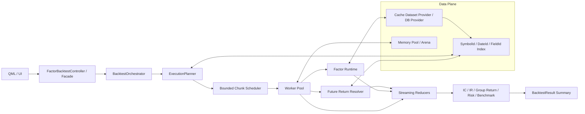

# 因子回测系统级重构 V2

本文面向当前因子回测的性能与结构问题，目标不是继续修补 `FactorBacktestExecutor` 的局部热点，而是把回测引擎改造成可支撑大批量回测的流式系统。

## 1. 现状结论

当前实现的核心问题不是单点慢，而是执行模型本身偏向“全量驻留后再汇总”：

- 因子序列、未来收益序列、分组中间态都先完整保存在内存里。
- 日期并行虽然能提速，但没有严格背压，容易把 chunk、future 和中间结果叠加到高峰值内存。
- 缓存路径和非缓存路径各自保留了多套索引与聚合逻辑，重复构建和重复遍历很多。
- 字符串键、哈希表、vector-of-vector 的组合在 CSI500 级别数据上会放大 allocator 压力。

## 2. V2 目标

V2 的目标是把回测管线改成“切片输入、在线聚合、摘要先出、明细按需落盘”的结构：

- 计算阶段只处理一个日期块或一个 symbol 块，不保留整段结果集。
- IC、IR、分组收益、多空曲线、风控统计都使用 streaming reducer。
- 调度层强制有界 in-flight，避免任务和结果同时膨胀。
- 数据层统一成紧凑索引，优先使用整数 ID 和列式/半列式结构。

## 3. 目标架构图

## 4. 执行链重构

### 4.1 现在的链

`FactorBacktestExecutor` 当前承担了太多角色：

- 构建市场上下文
- 计算因子序列
- 计算未来收益序列
- 计算 IC/IR
- 计算分组回测
- 计算风控和基准对比
- 组织进度、缓存和取消

这会导致任何一段的中间态都难以快速释放。

### 4.2 V2 的链

建议拆成四层：

1. Orchestrator
   - 负责任务生命周期、取消、进度、错误收口。
2. Planner
   - 负责把日期范围、股票池、因子参数转成可执行计划。
3. Chunk Executor
   - 负责在有界并发下计算一个切片，不保存不必要的全量结果。
4. Reducer
   - 负责在线汇总指标，直接产出摘要和轻量明细。

## 5. 关键设计原则

### 5.1 不再保存全量因子和收益结果

当前最重的结构就是 `factorResults` 和 `returnResults` 先完整驻留，再交给聚合器做二次扫描。V2 中应改成：

- 因子结果一到就进入 reducer。
- 未来收益一到就进入同一个日期级 reducer。
- 分组状态只保留当前 rebalance 窗口所需的活跃持仓。

### 5.2 取消字符串主索引

将下面几类字符串驱动结构尽量替换掉：

- `tradeDate -> symbol` 的嵌套 map
- `symbol -> close series` 的多层字符串索引
- 每次聚合都重新构造的 `matchedValues` 和 `rankedValues`

替代方案是：

- `DateId`、`SymbolId`、`FieldId` 的整数索引表
- 行级数据使用连续数组或列式块
- 持仓和分组状态使用 ID 切片而不是字符串集合

### 5.3 调度必须有背压

日期并行不能无限提交任务，也不能在任务内部再无界派生子任务。推荐策略：

- 每次只允许固定数量的 chunk in-flight。
- worker 可以保留线程池工作权，不要全部阻塞等待。
- 当 reducer 落后时，停止继续喂入新的 chunk。

### 5.4 摘要与明细分离

摘要指标直接在线计算；如果用户需要完整分组明细或日期明细，再单独写入轻量结果集或临时文件。

## 6. 与现有实现的映射

建议把当前 `FactorBacktestExecutor.cpp` 的职责拆分为下面几个组件：

- `BacktestOrchestrator`
  - 对应当前 `executeInternal` 的外层生命周期管理。
- `MarketContextPlanner`
  - 对应当前 `prepareExecutionMarketContext` 和 `prepareCachedExecutionMarketContext`。
- `ChunkFactorEngine`
  - 对应当前 `calculateFactorSeries` 的核心计算。
- `ChunkReturnEngine`
  - 对应当前 `calculateReturnSeries` 的未来收益计算。
- `StreamingBacktestReducer`
  - 对应当前 `aggregateNonCachedBacktestResults`、IC/IR 汇总、分组聚合和 benchmark 对齐。

## 7. 推荐迁移顺序

1. 先把非缓存路径改成流式 reducer，停止保存 `factorResults` / `returnResults` 全量副本。
2. 把日期并行改为有界 chunk 调度，限制 in-flight 数量。
3. 把 cached market index 和 future return lookup 改成更紧凑的 ID/数组索引。
4. 把摘要指标与明细输出拆开，避免所有结果都走同一个大对象。
5. 最后再做更激进的列式化和内存池优化。

## 8. 最小验收标准

V2 重构至少要满足下面三条：

- CSI500 日线加财务数据下，2 个因子可以稳定完成回测，不出现 bad allocation。
- 峰值内存随因子数和日期数增长近似线性，不再出现任务堆积式膨胀。
- 日期并行开启时，性能提升可控且不会因为调度过度而退化。

## 9. 可扩展性与灵活性

这套系统不能只为“当前这几个因子”和“当前这一个数据源”服务，而要作为一个可扩展的研究平台来设计。

### 9.1 扩展点必须前置设计

建议把下面几类能力都做成显式扩展点，而不是写死在 `FactorBacktestExecutor` 里：

- 数据源扩展：数据库、缓存集、文件切片、对象存储、远程数据服务。
- 因子 runtime 扩展：内置因子、配置型因子、脚本因子、原生插件因子。
- 执行模式扩展：单因子、因子组批量、单日快照、全市场扫描、增量重跑。
- 指标扩展：IC/IR、分组收益、胜率、回撤、换手、容量、暴露、行业中性指标。
- 输出扩展：内存摘要、明细表、Parquet/CSV、数据库结果表、报告文件。

### 9.2 配置必须分层

不要把所有参数都堆进一个巨大配置对象。建议拆成四层：

- UniverseConfig：决定“跑哪些股票、哪些市场、哪些交易日”。
- ExecutionConfig：决定“怎么并行、怎么切块、怎么限制内存”。
- MetricConfig：决定“算哪些指标、哪些明细要保留”。
- OutputConfig：决定“结果写到哪里、保留多久、是否异步落盘”。

这样做的好处是：

- 不同用户可以复用同一个执行引擎，但选择不同的 universe 和输出方式。
- 低延迟模式和高吞吐模式可以共用同一套核心代码，只切换配置。
- 后续接入新市场、新因子、新报告时，不需要改主流程。

### 9.3 架构要支持“局部替换”

全盘性考虑的关键不是“把所有东西都做完”，而是让每个模块都能被局部替换。

建议保证以下替换不会牵连整个系统：

- 可以单独替换未来收益计算器，而不改因子 runtime。
- 可以单独替换缓存索引结构，而不改指标 reducer。
- 可以单独替换数据提供器，而不改执行调度器。
- 可以单独替换结果输出器，而不改核心计算逻辑。

### 9.4 资源策略要可配置

全市场回测的稳定性，最终取决于资源策略，而不是单一算法。

建议把下面策略纳入可配置项：

- 最大 in-flight chunk 数。
- 每个 chunk 的目标日期数或 symbol 数。
- 结果缓存上限。
- 明细保留阈值。
- 是否允许降级为摘要模式。
- 是否允许长任务中断并断点续跑。

### 9.5 结果模型要能适配未来需求

不要把结果对象绑定成“现在页面上要展示什么就存什么”。更稳妥的做法是：

- 先定义稳定的核心摘要字段。
- 再定义可选扩展字段集合。
- 明细和报告以附加数据集形式存在。

这样未来你要加行业中性、风格暴露、容量约束、换手分解、分层回测、因子组合回测，都不需要推翻结果模型。

### 9.6 全盘思维下的优先级

如果按系统级优先级排序，应该是：

1. 先把执行模型改成流式和有背压。
2. 再把数据表示改成紧凑索引和分区加载。
3. 再把指标、输出和缓存做成可插拔。
4. 最后再追求极致性能，例如列式内存、内存池、SIMD、分布式执行。

这意味着我们不是只优化某个函数，而是在搭一个可以持续扩展的回测平台。
