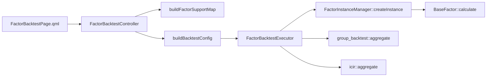
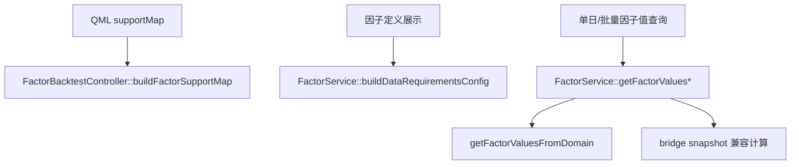
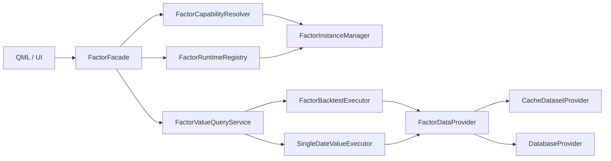

# 因子回测统一架构设计

本文基于当前真实代码梳理，不做假设路径。核心证据来自以下实现：

- `src/app/Qml/components/FactorWorkbench/Backtest/FactorBacktestPage.qml`
- `src/ui/bridge/src/FactorBacktestController.cpp`
- `src/ui/bridge/src/FactorService.cpp`
- `src/domain/factor/src/FactorBacktestExecutor.cpp`
- `src/domain/factor/src/ConfigurableFactor.cpp`

## 1. 当前真实执行链

### 1.1 主回测链

这条链已经是相对统一的 C++ domain runtime：

- 支持 cache dataset 与 database 两种数据源。
- 通过 `ThreadPoolExecutor` 做异步执行与进度跟踪。
- 真正的因子计算落在 `BaseFactor` 子类或 `ConfigurableFactor` runtime。

### 1.2 当前分叉链

当前不是只有一套事实来源，而是至少有四套职责重叠的判断：

- `FactorBacktestController::buildFactorSupportMap()` 定义“这个因子现在能不能跑”。
- `FactorService::buildDataRequirementsConfig()` 定义“这个因子需要哪些字段和表”。
- `FactorService::getFactorValues()/getFactorValuesBatch()` 定义“如果 domain 失败还能不能改走另一套桥接计算”。
- QML 自己缓存 `factorSupportMapCache`，导致刷新时机也会影响可选性。

## 2. 已确认的问题根因

### 2.1 单因子结果看起来相似的根因

不是 `FactorBacktestExecutor` 把多个因子混算了，而是不同入口可能走了不同计算链：

- 回测主链走 domain runtime。
- 展示/查询链此前在 domain 失败后会回退到 `FactorService` 内部桥接实现。
- 桥接实现里还保留了 `dividend`、`macro_sector`、`sentiment` 的代理计算。

这会造成同一个因子：

- 选择时一套支持判断。
- 回测时一套 runtime 逻辑。
- 页面取值或批量查询时又一套桥接逻辑。

### 2.2 为什么“选的时候能选，跑的时候报缺字段”

根因也不是单点，而是两层不一致叠加：

- `FactorService::buildDataRequirementsConfig()` 之前把 `dividend`、`sentiment` 的 `requiredFields` 放宽成了代理字段也算支持。
- `FactorBacktestPage.qml` 的 supportMap 刷新时机不够硬，数据集切换后可能沿用旧判断。

## 3. 本次已落地修复

### 3.1 运行时侧

- `ConfigurableFactor.cpp`
  - 禁止 `dividend` 使用估值/盈利能力代理。
  - 禁止 `macro_sector` 使用行业轮动代理。
  - 禁止 `sentiment` 使用市场宽度代理。

### 3.2 支持性定义侧

- `FactorService.cpp`
  - 收紧 `buildDataRequirementsConfig()`。
  - `dividend` 只认真实红利字段。
  - `sentiment` 只认真实情绪字段和真实表。

### 3.3 QML 页面侧

- `FactorBacktestPage.qml`
  - 数据集变化时强制刷新 `supportMap`。
  - 打开因子选择器前强制刷新 `supportMap`。
  - 开始回测前强制刷新 `supportMap`。

### 3.4 最关键的架构收口

- `FactorService.cpp`
  - 只要某因子已经能解析到 domain instance，就不再允许 domain 失败后回退到 bridge snapshot 计算。
  - `dividend`、`macro_sector`、`sentiment` 三个桥接代理分支已改为硬错误，不再允许任何旧入口继续代理计算。

## 4. 目标统一架构

目标不是继续在 bridge 上打补丁，而是把“能力判断、字段需求、执行入口”全部统一到 domain runtime。

### 4.1 单一事实来源

应该收敛成三类统一组件：

- `FactorCapabilityResolver`
  - 统一回答：某个实例在当前数据源、字段集、时间窗口下是否可执行。
- `FactorRuntimeRegistry` / `FactorInstanceManager`
  - 统一回答：某个实例的 runtime 类型、参数、字段需求是什么。
- `FactorDataProvider`
  - 统一回答：cache dataset 和 database 如何以同一接口给 runtime 提供截面、时序和元数据。

### 4.2 UI 与 bridge 只做编排，不再做计算

`FactorBacktestController` 和 `FactorService` 未来应只保留：

- 参数解析
- 异步任务编排
- 结果映射
- 错误上抛

不应再保留第二套因子计算规则。

### 4.3 C++ 抽象与并发的正确使用方式

当前已经有可复用基础：

- `ThreadPoolExecutor`
- `FactorBacktestExecutor`
- `FactorInstanceManager`
- `CachedRowFactorDataProvider`

下一步不是再加更多 if/else，而是复用这些抽象扩成两个统一执行器：

- `BacktestExecutor`
  - 负责区间回测、分组收益、IC/IR。
- `SnapshotValueExecutor`
  - 负责单日或多日因子值查询。

二者共享同一套 runtime 和 provider，不再允许 bridge 自己重算。

## 5. 推荐迁移顺序

### 阶段一：立即止血

- 已完成：切断 runtime 成功注册后的 bridge fallback。
- 已完成：移除三类代理桥接分支。

### 阶段二：统一能力解析

- 把 `buildFactorSupportMap()` 与 `buildDataRequirementsConfig()` 依赖的字段需求统一改成读取 runtime requirement。
- 让 QML 只消费一个 resolver 输出，不再自己拼判断。

### 阶段三：删除 bridge 计算器

- 把 `FactorService::getFactorValues*()` 剩余 bridge 计算分支迁移为 domain snapshot executor。
- `FactorService` 仅负责调用统一 executor，并返回序列化结果。

## 6. 结论

当前系统里最合理、最通用、最接近“单一清晰系统”的部分，其实已经是 `FactorBacktestExecutor + FactorInstanceManager + BaseFactor runtime` 这条 domain 链。问题不在于没有 runtime，而在于历史 bridge/service 还保留了第二套乃至第三套事实来源。

所以正确方向不是再扩 bridge 兼容，而是继续把 support、requirements、single-date query 全部收回 domain runtime。

## 7. 补充规则

1. 不允许使用 QString 做类型判断，QString 仅允许用于调试输出。
2. QVariantMap 仅允许作为 QML 输入参数和返回到 QML 的输出载荷，桥接输出对象名统一为 StrategyManage。