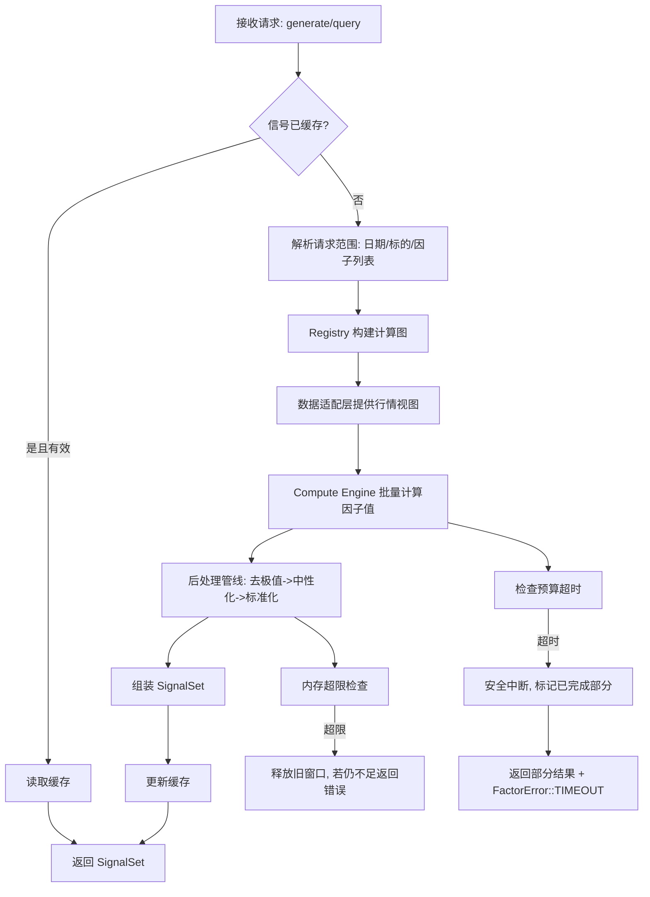
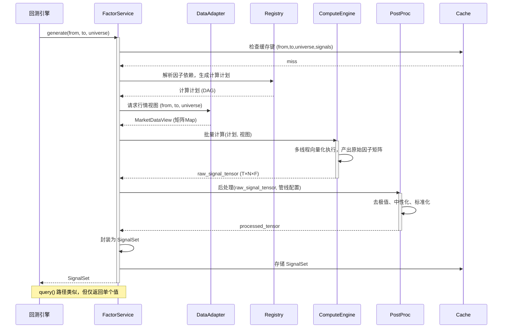

# 因子服务详细设计文档

## 1. 引言

### 1.1 目标

本文档详细描述因子服务的内部架构、工作流程、外部交互与功能模块，确保其作为统一回测平台的可替换 SignalEngine 插件，在 10 分钟内完成全市场 5 年日频因子的计算、后处理与输出。

### 1.2 范围

- 因子服务从标准化行情数据产生 SignalSet 的全过程。
- 涵盖因子注册、计算、后处理、缓存、查询、评估与错误治理。
- 不包括回测主链（组合构建、执行、撮合）。

### 1.3 设计原则

- 无 Qt：仅依赖 C++17 标准库、Eigen、Arrow、Taskflow 等高性能库。
- 强类型合同：所有标识、错误码、数据容器均使用 enum class 和值对象。
- 零未来信息：内置时间戳校验，确保时刻 t 的信号仅使用 <=t 的数据。
- 确定性并行：多线程计算结果位精确可复现。
- 硬预算控制：超时/超内存立即中断，返回部分结果和错误码。

---

## 2. 总体架构

因子服务内部模块划分如下：

```
┌──────────────────────────────────────────────────────────┐
│                    FactorService (实现 SignalEngine)      │
│                                                          │
│  ┌─────────────┐   ┌─────────────┐   ┌───────────────┐  │
│  │ 因子注册器    │   │ 计算引擎     │   │ 后处理管线     │  │
│  │ Registry    │   │ Compute     │   │ PostProc     │  │
│  └──────┬──────┘   └──────┬──────┘   └──────┬────────┘  │
│         │                │                   │           │
│  ┌──────┴────────────────┴───────────────────┴────────┐  │
│  │                    数据适配层 (Data Adapter)        │  │
│  │         行情视图 MarketDataView (零拷贝列式矩阵)    │  │
│  └────────────────────────────────────────────────────┘  │
│  ┌────────────────────────────────────────────────────┐  │
│  │              缓存 & 存储 (Cache & Storage)          │  │
│  └────────────────────────────────────────────────────┘  │
│  ┌────────────────────────────────────────────────────┐  │
│  │              分析模块 (Analysis)  [可选]            │  │
│  └────────────────────────────────────────────────────┘  │
└──────────────────────────────────────────────────────────┘
```

- Registry：管理因子定义、依赖图、编译后的计算公式。
- Compute Engine：向量化批量计算因子值，支持二维并行。
- PostProc：去极值、中性化、标准化等可配置管线。
- Data Adapter：适配外部 MarketDataView，提供统一的内存访问。
- Cache & Storage：管理预计算的 T×N×F 因子矩阵，支持持久化。
- Analysis：可选内置因子绩效评估（IC、分层回测等）。

---

## 3. 核心流程图（因子服务内部）



关键步骤说明：

- 缓存检查：按 (日期范围, 标的集合, 因子集合) 组合键查询，若命中则直接返回。
- 构建计算图：Registry 将请求的因子及其依赖展开为 DAG，按拓扑顺序执行。
- 批量计算：Compute Engine 利用 Eigen 对每个因子执行时间窗口上的向量化操作，日期和标的双重并行。
- 后处理：顺序执行用户配置的管线步骤，每个步骤都是对 Eigen::Tensor 的向量化操作。
- 预算闸门：每个阶段启动前和完成后检查 RuntimeBudget，超过则立即停止并返回。
- 内存控制：计算前预估所需内存，不足时尝试清理过期缓存，仍不足则报错。

---

## 4. 时序图（与外部组件交互）



### 4.1 基于时序图的功能详细划分

按照时序图，因子服务在当前设计下拆分为以下明确职责单元：

1. 请求协调器（FactorService / SignalEngineFacade）

- 作为唯一入口，接收 generate 和 query 请求。
- 负责参数校验、预算闸门、阶段调度、错误汇总和结果返回。
- 不直接承载具体算法实现，只负责编排各子模块。

2. 缓存门面（SignalCache / CacheFacade）

- 负责缓存键构造、命中判定、有效期校验和写回策略。
- 必须支持按日期范围、标的集合、因子集合精确索引。
- 必须与计算流程解耦，禁止在计算引擎内部散落缓存逻辑。

3. 计划构建器（Registry / ComputePlanBuilder）

- 负责解析因子定义、展开依赖、生成 DAG 和拓扑执行顺序。
- 负责检查循环依赖、字段依赖缺失、参数绑定错误。
- 输出统一 ComputePlan，供后续计算阶段直接消费。

4. 数据视图提供器（DataAdapter / MarketDataViewFactory）

- 负责把底层列式行情数据封装成只读视图。
- 负责时间窗口裁剪、标的过滤、字段可用性验证。
- 只暴露当前请求需要的数据窗口，禁止把全量原始源直接泄漏到上层。

5. 计算调度器（ComputeEngine / ComputeScheduler）

- 负责根据 ComputePlan 切分任务块并执行二维并行。
- 负责调用具体因子算子实现，产出原始因子矩阵或张量。
- 负责在每个任务边界检查预算、处理中断并保留已完成部分。

6. 后处理管线（PostProcessingPipeline）

- 负责按配置顺序执行去极值、缺失值处理、中性化、标准化、正交化。
- 每个处理步骤必须是独立策略对象，可插拔替换。
- 后处理与原始计算解耦，禁止将后处理硬编码进单个因子实现。

7. 信号装配器（SignalSetAssembler）

- 负责把处理后的张量装配为统一 SignalSet 合同。
- 负责填充 dates、insts、signals、values、mask 和 is_partial。
- 负责保证输出结构稳定，不把内部存储细节暴露给调用方。

8. 分析扩展器（AnalysisModule）

- 负责 IC、分层收益、换手率等研究型附加分析。
- 只消费 SignalSet 和行情事实，不参与主生成链的调度决策。
- 必须与主链解耦，分析失败不得污染主生成结果。

### 4.2 当前设计的强制实现要求

1. 禁止使用 Qt

- 因子服务、数据适配层、计算引擎、后处理管线、缓存、分析模块全部禁止依赖 Qt。
- 禁止出现 QString、QVariant、QDate、QObject、信号槽和任何 Qt 容器。
- 如果外部边界存在 Qt，必须在桥接层完成一次性转换，Qt 类型不得进入当前设计内部。

2. 必须使用纯 C++ 封装

- 当前设计内部实现必须使用 C++ 类型系统、RAII、值对象和明确的生命周期管理。
- 公开合同必须是 typed-only 合同，不能以字符串、动态 map 或脚本对象承载核心语义。
- 错误、模式、阶段、字段、频率等必须使用 enum class 或强类型值对象表达。

3. 必须使用抽象、多态、可替换边界

- FactorService 只依赖抽象接口，不直接依赖具体存储、具体算子库、具体缓存实现。
- Registry、DataAdapter、ComputeEngine、PostProcessingPipeline、SignalCache、AnalysisModule 都必须定义独立接口。
- 可变行为必须通过接口多态、策略模式、工厂模式或组合对象替换，禁止把差异逻辑硬编码进主流程。

4. 模板和开源库必须封装在内部边界后使用

- Eigen、Arrow、Taskflow 等开源库可以使用，但只能服务于当前设计目标：列式访问、向量化计算、并行调度、零拷贝视图。
- 开源库类型不得无约束泄漏到高层业务合同；需要通过内部适配层或值对象收口。
- 模板库引入必须以性能、内存效率、批量吞吐和可替换性为前提，禁止为语法便利引入无边界耦合。

5. 主流程必须保持编排层与算法层分离

- FactorService 负责阶段编排，不直接实现具体因子公式、后处理公式和缓存淘汰算法。
- ComputeEngine 负责算子执行，不负责缓存、错误展示和外部协议。
- PostProcessingPipeline 只负责处理步骤编排和执行，不负责数据加载和请求解析。

6. 实现目标必须服从当前设计而不是反过来修改当前设计

- 模板库、第三方库、工具库的选型和封装方式必须服从当前文档的模块边界。
- 若某个库无法满足 typed-only、无 Qt、可替换、批量并行和预算可控要求，应替换库或增加适配层，不能为了迁就库而破坏当前设计。

7. 因子服务实现禁止跑偏

- 所有实现、重构与优化必须严格限定在因子服务范围内：Registry、DataAdapter、ComputeEngine、PostProcessingPipeline、SignalCache、SignalSetAssembler、AnalysisModule。
- 未经明确指令，禁止扩展到策略域、执行域、UI 域或其他与因子服务主链无关的模块。
- 任何新增命名、类型、接口和文件必须服务于因子服务主链职责，不允许引入跨域语义混用或边界漂移。

8. 测试必须服从源码语义，禁止为过测改源码

- 禁止为了通过测试而修改因子服务源码语义、放宽边界、增加兼容回退或注入测试专用分支。
- 正确顺序必须是：先按文档和合同实现正确源码，再基于真实源码语义编写或修正测试。
- 若测试与源码冲突，优先修测试和测试夹具；仅当确认源码违背文档合同时，才允许修源码。

### 4.3 核心编排接口（当前设计约束）

SignalEngine 对外合同：

```cpp
class ISignalEngine {
public:
    virtual ~ISignalEngine() = default;

    virtual std::expected<SignalSet, FactorError>
    generate(const GenerateSpec& spec) = 0;

    virtual std::expected<SignalValue, FactorError>
    query(const QuerySpec& spec) const = 0;
};
```

SignalSet 装配边界（从 FactorService 中显式分离）：

```cpp
class ISignalSetAssembler {
public:
    virtual ~ISignalSetAssembler() = default;

    virtual SignalSet assemble(const ProcessedTensorView& tensor,
                               const AssembleContext& context) const = 0;
};
```

约束：

- FactorService 只负责阶段编排和错误治理，不直接组装 SignalSet。
- SignalSetAssembler 负责维度映射、掩码映射、partial 标志和索引布局。

---

## 5. 功能模块详细设计

### 5.1 因子注册器 (Registry)

职责：

- 管理所有因子定义，包括公式、参数、依赖、频率。
- 解析因子间的依赖关系，生成无循环的有向无环图 (DAG)。
- 提供编译期的公式验证和运行时参数绑定。

接口：

```cpp
struct FactorName final { uint32_t value; };
struct FormulaExpr final { FormulaProgram program; };
struct FieldKey final { uint32_t value; };
using FactorComputeFunc = std::function<Eigen::MatrixXd(const MarketDataView&)>;

class FactorRegistry {
public:
    // 注册一个因子
    FactorId register_formula(FactorName name,
                              FormulaExpr expression,
                              Frequency freq,
                              std::vector<FieldKey> required_fields);

    FactorId register_custom(FactorName name,
                             FactorComputeFunc func,
                             Frequency freq,
                             std::vector<FieldKey> required_fields);

    // 构建计算计划
    std::expected<ComputePlan, FactorError>
    build_plan(const std::vector<FactorId>& requested,
               DateKey from,
               DateKey to,
               const std::vector<InstrumentId>& universe) const;
};
```

说明：

- 字符串仅允许在桥接层解析为 FactorName / FormulaExpr / FieldKey，注册器内部不接收业务字符串。
- `build_plan` 在以下场景返回错误：空 universe 返回 `FactorError::INVALID_UNIVERSE`；请求字段缺失返回 `FactorError::INSUFFICIENT_DATA`。

内部数据结构：

- FactorDef：包含 id、表达式 AST/函数对象、所需数据字段。
- 全局 DAG（邻接表），用于拓扑排序和增量失效。

约束：

- 注册时即校验表达式合法性，失败返回 FactorError::INVALID_FORMULA。
- 检测循环依赖，存在则拒绝注册。

### 5.2 数据适配层 (Data Adapter)

职责：

- 将外部行情数据（Arrow/Parquet 内存映射）包装为统一的 MarketDataView 接口，供 Compute Engine 以零拷贝方式读取。
- 处理时间对齐和标的过滤，只暴露请求的日期范围和标的集合。

核心类型：

```cpp
class MarketDataView {
public:
    virtual Eigen::Map<Eigen::MatrixXd> open() const = 0;
    virtual Eigen::Map<Eigen::MatrixXd> high() const = 0;
    virtual Eigen::Map<Eigen::MatrixXd> low() const = 0;
    virtual Eigen::Map<Eigen::MatrixXd> close() const = 0;
    virtual Eigen::Map<Eigen::MatrixXd> volume() const = 0;

    // 返回时间索引和标的索引映射
    virtual const std::vector<DateKey>& dates() const = 0;
    virtual const std::vector<InstrumentId>& instruments() const = 0;
};
```

实现：

- ParquetMarketDataView：从 Parquet 文件内存映射，按列访问。
- SubView：对原视图进行时间/标的切片，返回新的 Map，不拷贝数据。

### 5.3 计算引擎 (Compute Engine)

职责：

- 根据 ComputePlan 执行批量因子计算，输出 T×N×F 的三维原始因子值（Eigen::Tensor<double,3> 或等价结构）。
- 利用多线程并行（Taskflow 或 OpenMP），同时保证结果可复现（按标的归并）。
- 通过独立算子库调用常用时间序列算子（lag, rolling_sum, rolling_mean, rank, groupby, winsorize, zscore），全部向量化。

算子边界约束：

- ComputeEngine 只负责调度与任务编排，不直接实现算子细节。
- 算子实现必须放在 `IFactorOperatorLibrary` 抽象之后，由具体实现注入。

接口：

```cpp
class IFactorOperatorLibrary {
public:
    virtual ~IFactorOperatorLibrary() = default;
    virtual MatrixView lag(MatrixView x, int window) const = 0;
    virtual MatrixView rolling_mean(MatrixView x, int window) const = 0;
    virtual MatrixView rolling_sum(MatrixView x, int window) const = 0;
    virtual MatrixView rank(MatrixView x) const = 0;
    virtual MatrixView groupby(MatrixView x, GroupKeyView g) const = 0;
};
```

计算流程：

1. 解析计划为一系列可并行的任务节点。
2. 对每个任务节点（一个因子），启动线程池并行处理日期块和标的块。
3. 每个线程块内使用 Eigen 矩阵表达式完成计算，无动态分配。
4. 所有节点完成，组装原始信号张量。

性能保障：

- 使用 Eigen 的 Eigen::ThreadPoolDevice 或多线程并行循环。
- 临时矩阵复用预分配池，避免 new/delete。
- 单一因子计算若包含窗口操作，用 Eigen::Map 滚动视图代替拷贝子矩阵。

确定性并行归约协议（强制）：

- 分块顺序固定：先按日期块排序，再按标的块排序。
- 归约顺序固定：同一输出单元总是按递增 instrument index 归并。
- 浮点归约统一使用 double 并采用固定二叉树归约拓扑，禁止运行期动态改变归约顺序。
- 任一并行实现必须保证相同输入、相同版本、相同线程配置下输出位级可复现。

### 5.4 后处理管线 (PostProc)

职责：

- 对原始因子值序列执行可配置的标准化步骤，生成最终 SignalSet 中的信号值。

管线步骤（可自由组合）：

1. 去极值：MAD 法或分位数截尾。
2. 缺失值填充：前值填充、行业均值填充、0 填充，同时记录掩码。
3. 中性化：对行业、市值等做线性回归残差。
4. 标准化：Z-score（截面）、rank 百分比。
5. 正交化：如施密特正交，排除相关性。

接口：

```cpp
class PostProcessingPipeline {
public:
    void add_step(std::unique_ptr<ProcessingStep> step);
    Eigen::Tensor<double,3> execute(Eigen::Tensor<double,3> raw,
                                    const MarketDataView& view) const;
};

class ProcessingStep {
public:
    virtual Eigen::Tensor<double,3> apply(Eigen::Tensor<double,3> data,
                                          const MarketDataView& view) = 0;
};
```

每个步骤实现为一个类，全部以向量化方式操作，不涉及逐标的 Python 循环。

### 5.5 缓存与存储 (Cache & Storage)

职责：

- 缓存最近计算过的 SignalSet，加速重复请求。
- 支持将预计算的因子矩阵持久化为 Parquet 文件，下次启动直接加载，跳过计算。

缓存策略：

- 键：(DateRange, InstrumentSet, FactorSet) 的哈希。
- 值：shared_ptr<SignalSet>，带时间戳。
- 淘汰策略：LRU + 最大内存容量限制（如物理内存的 40%）。

缓存键规范化约束：

- InstrumentSet 和 FactorSet 在构造键前必须按稳定顺序排序并去重。
- 语义等价但输入顺序不同的请求必须落到同一缓存键，避免重复缓存。

持久化：

- 在回测开始前，用户可以要求预计算并保存到指定路径。
- 后续 FactorService 初始化时可以指定加载路径，跳过 Compute 阶段。

### 5.6 分析模块 (Analysis) [可选]

职责：

- 基于 SignalSet 和行情数据，计算因子评价指标，供研究人员使用。
- 不阻塞主回测流程，可按需调用。

功能：

- ICSeries compute_ic(SignalId, DateRange, universe, forward_period)
- LayerReturns compute_layer_returns(SignalId, DateRange, universe, n_buckets)
- Turnover compute_turnover(SignalId, DateRange, universe)

所有函数返回结构化的分析结果对象，不直接生成图片或报告文本。

---

## 6. 性能与资源管理

### 6.1 预算执行

- FactorService 在接收到 generate() 请求时读取 RuntimeBudget。
- 在每个阶段（计算、后处理）前后调用 check_budget()，超支则停止并返回 FactorError::TIMEOUT 和已完成部分的结果。
- 预算消耗主要包括：数据加载、因子计算、后处理。缓存命中时不耗计算时间。

### 6.2 内存控制

- 通过配置 max_cache_memory 限制缓存上限。
- 预估计算所需临时内存，若超过系统可用内存的 80%，拒绝请求并返回 FactorError::MEMORY_EXCEEDED。
- 大型矩阵使用 Eigen::Matrix 列连续内存，分配时指定对齐，释放后立即归还。

内存预估公式（基线）：

- `base_bytes = T * N * F * sizeof(double)`。
- `mask_bytes = T * N * F * sizeof(uint8_t)`。
- `temp_bytes = base_bytes * temp_buffer_ratio`，其中 `temp_buffer_ratio` 默认 0.5，可配置。
- `estimated_total = base_bytes + mask_bytes + temp_bytes + operator_workspace_bytes`。
- 若 `estimated_total > available_memory * 0.8`，立即返回 `FactorError::MEMORY_EXCEEDED`。

### 6.3 并行策略

- 因子级并行：独立的因子或 DAG 中无依赖的节点并行执行。
- 数据级并行：每个因子计算内部，先切日期块，再在日期块内切标的块，分配到线程池。
- 使用 Taskflow 编排任务依赖，避免显式锁，数据竞争通过分块归约避免。

分块策略约束：

- 日期块优先，保障时间窗口算子复用和缓存局部性。
- 标的块次级切分，块大小按 `L2_cache_bytes / (field_count * sizeof(double))` 估算并向下对齐到 SIMD 友好边界。
- 块大小必须是可配置项，并在运行日志中记录实际切分参数。

---

## 7. 错误处理与合约

错误码枚举：

```cpp
enum class FactorError {
    NONE = 0,
    INVALID_FORMULA,
    CIRCULAR_DEPENDENCY,
    INVALID_UNIVERSE,
    INSUFFICIENT_DATA,
    TIMEOUT,
    MEMORY_EXCEEDED,
    INTERNAL_ERROR
};
```

错误传播：

- 所有公开接口返回 std::expected<Result, FactorError> (C++23) 或自定义 Result<Value, Error> 类型。
- 内部异常（如 bad_alloc）在服务边界捕获，转换为 FactorError::INTERNAL_ERROR。

部分结果：

- 超时或中断时，返回的 SignalSet 中 dates 数组仅包含已完成的时间点，并附带标志 is_partial = true。

构建计划阶段错误映射：

- universe 为空或存在非法标的时，返回 `FactorError::INVALID_UNIVERSE`。
- 依赖字段在请求窗口内不可用时，返回 `FactorError::INSUFFICIENT_DATA`。
- 公式编译失败时，返回 `FactorError::INVALID_FORMULA`。
- 检测到环依赖时，返回 `FactorError::CIRCULAR_DEPENDENCY`。

---

## 8. 附录：关键数据结构

### SignalSet

```cpp
struct SignalSet {
    std::vector<DateKey> dates;          // 时间维度
    std::vector<InstrumentId> insts;     // 标的维度
    std::vector<SignalId> signals;       // 信号维度（因子ID）

    struct IndexMap final {
        int time_stride;
        int inst_stride;
        int signal_stride;
    } index;

    // 三维数组，逻辑索引为 [time][inst][signal]
    // 采用平展布局，由 IndexMap 提供 strides
    Eigen::ArrayXd values;

    Eigen::Array<bool, Eigen::Dynamic, 1> mask; // 缺失标记，同形平展

    bool is_partial = false; // 是否是部分结果

    // 辅助访问函数
    double operator()(int t, int i, int s) const;
};
```

### ComputePlan

```cpp
struct ComputePlan {
    using FactorComputeFunc = std::function<Eigen::MatrixXd(const std::vector<Eigen::MatrixXd>&)>;

    struct Node {
        FactorId fid;
        std::vector<FactorId> dependencies;
        FactorComputeFunc func;
    };
    std::vector<Node> nodes; // 已拓扑排序
    DateKey from, to;
    std::vector<InstrumentId> universe;
};
```

---

## 9. 总结

因子服务作为独立、高性能、强类型的信号生成插件，完整覆盖了从数据读取到标准化信号输出的全生命周期。通过严格的模块划分、向量化计算、可控并行和预算管理，能够在统一的回测架构中稳定实现 10 分钟全市场回测的性能目标，同时保持与回测主链的清晰边界。
