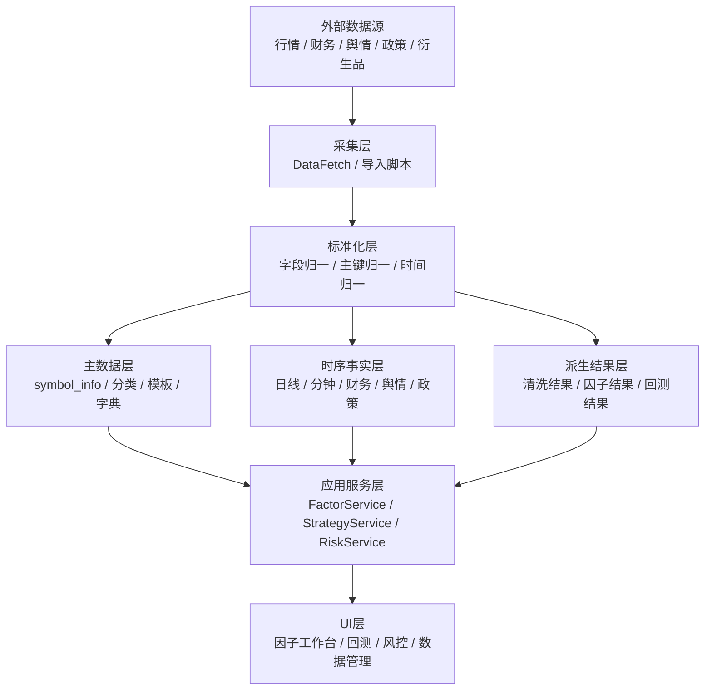
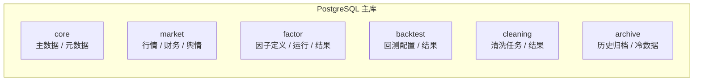
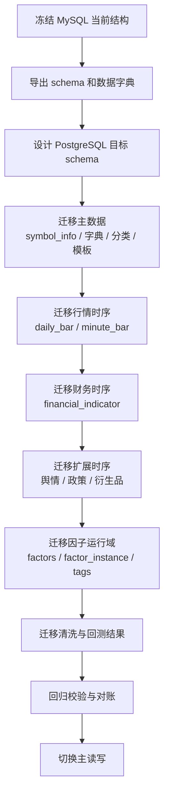

# AStockQuantEngine 数据存储路线图与迁移方案（2026-04-20）

## 1. 目标

当前项目已经完成了因子工作台、回测准备、财务导入、日线导入和部分清洗链路的基础搭建，但数据库侧仍然存在明显的代际混合与职责重叠：

- MySQL 作为现有业务库，已经承载了主业务数据和若干旧代数据模型。
- PostgreSQL 18 已在本机 D 盘安装并运行，但尚未建立业务表。
- 当前代码链路中，已经明确把 `factor_instance.full_config` 作为参数真源，旧的 `factor_params` 快照只适合做历史兼容，不应继续作为主链路。
- `daily_bar` 与 `daily_bar_optimized`、`factor_category` / `factor_template` / `factor_parameter` / `factor_params` 这类表之间存在职责交叉，需要在新数据库方案中收口。

本方案的目标不是“再做一次兼容层”，而是基于当前项目进度，直接设计一套可长期演进、可迁移、可校验、不过度设计但足够实用的数据存储体系。

## 2. 设计原则

1. 不做运行时兼容兜底。
2. 不保留旧字段混用和多真源并存。
3. 不把历史遗留表继续抬升为主链路。
4. 允许迁移窗口期的批处理转换，但不允许产品运行时依赖双轨逻辑。
5. 以“主数据 + 时序数据 + 派生结果 + 兼容视图”四层组织数据。
6. 所有设计必须能支撑当前的因子回测、策略回测、数据清洗和未来风险监控。

## 3. 当前现状诊断

### 3.1 MySQL 现状

当前 MySQL 库 `astock_quant` 中已经存在以下主要数据簇：

- 主数据：`symbol_info`、`exchange_info`、`industry_classification`、`data_source_type`
- 行情时序：`daily_bar`、`daily_bar_optimized`、`weekly_bar`、`monthly_bar`、`minute_bar`、`tick_data`
- 财务时序：`financial_indicator`
- 扩展数据：`news_sentiment`、`policy_data`、`alternative_data`、`derivatives_data`
- 因子元数据：`factors`、`factor_instance`、`factor_tags`、`factor_category`、`factor_template`、`factor_parameter`、`factor_params`
- 回测/清洗结果：`backtest_result`、`backtest_summary`、`cleaning_tasks`、`cleaning_results`、`cleaned_dataset`、`cleaned_dataset_items`
- 其他：`strategy`、`trade_record`、`system_event`、`user_factor` 等

### 3.2 明显冗余或代际混合点

#### 3.2.1 日线层

- `daily_bar`：通用日线主表，使用自然代码 `symbol`。
- `daily_bar_optimized`：优化版日线表，使用 `symbol_id`，字段类型和编码方式已经和 `daily_bar` 分离。
- 相关视图：`v_daily_bar`、`v_daily_bar_compatible`、`v_daily_bar_wide`。

结论：

- 这不是两个完全独立业务域，而是同一行情域的两种物理表达。
- 长期应保留一套主表，另一套只允许在迁移窗口或兼容视图中存在。

#### 3.2.2 因子参数层

- `factor_params`：旧快照式参数表，属于历史产物。
- `factor_parameter`：参数字典表。
- `factor_template`：模板表。
- `factor_category`：因子分类表。

结论：

- 代码当前已把 `factor_instance.full_config` 作为参数真源。
- `factor_params` 不应继续承担主数据职责。
- `factor_parameter`、`factor_template`、`factor_category` 应明确层级：字典、模板、分类，不允许互相覆盖语义。

#### 3.2.3 清洗和回测结果层

- `cleaning_tasks`、`cleaning_results`、`cleaned_dataset`、`cleaned_dataset_items` 当前是流程性和结果性表。
- `backtest_result`、`backtest_summary`、`factor_performance` 当前偏框架型结果表。

结论：

- 这些表不是天然冗余，但必须明确“生成来源”和“保留期限”。
- 结果表要么成为正式审计/分析结果，要么降级为临时流水表，不能长期无边界堆积。

## 4. 目标存储架构

### 4.1 逻辑分层

### 4.2 物理分层

#### 主库（Operational Core）

建议 PostgreSQL 作为未来主库，承接：

- 因子和策略的元数据
- 主业务配置
- 数据源与字典
- 因子实例定义
- 回测配置与结果索引

#### 时序库（Time Series Core）

承接：

- 日线
- 分钟线
- 财务快照
- 舆情快照
- 政策快照
- 衍生市场状态快照

#### 分析结果层（Result/Analytics）

承接：

- 因子分组回测结果
- IC / IR / RankIC / 分层收益曲线
- 策略回测结果摘要
- 清洗任务与清洗结果审计

#### 兼容视图层（Transition Only）

- 只用于迁移窗口。
- 不写入产品代码的核心逻辑。
- 可在未来完全移除。

## 5. 推荐的目标表域

### 5.1 主数据域

- `symbol_info`
- `exchange_info`
- `industry_classification`
- `data_source_type`
- `factor_category`
- `factor_template`
- `factor_parameter`

### 5.2 因子运行域

- `factors`
- `factor_instance`
- `factor_tags`
- `factor_config_version`
- `factor_runtime_snapshot`（建议新增，用于记录一次运行的完整配置快照）

### 5.3 行情与财务域

- `daily_bar`
- `minute_bar`
- `financial_indicator`
- `news_sentiment`
- `policy_data`
- `alternative_data`
- `derivatives_data`
- `index_constituents`

### 5.4 清洗与质量域

- `cleaning_tasks`
- `cleaning_results`
- `data_quality_rule`
- `data_quality_report`
- `data_update_log`

### 5.5 回测域

- `backtest_config`
- `backtest_result`
- `backtest_summary`
- `factor_performance`
- `factor_group_result`
- `factor_icir_result`

## 6. 推荐的 PostgreSQL 目标结构

### 6.1 推荐分 schema

### 6.2 为什么这样分

1. `core` 放不频繁变化的基础字典，方便权限和备份策略统一。
2. `market` 放高频时序数据，方便分区和冷热分离。
3. `factor` 和 `backtest` 放分析型结果，便于按版本和任务追溯。
4. `cleaning` 单独管理数据质量任务，避免和业务结果混写。
5. `archive` 留给长期归档和低频访问，避免主库膨胀。

## 7. 当前迁移方案

### 7.1 总体策略

当前不建议重新建一套完全不同的体系再从网络全量重拉。原因是：

- MySQL 里已经有大量有效数据。
- 现有导入脚本和回测脚本已形成可用链路。
- PostgreSQL 当前还是空库，最适合做一次干净迁移。

因此推荐：

1. 以当前 MySQL 为源。
2. 以 PostgreSQL 为目标主库。
3. 迁移时只做批处理转换，不在业务运行时做兼容兜底。
4. 网络数据只用于补缺和增量更新，不用于重新定义主结构。

### 7.2 迁移顺序

### 7.3 迁移优先级

#### 第一优先级：主数据

- `symbol_info`
- `exchange_info`
- `industry_classification`
- `data_source_type`
- `factor_category`
- `factor_template`
- `factor_parameter`

#### 第二优先级：回测刚需时序

- `daily_bar`
- `financial_indicator`
- `minute_bar`

#### 第三优先级：扩展时序

- `news_sentiment`
- `policy_data`
- `alternative_data`
- `derivatives_data`
- `index_constituents`

#### 第四优先级：结果与审计

- `factor_instance`
- `backtest_config`
- `backtest_result`
- `backtest_summary`
- `cleaning_tasks`
- `cleaning_results`

#### 第五优先级：历史兼容层

- `factor_params`
- `daily_bar_optimized`
- 各类兼容视图

### 7.4 迁移原则

1. 先主后辅。
2. 先真源后缓存。
3. 先结构后数据。
4. 先高价值后低价值。
5. 先可回测后可分析。
6. 迁移窗口内允许批处理转换，不允许产品层多真源并存。

## 8. 当前项目阶段的落地方案

### 8.1 当前阶段目标

当前阶段不追求一次性把所有历史系统重构完，而是确保下面三件事先成立：

1. 回测可稳定读取主行情和财务数据。
2. 因子参数、因子实例、因子结果的真源统一。
3. PostgreSQL 作为未来主库的 schema 先设计好，不再继续扩充 MySQL 冗余结构。

### 8.2 当前阶段建议动作

1. 锁定 PostgreSQL 为新主库目标。
2. 先建立 PostgreSQL 核心 schema，不做业务兼容层。
3. 把 `daily_bar`、`financial_indicator`、`symbol_info` 作为最先迁移的核心表。
4. 把 `factor_instance.full_config` 确认为因子参数唯一真源。
5. 把 `factor_params` 定位为历史兼容，不再作为主写。
6. 设计 `factor_runtime_snapshot`、`backtest_config`、`data_quality_report` 等未来扩展表。

## 9. 推荐的数据模型演进路线

### 9.1 近期（当前迭代）

- 收敛因子参数真源。
- 收敛日线主表职责。
- 补齐财务和回测的最小可用链路。
- 建立 PostgreSQL 空库目标 schema 草案。

### 9.2 中期（1-2 个迭代）

- 完成 MySQL -> PostgreSQL 主数据和行情数据迁移。
- 建立时间分区和常用索引。
- 把清洗和回测结果纳入正式结果域。
- 让 UI 和桥接层改为显式按 schema 读取，而不是按旧表名猜测。

### 9.3 长期（后续升级）

- 构建冷热分层。
- 归档长期历史数据。
- 建立数据质量监控和数据血缘追踪。
- 为风险监控、组合管理、实盘执行预留独立数据域。

## 10. 明确不做的事情

1. 不做“看到字段缺失就自动兜底”的业务逻辑。
2. 不做“新旧字段并存并长期支撑”的双真源设计。
3. 不做运行时同时读写两套主数据的长期兼容。
4. 不把历史表名继续抬升为新架构的永久基座。

## 11. 实施建议

### 11.1 先做文档冻结

先冻结下面三类设计：

- 主数据域定义
- 时序数据域定义
- 结果域定义

### 11.2 再做迁移脚本

后续应配套三类脚本：

- schema 建库脚本
- 数据迁移脚本
- 对账与校验脚本

### 11.3 最后做切换

切换时只做一次主读切换，保留旧库做一段时间的归档和回退检查，但不再作为产品主链路。

## 12. 当前结论

当前系统已经具备做“优秀数据存储方案”的前提：

- 数据源链路已经存在。
- 因子服务和回测准备链路已经存在。
- PostgreSQL 已安装且空库可塑性强。

因此最合适的方案不是继续在 MySQL 上堆兼容，而是：

1. 立即冻结目标存储结构。
2. 以 PostgreSQL 作为新主库设计目标。
3. 以当前 MySQL 作为迁移源和对账源。
4. 以批处理迁移替代运行时兜底。
5. 以分层、分区、真源统一、结果可追溯作为长期原则。

## 13. 实施产物

本次路线图已经拆出两个可直接落地的实施文档和一个 SQL 骨架：

- [PostgreSQL 目标库结构草案](PostgreSQL%E7%9B%AE%E6%A0%87%E5%BA%93%E7%BB%93%E6%9E%84%E8%8D%89%E6%A1%88_2026-04-20.md)
- [MySQL 到 PostgreSQL 迁移执行清单](MySQL%E5%88%B0PostgreSQL%E8%BF%81%E7%A7%BB%E6%89%A7%E8%A1%8C%E6%B8%85%E5%8D%95_2026-04-20.md)
- [PostgreSQL schema draft SQL](../tools/postgresql_schema_draft.sql)

