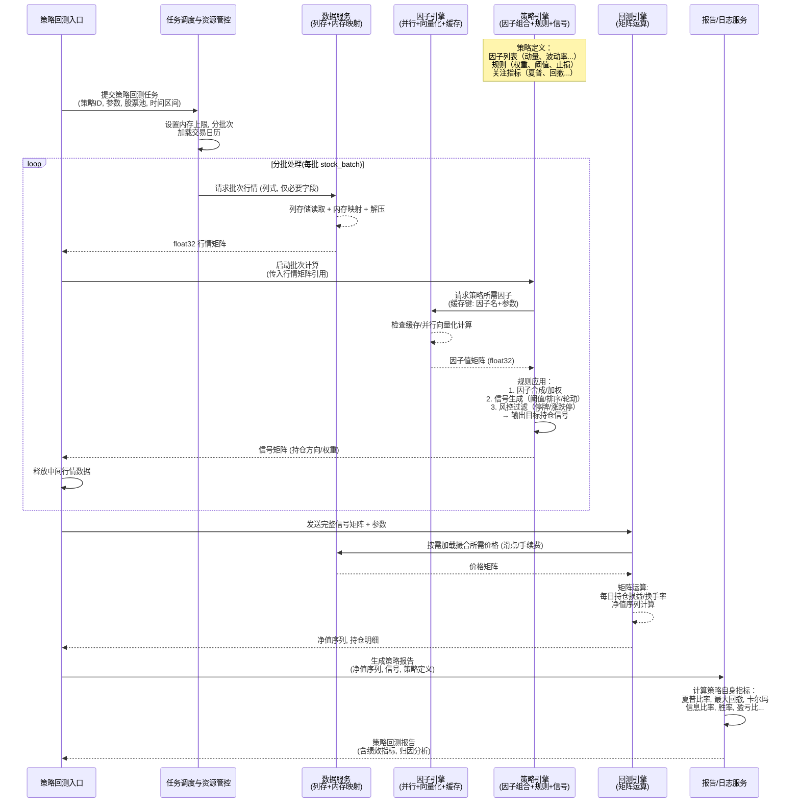

# 策略回测独立细化时序图与代码对齐方案

日期：2026-06-08

---

## 一、策略回测独立细化时序图（目标架构）



### 策略内部组件说明

| 组件 | 说明 | 在时序图中的体现 |
|------|------|------------------|
| **因子组合** | 策略引用的一个或多个因子（如动量+波动率），由因子引擎统一计算并缓存 | `StrategyEngine -> FactorEngine` 请求因子值 |
| **交易规则** | 信号生成逻辑：权重分配、阈值过滤、排序轮动、风控约束等 | `StrategyEngine 内部规则应用步骤` |
| **策略自身指标** | 回测完成后评价策略优劣的指标：夏普、回撤、信息比率等 | `Reporter 计算策略自身指标` |

---

## 二、当前代码现状分析

### 2.1 各模块对照表

| 时序图角色 | 当前代码模块 | 文件路径 | 对齐状态 |
|------------|-------------|---------|---------|
| **StrategyUI** | `StrategyBacktestBridge` (Qt桥接) | `src/ui/bridge/` | ⚠️ 部分对齐 |
| **Scheduler** | `ResourceGovernor` | `src/domain/scheduler/` | ❌ 缺口较大 |
| **DataSvc** | `ParquetMarketDataView` / `CachedMarketDataView` / `SubMarketDataView` | `src/domain/factor/include/factor_compute/` | ✅ 已就绪 |
| **FactorEngine** | `IFactorComputeEngine` / `ISignalEngine` / `FactorComputeEngine` / `BacktestFactorEngine` | `src/domain/factor/` | ✅ 已就绪 |
| **StrategyEngine** | `IStrategySignalEngine` / `DefaultStrategySignalEngine` / `SignalProducers` | `src/domain/strategy/` + `src/application/backtest/` | ❌ 缺口较大 |
| **BacktestEngine** | `MatrixPnLEngine` / `BacktestRuntime` / `StagePipeline` / `BacktestOrchestrator` | `src/domain/backtest/` + `src/application/backtest/` | ⚠️ 部分对齐 |
| **Reporter** | `PerformanceMetricsAggregator` | `src/application/backtest/` | ⚠️ 部分对齐 |

### 2.2 各模块详细现状

#### A. StrategyUI (`StrategyBacktestBridge`)

**已实现：**
- `QVariantMap -> BacktestRequest` 参数转换
- 线程池创建与管理 (`ThreadPoolExecutor`)
- QML信号转发 (`backtestCompleted` / `backtestFailed` / `backtestCancelled`)
- 模块注入链 (`ExistingModuleSlots`)
- 策略引擎解析 (`resolveBacktestModules`)

**未对齐：**
- 没有分批次循环逻辑
- 没有与 `Scheduler (ResourceGovernor)` 集成的批次调度
- 没有中间行情数据释放流程
- 结果返回仅占位 `QVariantMap`，未填充实际指标
- `RunMode::StrategyBacktest` 已定义但 `StrategySignalProducerAdapter` 的实现缺失
- **⚠️ 存在业务代码泄漏风险** — `resolveBacktestModules()` 中直接调用 `strategyBridge->start(strategyId)` 创建运行时引擎，属于策略生命周期业务操作，不应在桥接层执行

---

#### B. Scheduler (任务调度与资源管控)

**已实现：**
- `domain::scheduler::ResourceGovernor`：内存水位检查、降速策略
- `factor::compute::RuntimeBudgetGuard`：阶段时间+内存预算
- `factor::compute::OptimizerTimeoutGuard`：优化器超时治理
- `factor::compute::AsyncDiagnosticsWriter`：异步诊断落盘

**未对齐（gap list）：**
1. **没有交易日历加载** — 时序图中 `Scheduler->Scheduler: 设置内存上限, 分批次加载交易日历`
2. **没有 stock_batch 分批循环** — 时序图中的 `loop 分批处理(每批 stock_batch)` 逻辑完全缺失
3. **没有批次调度接口** — 调度器不存在对 StrategyEngine 的批次调用能力
4. **ResourceGovernor 只做资源检查不做任务调度** — 需要增加批次拆分与调度编排职责

---

#### C. StrategyEngine (策略引擎 -- 因子组合+规则+信号)

**已实现：**
- `domain::strategy::IStrategySignalEngine`：批接口定义，`evaluateBatch(dateRange, universe) -> SignalSet`
- `domain::strategy::DefaultStrategySignalEngine`：**占位实现**，仅构造空 SignalSet 框架
- `application::backtest::StrategySignalProducerAdapter`：声明存在，但 `SignalProducers.cpp` 中无此类的 `generateSignal()` 实现
- `application::backtest::FactorSignalProducerAdapter`：已完成，通过 `ISignalEngine` 或 `IFactorComputeEngine` 生成因子信号

**未对齐（gap list）：**
1. **策略因子组合逻辑完全缺失** — 目标要求 `StrategyEngine->FactorEngine: 请求策略所需因子(缓存键: 因子名+参数)`，实际无此调用链
2. **规则应用逻辑缺失** — 目标：
   - 因子合成/加权
   - 信号生成（阈值/排序/轮动）
   - 风控过滤（停牌/涨跌停）
   - 实际：以上三项均未实现
3. **StrategySignalProducerAdapter 实现缺失** — `SignalProducers.cpp` 只实现了 `FactorSignalProducerAdapter` 和 `MissingStrategySignalProducerAdapter`，`StrategySignalProducerAdapter` 仅声明未实现
4. **DefaultStrategySignalEngine 是占位** — 返回空信号矩阵，无实际计算
5. **策略规则引擎 (IRuleChecker 等) 未接入** — 约束文档要求的规则检查器未与信号生成对接

---

#### D. BacktestEngine (回测引擎 -- 矩阵运算)

**已实现：**
- `domain::backtest::MatrixPnLEngine`：矩阵运算核心已就绪
  - 持仓权重计算 `computePositionMatrix` (信号按行归一化)
  - 日收益率矩阵 `computeDailyReturnMatrix`
  - 每日损益向量 `computeDailyPnL`
  - 滑点/手续费调整
  - 累计损益 `computeCumulativePnL`
  - 换手率 `computeTurnover`
  - 汇总指标 (夏普、最大回撤、年化收益)
- `application::backtest::BacktestRuntime` + `BacktestRunEntry`：运行时入口
- `application::backtest::StagePipeline` / `BacktestOrchestrator`：阶段管线编排
- `domain::backtest::BacktestRequest`：请求合同

**未对齐（gap list）：**
1. **数据服务集成不完整** — 目标：`BacktestEngine->DataSvc: 按需加载撮合所需价格 (滑点/手续费)`，当前 MatrixPnLEngine 通过 PnLSpec 手动传入价格矩阵，需要增加从 DataSvc 按需拉取的能力
2. **RunMode::StrategyBacktest 路径未打通** — 虽然枚举已定义，但 `ModuleRegistryAssembler` 中策略信号生产者未正确装配
3. **信号矩阵到 PnL 引擎的桥接缺失** — StrategyEngine 输出的 SignalSet 如何转换为 MatrixPnLEngine::PnLSpec 的流程未实现

---

#### E. Reporter (报告/日志服务)

**已实现：**
- `application::backtest::PerformanceMetricsAggregator`：
  - 指标字段定义完整 (夏普、回撤、卡尔玛、信息比率、胜率、盈亏比等)
  - 阶段计时统计
  - 实际计算部分依赖外部注入 (`equityCurve_`, `benchmarkCurve_`)

**未对齐（gap list）：**
1. **胜率/盈亏比计算逻辑缺失** — 字段已定义但无对应计算函数
2. **从 MatrixPnLEngine::PnLResult 到 AggregatedPerformanceMetrics 的转换缺失** — 目标：`Reporter->Reporter: 计算策略自身指标`，实际需要 PnLResult 填充指标
3. **归因分析逻辑缺失** — 目标最终输出含归因分析，当前未实现
4. **信息系数(IC)分析链路不完整** — `informationCoefficient` / `rankIC` 等字段未从因子分析结果填充

---

#### F. DataSvc (数据服务)

**已实现：**
- `factor::compute::ParquetMarketDataView`：Parquet 列存读取
- `factor::compute::SubMarketDataView`：日期窗口子视图
- `ui::bridge::CachedMarketDataView`：缓存封装
- `factor::compute::IMarketDataView`：统一接口
- 列式存储 + 内存映射能力已就绪

**未对齐：**
- 基本就绪，`仅必要字段` 加载策略需在调用方约束

---

#### G. FactorEngine (因子引擎)

**已实现：**
- `factor::compute::IFactorComputeEngine` / `ISignalEngine`
- `factor::compute::FactorComputeEngine` / `BacktestFactorEngine`
- `factor::compute::SignalCache`：缓存机制
- `factor::compute::ParallelChunkScheduler`：并行分块调度
- `factor::compute::FactorRegistry`：因子注册
- 并行+向量化+缓存能力已就绪

**未对齐：**
- 基本就绪，需要 StrategyEngine 正确调用

---

## 三、缺口汇总与优先级

### 3.1 致命缺口（阻塞策略回测主链）

| # | 缺口描述 | 当前状态 | 优先级 |
|---|---------|---------|-------|
| G1 | **StrategySignalProducerAdapter 实现缺失** | `SignalProducers.cpp` 中该类 `generateSignal()` 未实现 | 🔴 P0 |
| G2 | **DefaultStrategySignalEngine 是占位实现** | 返回空 SignalSet，无因子组合/规则应用/风控过滤 | 🔴 P0 |
| G3 | **策略因子组合调用链缺失** | StrategyEngine 未调用 FactorEngine 获取因子值 | 🔴 P0 |
| G4 | **Scheduler 分批调度循环缺失** | ResourceGovernor 不做任务调度，无 stock_batch 循环 | 🔴 P0 |
| G5 | **RunMode::StrategyBacktest 路径未打通** | ModuleRegistryAssembler 策略信号生产者装配不完整 | 🔴 P0 |

### 3.2 功能缺口（影响正确性）

| # | 缺口描述 | 当前状态 | 优先级 |
|---|---------|---------|-------|
| G6 | **规则应用逻辑缺失** | 因子合成/加权、信号生成(阈值/排序/轮动)、风控过滤均未实现 | 🟡 P1 |
| G7 | **信号矩阵 -> PnLSpec 转换桥接缺失** | SignalSet 到 MatrixPnLEngine 输入参数的适配器未实现 | 🟡 P1 |
| G8 | **PnLResult -> AggregatedPerformanceMetrics 填充缺失** | 矩阵引擎输出未自动流入指标聚合器 | 🟡 P1 |

### 3.3 完善性缺口（影响指标完整性）

| # | 缺口描述 | 当前状态 | 优先级 |
|---|---------|---------|-------|
| G9 | **胜率/盈亏比计算缺失** | PerformanceMetricsAggregator 有字段无计算 | 🟢 P2 |
| G10 | **归因分析缺失** | 目标最终输出含归因分析，当前未实现 | 🟢 P2 |
| G11 | **交易日历加载缺失** | Scheduler 未加载交易日历 | 🟢 P2 |
| G12 | **IC 分析链路不完整** | informationCoefficient 等字段未从因子分析结果填充 | 🟢 P2 |

---

## 四、完整架构对齐方案

### 4.1 总体策略

按照统一回测服务架构评审稿（`doc/统一回测服务架构评审稿_2026-06-01.md`）确定的分层架构，分阶段填补缺口：

```
QML/UI -> Bridge -> Application Typed Contract -> Unified Backtest Service Core
                                                      |-- Data Plane
                                                      |-- Signal Plane
                                                      |-- Execution Plane
                                                      |-- Metrics Plane
```

**核心原则（从架构评审稿 & 约束文档提取）：**
1. Qt 只允许存在于 Bridge 层
2. **QML 桥接层（Bridge）只负责启动、传参、接受进度、接受结果，不允许出现任何业务代码**
3. 禁止字符串业务合同、禁止兼容回退
4. 因子/策略共用统一后半链路，无来源特判分支
5. 策略信号通过统一 `ISignalProducer` 接入
6. 强类型、面向对象、无 map 容器语义

### 4.2 Phase 1：打通策略信号主链（P0）

**目标**：让策略回测能够端到端运行（即使指标不完全）

#### Task 1.1：实现 `StrategySignalProducerAdapter::generateSignal()`

- **文件**：`src/application/backtest/src/SignalProducers.cpp`
- **方案**：
  1. 从 `RunContext.spec.request` 中提取策略相关参数
  2. 将回测请求中的因子列表、股票池、日期窗口传递给 `IStrategyService`
  3. 调用 `IStrategySignalEngine::evaluateBatch(dateRange, universe)` 获取 SignalSet
  4. 将 SignalSet 写入 `context.workingSet.signalBatch`
- **依赖**：`IStrategyService` 已就绪（通过 `ExistingModuleSlots` 注入）

#### Task 1.2：实现完整的 `DefaultStrategySignalEngine`

- **文件**：`src/domain/strategy/src/DefaultStrategySignalEngine.cpp`
- **方案**：
  1. **因子获取**：通过构造注入 `IFactorComputeEngine*` 或 `ISignalEngine*`，调用 `generate(GenerateSpec)` 获取所有所需因子的 SignalSet
  2. **因子组合**：从 `StrategySpec` 中读取因子权重配置，对多因子 SignalSet 做加权合成得到单维度策略信号值
  3. **信号生成**：根据规则配置执行排序（Top-N 选股 / 阈值过滤）-> 输出候选持仓方向与权重
  4. **风控过滤**：检查停牌（通过 MarketDataView 的停牌标记）、涨跌停（比较当日涨跌幅与涨跌停阈值），过滤不可交易标的
  5. 返回统一 SignalSet（含信号值 + 掩码）
- **接口扩展**：`IStrategySignalEngine` 需要增加策略配置参数（因子列表、权重、规则参数等）

#### Task 1.3：实现因子组合逻辑

- **位置**：新增 `src/domain/strategy/include/FactorCompositor.h`
- **方案**：
  1. `FactorCompositor` 类，输入多因子 SignalSet + 权重配置，输出合成信号
  2. 支持等权、自定义权重、IC 加权等组合方式
  3. 输出为单维度 `std::vector<signal_value_t>` (T×N)
  4. 纯矩阵运算，无逐标的循环

#### Task 1.4：实现风控过滤器

- **位置**：新增 `src/domain/strategy/include/StrategyFilterPipeline.h`
- **方案**：
  1. `StrategyFilterPipeline` 管道，包含可组合的过滤器链：
     - `SuspensionFilter`：过滤停牌标的
     - `LimitUpDownFilter`：过滤涨跌停标的
     - `LiquidityFilter`：过滤流动性不足标的
  2. 输入候选 SignalSet，输出过滤后的 SignalSet（含 mask 标记）

#### Task 1.5：实现 Scheduler 批次调度

- **文件**：扩展 `src/domain/scheduler/include/ResourceGovernor.h`
- **方案**：
  1. 新增 `BatchScheduler` 类（或扩展 `ResourceGovernor`）：
     - `loadTradingCalendar(startDate, endDate)`：加载交易日历
     - `splitIntoStockBatches(universe, batchSize)`：按 stock_batch 拆分
     - `for_each_batch(...)`：批次循环模板，集成资源检查
  2. 与 `StrategyBacktestBridge` 中的分批循环集成
  3. 每批调用 `DataSvc` 加载行情 -> `StrategyEngine` 计算信号 -> 释放中间数据

#### Task 1.6：打通 RunMode::StrategyBacktest 装配路径

- **文件**：`src/application/backtest/src/ModuleRegistryAssembler.cpp`
- **方案**：
  1. 在 `assembleForMode(RunMode::StrategyBacktest)` 中正确创建 `StrategySignalProducerAdapter` 并将其注入 `RunModuleRegistry.strategySignalProducer`
  2. 确保 `StagePipeline` 在策略模式下使用 `strategySignalProducer` 而非 `factorSignalProducer`

### 4.3 Phase 2：信号->PnL 桥接与指标填充（P1）

#### Task 2.1：SignalSet -> PnLSpec 适配器

- **位置**：新增 `src/domain/backtest/include/SignalToPnLAdapter.h`
- **方案**：
  1. 输入：`SignalSet`（T 日期 × N 标的 × S 信号维度）
  2. 从 DataSvc 按需加载所需的收盘价/最高价/最低价/成交量矩阵
  3. 组装为 `MatrixPnLEngine::PnLSpec`
  4. 调用 `MatrixPnLEngine::computePnL(spec)` 获取 `PnLResult`

#### Task 2.2：PnLResult -> AggregatedPerformanceMetrics 填充

- **文件**：扩展 `src/application/backtest/src/PerformanceMetricsAggregator.cpp`
- **方案**：
  1. 新增 `populateFromPnLResult(const domain::backtest::MatrixPnLEngine::PnLResult& result)` 方法
  2. 填充：`totalReturn`, `annualizedReturn`, `sharpeRatio`, `maxDrawdown`, `volatility`
  3. 填充 `equityCurve_` 从 `cumulativePnL`
  4. 计算 `calmarRatio`, `informationRatio`（需要基准）
  5. 计算 `maxConsecutiveLossDays`, `recoveryDays`

#### Task 2.3：实现胜率/盈亏比

- **文件**：`PerformanceMetricsAggregator.cpp`
- **方案**：
  1. 从 `dailyPnL` 序列计算：正收益天数 = 胜，负收益天数 = 负
  2. `winRate = positiveDays / totalDays`
  3. `profitFactor = sum(positivePnL) / |sum(negativePnL)|`
  4. `averageWin = sum(positivePnL) / positiveDays`
  5. `averageLoss = |sum(negativePnL)| / negativeDays`

### 4.4 Phase 3：报告与归因完善（P2）

#### Task 3.1：实现归因分析

- **位置**：新增 `src/application/backtest/include/AttributionAnalyzer.h`
- **方案**：
  1. 按因子维度分解损益：计算每个因子对总收益的边际贡献
  2. 按行业/市值分组归因（需要行业分类数据）
  3. 输出归因报告结构体

#### Task 3.2：完善 IC 分析

- **文件**：`PerformanceMetricsAggregator`
- **方案**：
  1. 从因子 SignalSet 中提取每日信号值与次日收益
  2. 计算 Spearman Rank IC / Pearson IC
  3. 计算 IC 均值、标准差、正/负比率

#### Task 3.3：交易日历完善

- **位置**：扩展 `ResourceGovernor` 或新增独立模块
- **方案**：
  1. 从数据库加载交易日历到 `std::vector<DateKey>`
  2. 提供 `isTradingDay(DateKey)`, `nextTradingDay(DateKey)` 等查询接口
  3. 在分批循环中使用交易日对齐

### 4.5 实施顺序

```
Phase 1 (P0 - 打通主链):
  Task 1.1 StrategySignalProducerAdapter 实现         <- 最先，解锁整个链路
  Task 1.2 DefaultStrategySignalEngine 完整实现        <- 核心策略逻辑
  Task 1.3 FactorCompositor 因子组合                   <- 依赖 1.2
  Task 1.4 StrategyFilterPipeline 风控过滤             <- 依赖 1.2
  Task 1.5 BatchScheduler 批次调度                     <- 可并行
  Task 1.6 ModuleRegistryAssembler 装配               <- 依赖 1.1

Phase 2 (P1 - 指标填充):
  Task 2.1 SignalToPnLAdapter                          <- 依赖 Phase 1 完成
  Task 2.2 PnLResult -> Metrics 填充                    <- 依赖 2.1
  Task 2.3 胜率/盈亏比                                  <- 依赖 2.2

Phase 3 (P2 - 完善):
  Task 3.1 归因分析
  Task 3.2 IC 分析
  Task 3.3 交易日历完善
```

### 4.6 关键接口定义草案

#### 4.6.1 IStrategySignalEngine 扩展

```cpp
// src/domain/strategy/include/IStrategySignalEngine.h (扩展)

struct StrategySignalSpec {
    std::vector<factor::compute::FactorId> factorIds;   // 策略引用的因子列表
    std::vector<double> factorWeights;                   // 因子权重（与 factorIds 一一对应）
    double signalThreshold{0.0};                         // 信号阈值
    uint32_t topN{0U};                                   // Top-N 选股数量（0 = 不限制）
    bool enableSuspensionFilter{true};                   // 启用停牌过滤
    bool enableLimitFilter{true};                        // 启用涨跌停过滤
};

class IStrategySignalEngine {
public:
    // 扩展：增加策略配置参数
    [[nodiscard]] virtual factor::compute::FactorResult<factor::compute::SignalSet>
    evaluateBatch(
        factor::compute::DateRange dateRange,
        const std::vector<factor::compute::InstrumentId>& universe,
        const StrategySignalSpec& spec) = 0;   // <- 新增 spec 参数
};
```

#### 4.6.2 BatchScheduler 接口

```cpp
// src/domain/scheduler/include/BatchScheduler.h (新增)

struct StockBatch {
    std::vector<factor::compute::InstrumentId> instruments;
    size_t batchIndex{0};
};

class BatchScheduler {
public:
    void loadTradingCalendar(factor::compute::DateKey start, factor::compute::DateKey end);
    std::vector<StockBatch> splitStockBatches(
        const std::vector<factor::compute::InstrumentId>& universe,
        size_t batchSize) const;
    
    template<typename BatchFn>
    void forEachBatch(
        const std::vector<factor::compute::InstrumentId>& universe,
        size_t batchSize,
        BatchFn&& fn);  // fn(StockBatch) -> void
};
```

#### 4.6.3 SignalToPnLAdapter 接口

```cpp
// src/domain/backtest/include/SignalToPnLAdapter.h (新增)

class SignalToPnLAdapter {
public:
    // 从 SignalSet + MarketDataView 构造 PnLSpec
    [[nodiscard]] MatrixPnLEngine::PnLSpec buildPnLSpec(
        const factor::compute::SignalSet& signalSet,
        factor::compute::IMarketDataView& marketData,
        const BacktestRequest& request) const;
};
```

---

## 五、与现有架构约束的合规检查

| 约束项 | 来源文档 | 方案是否符合 |
|--------|---------|------------|
| Qt 只在 Bridge 层 | 统一回测服务架构评审稿 Section 2.1 | ✅ 符合 -- 所有新增类型在 domain/application 层，无 Qt |
| **Bridge 层只做启动/传参/进度/结果，禁止业务代码** | 本方案 Section 4.1 原则2 | ✅ 符合 -- 桥接方法只有参数转换、线程调度、信号转发，无因子计算/规则应用/信号生成/回测逻辑 |
| 禁止字符串业务合同 | 策略回测引擎实现约束 Section 3.1 | ✅ 符合 -- 使用 SignalId/FactorId/DateKey 等强类型 |
| 因子/策略共用统一后半链 | 统一回测服务架构评审稿 Section 7 | ✅ 符合 -- StrategySignalProducerAdapter 实现 ISignalProducer |
| 强类型、面向对象 | 策略回测引擎实现约束 Section 4 | ✅ 符合 -- FactorCompositor/StrategyFilterPipeline/BatchScheduler 均为独立类 |
| 失败即终止 | 策略回测引擎实现约束 Section 5.3 | ✅ 符合 -- 沿用现有 RunErrorCode/FactorResult 错误处理 |
| 批处理优先 | 统一回测服务架构评审稿 Section 8.2 | ✅ 符合 -- SignalSet 批接口 + 矩阵运算 |
| 批接口约束 | 统一回测服务架构评审稿 Section 8.2 | ✅ 符合 -- IStrategySignalEngine::evaluateBatch 支持批处理 |

---

## 六、风险与缓解

| 风险 | 影响 | 缓解措施 |
|------|------|---------|
| StrategySignalProducerAdapter 实现依赖 IStrategyService 接口稳定 | Phase 1 阻塞 | 先确认 IStrategyService 现有接口可以满足需求 |
| 因子组合逻辑复杂度可能被低估 | Phase 1 实现膨胀 | 先支持等权和简单加权，复杂组合放 P2 |
| 分批调度与数据加载的性能边界不明确 | Phase 1 性能不达标 | 在 Task 1.5 完成后立即做性能基准测试 |
| Bridge 层 QVariantMap 参数转换可能遗漏字段 | 参数传递不完整 | 先补全 `buildBacktestRequest` 中的因子/规则参数映射 |

---

## 七、验收标准

### Phase 1 DoD
- [ ] 策略回测可以端到端运行：UI -> Bridge -> Application -> Domain -> 返回结果
- [ ] StrategySignalProducerAdapter 正确生成信号
- [ ] DefaultStrategySignalEngine 完成因子组合 + 规则应用 + 风控过滤
- [ ] BatchScheduler 实现分批次循环
- [ ] 策略回测路径不使用 Qt 类型
- [ ] 因子/策略共用同一后半链路，无来源特判
- [ ] **Bridge 层不包含任何业务代码**（参数转换和进度转发不计入业务代码）

### Phase 2 DoD
- [ ] 信号矩阵正确转换为 PnLSpec 并计算损益
- [ ] AggregatedPerformanceMetrics 所有字段正确填充
- [ ] 胜率/盈亏比计算正确（与手动计算误差 < 1e-6）

### Phase 3 DoD
- [ ] 归因分析按因子维度分解
- [ ] IC 分析链路完整
- [ ] 交易日历正确加载并使用
