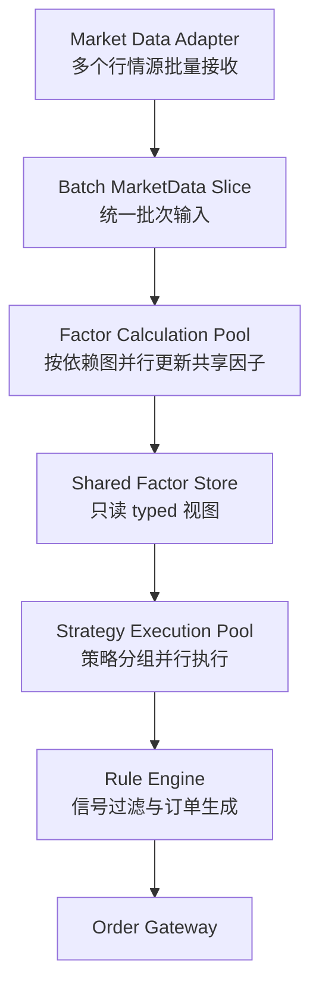

# 策略系统大批量数据扩展设计

## 1. 目标

本文档用于说明当前策略系统在中小规模场景下的性能边界，以及在大批量数据场景下的 C++ 扩展方案。

本文档只讨论以下目标：

1. 在不破坏策略逻辑独立性的前提下，把现有设计扩展到数千标的、毫秒级行情、数百策略并发的场景。
2. 明确当前架构的主要瓶颈，并给出调度层、计算层、内存层的收口方案。
3. 约束后续实现方向，避免在运行时主链里继续引入重复计算、无界缓存、字符串主键和隐式回退。

本文档不承担以下职责：

1. 不定义具体页面交互。
2. 不定义数据库 schema。
3. 不定义某个单一策略的业务语义。
4. 不通过兼容层维持旧实现。

## 2. 适用场景

当前设计在中小规模下已经能够提供较好的可维护性和可扩展性，但当场景扩大到以下量级时，需要专门的高吞吐扩展：

1. 数千只股票同时进入同一批行情切片。
2. 行情更新间隔压缩到亚毫秒或毫秒级。
3. 数十到数百个策略共享同一市场视图并并发求值。
4. 单次计算中包含大量滚动窗口、截面计算、排序、过滤和规则校验。

## 3. 现有设计的性能边界

| 维度 | 现状 | 大量数据下的瓶颈 |
|------|------|------------------|
| 调度线程 | 单线程事件循环顺序执行所有策略 | 策略数量乘以因子计算耗时超过行情间隔后会出现积压 |
| 因子计算 | 每个策略独立更新自身因子 | 同一类因子在多策略间重复计算，浪费 CPU 与缓存 |
| 数据访问 | Context 集中存储，策略遍历读取 | 多线程下会出现缓存竞争、伪共享和重复扫描 |
| 规则链 | 通过虚函数逐条执行 | 规则规模扩大后，分派开销和分支预测失效率会放大 |
| 内存分配 | shared_ptr 和运行时小对象分配较多 | 大量小对象会导致碎片、抖动和尾延迟上升 |

结论：

1. 当前框架的解耦方向没有问题。
2. 真正的瓶颈主要集中在调度方式、重复计算、数据布局和运行时分配策略。
3. 若继续沿用单线程顺序驱动和策略内自持因子实例的模式，吞吐会很快撞到上限。

## 4. 扩展目标

面向大批量数据场景，核心设计目标应统一为四条主线：

1. 并行。
2. 批处理。
3. 共享计算。
4. 零拷贝或近零拷贝读取。

对应的工程约束如下：

1. 策略逻辑仍保持独立，不允许把差异算法硬编码进统一主流程。
2. 共享层只提供 typed 数据视图，不向主链暴露字符串键查找。
3. 数据结构默认按大批量吞吐设计，显式控制复杂度、容量预留和生命周期。
4. 缺少元信息、依赖图或调度合同的时候必须直接失败，不允许运行时脑补。

## 5. 目标架构



分层职责如下：

1. Market Data Adapter 负责把多个外部行情源标准化成统一批次输入。
2. Factor Calculation Pool 负责基于依赖图批量更新共享因子结果。
3. Shared Factor Store 负责向策略提供只读 typed 视图。
4. Strategy Execution Pool 负责把策略按组并行执行，并输出中间信号。
5. Rule Engine 负责把信号转换成可执行决策，并执行可并行的规则过滤。
6. Order Gateway 负责最终委托下发，不承担上游计算职责。

## 6. 关键扩展方案

### 6.1 共享因子计算

策略不再自持因子实例，而是声明自己依赖的 typed 因子键。系统维护全局因子注册表和共享结果存储，由统一线程池按依赖图执行一次，再向所有策略开放只读访问。

建议合同：

1. 使用 `FactorKey`、`FactorSlotId`、`InstrumentSlot` 这类 typed 标识，不在主链使用 `std::string` 作为因子主键。
2. 共享结果以列式连续内存保存，优先提供 `const double*` 或 `std::span<const double>` 只读视图。
3. 依赖图在启动期或策略装配期冻结，运行期只执行拓扑调度，不再反复解析。

示意代码：

```cpp
enum class FactorKey : int {
    MovingAverage,
    Momentum,
    Volatility,
};

struct InstrumentSlot final {
    int value{-1};
};

struct FactorBufferView final {
    const double* data{nullptr};
    std::size_t size{0};
};

class FactorRegistry final {
public:
    void updateAll(const MarketBatchView& batch);

    [[nodiscard]] FactorBufferView values(FactorKey key) const;
};
```

收益：

1. 消除多策略重复计算。
2. 降低因子对象数量和内存碎片。
3. 把热点数据收敛到少数共享连续缓冲区，改善缓存命中率。

### 6.2 微批处理驱动

单条行情驱动改为微批处理驱动。典型做法是按照固定条数上限、固定时间片上限，或者两者组合形成批次切片。

建议原则：

1. 优先使用固定容量批次，避免批次大小完全无界。
2. 时间门限只作为 flush 条件，不作为唯一批次边界。
3. 批次结构必须显式携带序列号、时间戳范围和容量信息，不能依赖外部隐式状态。

收益：

1. 提升数据局部性。
2. 提供 SIMD 和线程池更稳定的工作单元。
3. 降低线程间同步频率。

### 6.3 向量化与列式数据布局

批量因子更新应优先基于列式内存、连续数组和 SIMD 路径实现，而不是在对象数组上反复随机访问。

建议实现方向：

1. 行情批次在进入计算池前先转换为列式视图或共享列缓冲。
2. 每个因子实现 `updateBatch(...)`，直接处理整批 instrument 切片。
3. 对简单滚动统计、均值、方差、归一化、阈值过滤，优先提供 AVX2 或 AVX-512 快路径。
4. 若涉及复杂矩阵、协方差、回归或优化问题，可直接使用 Eigen，但必须保持 typed 边界清晰，并控制临时对象数量。

示意代码：

```cpp
struct BatchPriceColumns final {
    const double* lastPrice{nullptr};
    std::size_t count{0};
};

class MovingAverageFactor final {
public:
    void updateBatch(const BatchPriceColumns& columns,
                     MutableFactorBufferView output);
};
```

### 6.4 策略执行池并行化

完成共享因子更新后，策略执行阶段只读取共享只读视图，因此适合做大粒度并行。

建议原则：

1. 策略执行必须视为纯读共享数据、纯写私有输出。
2. 每个策略实例只写入自己的信号缓冲，避免交叉写共享容器。
3. 策略分组应优先按数据依赖、计算复杂度和目标线程数分片，而不是简单平均切分数量。
4. 若策略数量远大于线程数，应采用工作窃取或有界任务队列，避免单批次一次性提交全部任务。

示意代码：

```cpp
class StrategyExecutionPool final {
public:
    void execute(const SharedFactorStore& factorStore,
                 const StrategyBatchView& strategies,
                 SignalBatchWriter& writer);
};
```

### 6.5 规则引擎并行过滤

若规则链之间不存在副作用或顺序修改依赖，可以把规则校验阶段改成对信号集合的并行过滤。

建议收口方式：

1. 把规则区分为纯过滤规则和带状态修改的规则。
2. 纯过滤规则允许在信号维度并行执行。
3. 带状态修改的规则必须显式串行化，或者拆成前置只读阶段与后置提交阶段。
4. 不允许把两类规则混用在同一无约束流水线中。

### 6.6 无锁队列与有界内存池

高吞吐场景下必须减少跨线程锁竞争和频繁堆分配。

建议方向：

1. 行情接收线程与计算池之间使用 MPMC 无锁队列传递批次。
2. 委托下发线程与 IO 线程之间使用 SPSC 队列。
3. 信号对象、订单草稿、批次包装对象优先采用对象池或 arena 分配。
4. 所有池化结构必须有显式上限，禁止无界增长。

### 6.7 CPU 亲和性与 NUMA

当部署环境具备较多核心或 NUMA 拓扑时，调度器应进一步区分不同工作池的 CPU 亲和性。

建议原则：

1. 行情接收线程、因子计算池、策略执行池、订单 IO 线程尽量分离核心。
2. 同一工作池优先访问本地节点内存。
3. 若跨 NUMA 节点访问不可避免，应把共享结果缓冲做成长寿命稳定布局，减少迁移和复制。

## 7. 关键数据结构建议

为了避免后续实现再次退回字符串查找和对象遍历，建议优先固化以下 typed 数据合同：

1. `InstrumentSlot`，表示标的在批次中的稳定槽位。
2. `FactorKey`，表示共享因子标识。
3. `FactorDependencyGraph`，表示因子依赖拓扑。
4. `MarketBatchView`，表示单批行情只读视图。
5. `SharedFactorStore`，表示共享因子只读存储。
6. `SignalBatch`，表示策略输出信号的批次缓冲。
7. `RuleEvaluationBatch`，表示规则引擎输入视图。

这些合同必须满足以下要求：

1. typed-only。
2. 容量可预留。
3. 生命周期清晰。
4. 默认支持批量遍历。

## 8. 性能预估

假设场景如下：

1. 五千只股票。
2. 每只股票十个共享因子。
3. 一百个策略并行运行。
4. 每毫秒接收一次全市场快照。

粗略估算：

| 组件 | 计算量 | 并行化后耗时 |
|------|--------|--------------|
| 因子更新 | 五千乘十个因子批量计算 | 单线程约五毫秒，十核并行约零点五毫秒 |
| 策略决策 | 一百个策略乘五千标的截面判断 | 单线程约二十五毫秒，十核并行约二点五毫秒 |
| 规则校验 | 假设百分之十产生信号后的批量过滤 | 约零点零五毫秒 |
| 总计 | 同批行情切片的总工作量 | 约三毫秒 |

结论：

1. 在该量级下，仅靠单线程顺序驱动无法满足实时性要求。
2. 完成共享因子、批处理和并行执行后，性能会获得数量级改善。
3. 若要求稳定压缩到单毫秒以内，还需要更多核心、更强 SIMD 路径或进一步降低算法复杂度。

## 9. 分阶段落地建议

### 9.1 第一阶段：先收口共享计算层

1. 定义 typed 因子键与共享因子存储合同。
2. 把策略内自持因子实例迁出主链。
3. 引入统一因子注册表和依赖图。
4. 保持策略逻辑不变，只改变输入来源。

### 9.2 第二阶段：引入批处理与线程池

1. 把单事件驱动切到微批处理。
2. 为因子更新和策略执行建立分离线程池。
3. 增加有界任务调度，避免任务风暴。

### 9.3 第三阶段：追求高性能快路径

1. 为核心因子补 SIMD 实现。
2. 为信号对象和订单草稿接入对象池。
3. 评估 CPU 亲和性和 NUMA 优化。
4. 对真正计算密集的矩阵问题评估 Eigen 或 GPU 路径。

## 10. 实施约束

后续实现必须遵守以下约束：

1. 不得把字符串因子名重新引回引擎主链。
2. 不得为了兼容旧实现而保留双轨调度逻辑。
3. 不得把共享缓冲做成无界缓存。
4. 不得在策略执行阶段直接改写共享因子结果。
5. 不得把批处理实现成一次性全量提交所有任务。
6. 不得在缺失依赖图或 typed 合同时私自推断默认结构。

## 11. 总结

当前设计的问题不是架构方向错误，而是现有调度层和计算层仍停留在中小规模实现方式。若要支撑大批量数据场景，必须把外层运行时扩展成共享因子、微批处理、并行执行、列式存储和有界内存管理的组合架构。

在这一路径下，策略基类和大部分业务算法可以继续保留；真正需要重做的是调度方式、共享数据合同与批量运行时基础设施。只要这些底座按 typed-only 和大批量吞吐要求收口，现有策略系统可以平滑升级到更高负载级别。
