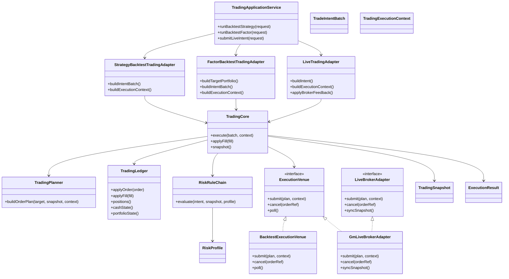
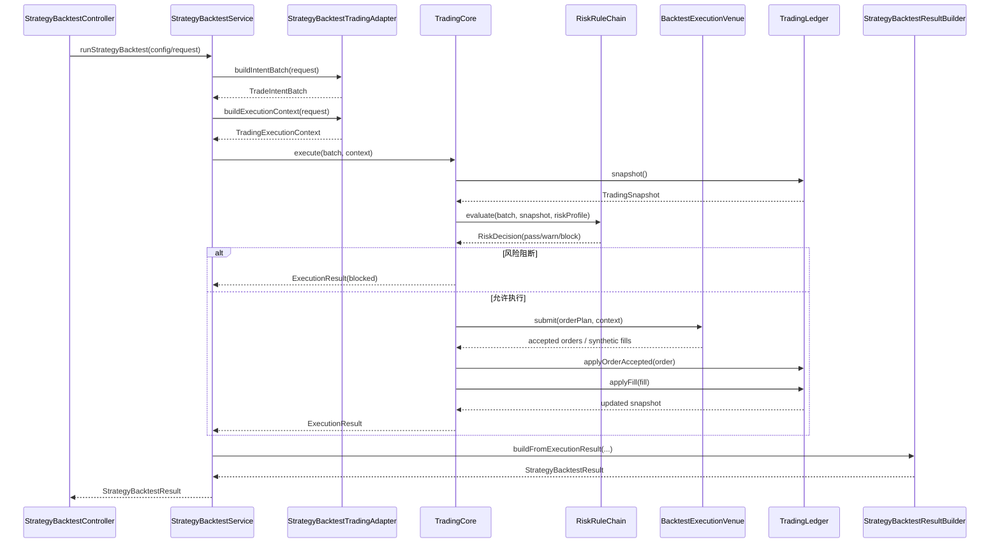
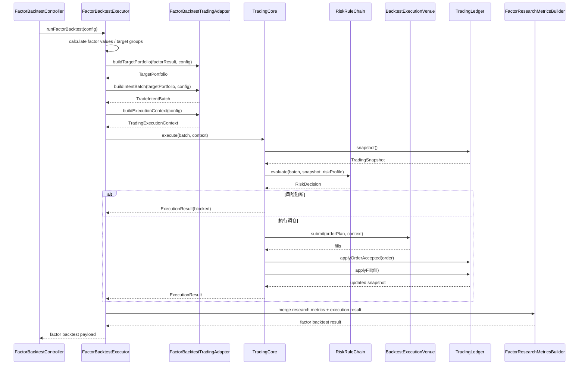
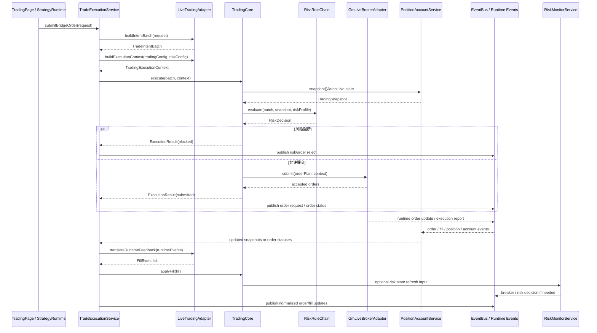

# 统一交易模块类图与接口草案

> 说明：本文是设计草案，含有旧 `BacktestEngine` 与 `StrategyBacktestService` 作为当时现状锚点的描述，不代表当前仓库实现。当前代码里旧 `StrategyBacktestService` 已删除，旧共享 `BacktestEngine` 已收紧替换为 factor/group 专用 `FactorBacktestEngine`。

## 1. 目的

本文是 [doc/统一交易模块规划_2026-05-25.md](doc/统一交易模块规划_2026-05-25.md) 的细化稿，目标不是再讨论方向，而是把方向直接落到当前仓库的 C++ 结构上。

本稿回答三件事：

1. 统一交易模块在当前目录结构里应该落到哪里。
2. 它和现有策略回测、因子回测、实盘交易、风险监控分别怎么衔接。
3. 第一版接口应该长什么样。

## 2. 当前代码锚点

为了避免空设计，后续类图和接口均以现有入口为锚点。

### 2.1 回测侧锚点

1. [src/domain/backtest/include/BacktestEngine.h](src/domain/backtest/include/BacktestEngine.h)
2. [src/domain/backtest/src/BacktestEngine.cpp](src/domain/backtest/src/BacktestEngine.cpp)
3. [src/domain/backtest/include/StrategyBacktestService.h](src/domain/backtest/include/StrategyBacktestService.h)
4. [src/domain/backtest/src/StrategyBacktestService.cpp](src/domain/backtest/src/StrategyBacktestService.cpp)

当前特征：

1. BacktestEngine 已经是纯 C++ 执行器，但接口仍偏旧式参数列表，尚未统一成结构化执行合同。
2. StrategyBacktestService 已经承担了“装配回测输入 + 调用执行器 + 汇总结果”的职责。
3. 因子侧仍存在基于 GroupBacktester/FactorBacktestExecutor 的研究型执行路径，没有统一落到订单级执行合同。

### 2.2 实盘侧锚点

1. [src/ui/bridge/include/TradeExecutionService.h](src/ui/bridge/include/TradeExecutionService.h)
2. [src/ui/bridge/src/TradeExecutionService.cpp](src/ui/bridge/src/TradeExecutionService.cpp)
3. [src/ui/bridge/include/PositionAccountService.h](src/ui/bridge/include/PositionAccountService.h)
4. [src/ui/bridge/src/PositionAccountService.cpp](src/ui/bridge/src/PositionAccountService.cpp)

当前特征：

1. TradeExecutionService 已经是实盘交易入口，但它是 QObject bridge service，不适合作为统一执行内核本体。
2. PositionAccountService 已经在维护持仓、账户、订单状态快照，是统一账本层的重要现实来源。
3. 实盘链路已经依赖真实订单状态、成交回报、补查修正，这部分必须保留在 live adapter，不应被回测语义污染。

### 2.3 风险侧锚点

1. [src/ui/bridge/include/RiskMonitorService.h](src/ui/bridge/include/RiskMonitorService.h)
2. [src/ui/bridge/src/RiskMonitorService.cpp](src/ui/bridge/src/RiskMonitorService.cpp)

当前特征：

1. RiskMonitorService 既承担快照分析，也承担交易信号审核和熔断动作。
2. 它已经接近“风控规则执行入口”，但仍是 UI bridge 层服务，不应直接成为 domain 层统一规则链。

## 3. 建议目录落位

建议在当前结构下新增一层统一交易领域，而不是把职责继续堆在 ui/bridge 或 domain/backtest 下。

建议目录：

```text
src/
  application/
    trading/
      include/
      src/
  domain/
    trading/
      include/
      src/
  infrastructure/
    trading/
      include/
      src/
```

### 3.1 domain/trading

放纯领域对象和执行内核：

1. 类型合同
2. 执行计划
3. 仓位账本
4. 订单账本
5. 成交账本
6. 风险规则链接口
7. 统一执行内核

### 3.2 application/trading

放业务装配：

1. StrategyBacktestTradingAdapter
2. FactorBacktestTradingAdapter
3. LiveTradingAdapter
4. TradingApplicationService

### 3.3 infrastructure/trading

放环境相关实现：

1. BacktestExecutionVenue
2. GmLiveBrokerAdapter
3. EventBusExecutionPublisher
4. RuntimeSnapshotRepository

## 4. 目标类图



## 5. 与当前类的映射关系

### 5.1 第一阶段不替换的类

以下类第一阶段不建议直接删除，而是改成上层适配器或外层 facade：

1. [src/ui/bridge/include/TradeExecutionService.h](src/ui/bridge/include/TradeExecutionService.h) 继续作为 QML/live bridge facade。
2. [src/ui/bridge/include/PositionAccountService.h](src/ui/bridge/include/PositionAccountService.h) 继续作为 live snapshot bridge。
3. [src/ui/bridge/include/RiskMonitorService.h](src/ui/bridge/include/RiskMonitorService.h) 继续作为风险服务 facade。
4. [src/domain/backtest/include/StrategyBacktestService.h](src/domain/backtest/include/StrategyBacktestService.h) 继续作为策略回测业务入口。

### 5.2 未来被下沉或抽象的职责

#### 从 BacktestEngine 下沉到 TradingCore

1. 仓位状态推进
2. 成交落账
3. 现金变化
4. 权益曲线更新
5. 调仓执行通道

#### 从 TradeExecutionService 抽象到 ExecutionVenue / LiveBrokerAdapter

1. 提交委托
2. 撤单
3. 回报对账
4. 订单状态映射

#### 从 RiskMonitorService 抽象到 RiskRuleChain

1. 预交易审核
2. 仓位和敞口约束
3. 熔断判定
4. 执行阻断

## 6. 领域类型草案

内部合同建议全部类型化，不再依赖字符串口径决定行为。

### 6.1 核心枚举

```cpp
enum class TradingMode : uint8_t {
    Backtest = 0,
    Live = 1
};

enum class IntentSource : uint8_t {
    StrategyBacktest = 0,
    FactorBacktest = 1,
    LiveStrategy = 2,
    ManualTrader = 3
};

enum class OrderSide : uint8_t {
    Buy = 0,
    Sell = 1,
    SellShort = 2,
    BuyToCover = 3
};

enum class OrderType : uint8_t {
    Market = 0,
    Limit = 1,
    MarketOnClose = 2,
    NextSessionOpen = 3
};

enum class ExecutionPriceModel : uint8_t {
    MarketOnClose = 0,
    NextSessionOpen = 1,
    Custom = 2
};

enum class RiskDecisionType : uint8_t {
    Pass = 0,
    Warn = 1,
    Block = 2,
    ForceReduce = 3,
    TradingHalt = 4
};
```

### 6.2 统一执行请求

```cpp
struct TradeIntent final {
    foundation::Uuid intentId;
    IntentSource source;
    domain::strategy::StrategyIdentity strategyIdentity;
    factor::MarketEnvironmentProfile marketProfile;
    OrderSide side;
    OrderType orderType;
    domain::strategy::SymbolId symbol;
    strategy::Quantity quantity;
    strategy::Price referencePrice;
    QDate signalDate;
    QDate effectiveDate;
};

struct TargetPosition final {
    domain::strategy::SymbolId symbol;
    strategy::Ratio targetWeight;
    strategy::Quantity targetQuantity;
    strategy::Price referencePrice;
};

struct TradeIntentBatch final {
    foundation::Uuid batchId;
    TradingMode mode;
    IntentSource source;
    QVector<TradeIntent> intents;
    QVector<TargetPosition> targetPositions;
};
```

### 6.3 执行上下文

```cpp
struct TradingCostProfile final {
    strategy::Money initialCapital;
    strategy::Ratio commissionRate;
    strategy::Ratio slippageRate;
    strategy::Ratio taxRate;
};

struct TradingRiskProfile final {
    strategy::Ratio maxPositionRatio;
    strategy::Ratio maxSinglePositionRatio;
    strategy::Ratio maxDrawdownLimit;
    strategy::Ratio stopLossRate;
    int maxBatchOrders{0};
    strategy::Money maxBatchNotional;
    bool enableTradingHalt{false};
};

struct TradingExecutionProfile final {
    strategy::StrategyExecutionKind executionKind{strategy::StrategyExecutionKind::Standard};
    strategy::PositionSizingMethod positionSizingMethod{strategy::PositionSizingMethod::FixedFraction};
    ExecutionPriceModel priceModel{ExecutionPriceModel::MarketOnClose};
    bool enableShortSelling{false};
    int rebalanceFrequencyDays{1};
};

struct TradingExecutionContext final {
    TradingMode mode{TradingMode::Backtest};
    factor::MarketEnvironmentProfile marketProfile{factor::MarketEnvironmentProfile::GENERIC_EQUITY};
    domain::backtest::DateWindow window;
    TradingCostProfile costProfile;
    TradingRiskProfile riskProfile;
    TradingExecutionProfile executionProfile;
    domain::backtest::RuntimeOptionSpec runtimeOptions;
};
```

## 7. 核心接口草案

### 7.1 TradingCore

职责：统一执行入口，不负责直接读 UI 配置，也不直接依赖 QObject。

建议头文件：

```cpp
namespace domain::trading {

class TradingCore {
public:
    virtual ~TradingCore() = default;

    virtual ExecutionResult execute(const TradeIntentBatch& batch,
                                    const TradingExecutionContext& context) = 0;

    virtual void applyFill(const FillEvent& fill) = 0;

    virtual TradingSnapshot snapshot() const = 0;
};

} // namespace domain::trading
```

### 7.2 TradingPlanner

职责：把目标组合或交易意图生成可执行订单计划。

```cpp
namespace domain::trading {

class TradingPlanner {
public:
    virtual ~TradingPlanner() = default;

    virtual OrderPlan buildOrderPlan(const TradeIntentBatch& batch,
                                     const TradingSnapshot& snapshot,
                                     const TradingExecutionContext& context) const = 0;
};

} // namespace domain::trading
```

### 7.3 RiskRuleChain

职责：统一预交易风险评估与执行阻断。

```cpp
namespace domain::trading {

class RiskRuleChain {
public:
    virtual ~RiskRuleChain() = default;

    virtual RiskDecision evaluate(const TradeIntentBatch& batch,
                                  const TradingSnapshot& snapshot,
                                  const TradingRiskProfile& profile) const = 0;
};

} // namespace domain::trading
```

### 7.4 ExecutionVenue

职责：隔离回测撮合环境与实盘券商环境。

```cpp
namespace domain::trading {

class ExecutionVenue {
public:
    virtual ~ExecutionVenue() = default;

    virtual ExecutionVenueResult submit(const OrderPlan& plan,
                                        const TradingExecutionContext& context) = 0;

    virtual CancelResult cancel(const OrderRef& orderRef) = 0;

    virtual QVector<FillEvent> poll() = 0;
};

} // namespace domain::trading
```

### 7.5 TradingLedger

职责：统一持仓、现金、成交、订单状态推进。

```cpp
namespace domain::trading {

class TradingLedger {
public:
    virtual ~TradingLedger() = default;

    virtual void applyOrderAccepted(const AcceptedOrder& order) = 0;
    virtual void applyFill(const FillEvent& fill) = 0;
    virtual void applyCancel(const CancelEvent& cancel) = 0;
    virtual TradingSnapshot snapshot() const = 0;
};

} // namespace domain::trading
```

## 8. 业务适配层草案

### 8.1 StrategyBacktestTradingAdapter

职责：把现有 StrategyBacktestConfig 或 BacktestRequest 转成统一交易执行合同。

```cpp
namespace application::trading {

class StrategyBacktestTradingAdapter {
public:
    domain::trading::TradeIntentBatch buildIntentBatch(
        const domain::backtest::BacktestRequest& request) const;

    domain::trading::TradingExecutionContext buildExecutionContext(
        const domain::backtest::BacktestRequest& request) const;
};

} // namespace application::trading
```

落位建议：

1. 先放在 application/trading。
2. 由现有 [src/domain/backtest/src/StrategyBacktestService.cpp](src/domain/backtest/src/StrategyBacktestService.cpp) 调用。
3. 现有 StrategyBacktestService 不必第一阶段删除，只需要改成组装器和结果汇总器。

### 8.2 FactorBacktestTradingAdapter

职责：先把因子研究输出的目标组合落成统一调仓请求，再交 TradingCore。

```cpp
namespace application::trading {

class FactorBacktestTradingAdapter {
public:
    domain::trading::TargetPortfolio buildTargetPortfolio(
        const factor::CalculationResult& factorResult,
        const factor::BacktestConfig& config) const;

    domain::trading::TradeIntentBatch buildIntentBatch(
        const domain::trading::TargetPortfolio& targetPortfolio,
        const factor::BacktestConfig& config) const;

    domain::trading::TradingExecutionContext buildExecutionContext(
        const factor::BacktestConfig& config) const;
};

} // namespace application::trading
```

关键点：

1. 因子研究层先产出目标组合。
2. 因子 IC、分组收益、暴露诊断继续留在 factor 域。
3. 统一交易模块只接目标组合和调仓执行，不接管研究指标计算。

### 8.3 LiveTradingAdapter

职责：把现有桥接层请求转成统一 live 执行合同。

```cpp
namespace application::trading {

class LiveTradingAdapter {
public:
    domain::trading::TradeIntentBatch buildIntentBatch(const QVariantMap& request) const;

    domain::trading::TradingExecutionContext buildExecutionContext(
        const QVariantMap& tradingConfiguration,
        const QVariantMap& riskConfiguration) const;

    QVector<domain::trading::FillEvent> translateRuntimeFeedback(
        const QVariantList& runtimeEvents) const;
};

} // namespace application::trading
```

落位建议：

1. 由 [src/ui/bridge/src/TradeExecutionService.cpp](src/ui/bridge/src/TradeExecutionService.cpp) 调用。
2. QML 继续走 TradeExecutionService，不直接接触 domain::trading。

## 9. 对现有服务的收口建议

### 9.1 TradeExecutionService

未来角色：Live facade + 事件桥接器。

保留职责：

1. QML 可调用入口
2. EventBus 事件发布
3. runtime 回报转译

迁出职责：

1. 订单计划生成
2. 通用执行状态机
3. 通用风险规则编排

### 9.2 PositionAccountService

未来角色：Live snapshot provider。

语义冻结：

1. `side` 只允许 `BUY` / `SELL`。
2. `positionSide` 只允许 `LONG` / `SHORT`。
3. `positionEffect` 只允许 `OPEN` / `CLOSE`。
4. `type` 只允许 `stock` / `margin_buy` / `margin_sell` / `futures` / `options` 这组 canonical 值；不得再接受 `marginbuy`、`future`、`equity`、中文类型词等别名。
5. `PositionAccountService` 内部不得再兼容 `1/2`、`LONG/SHORT` 充当订单方向、`BUY/SELL` 充当持仓方向、中文 `多/空`、或其他别名；异常输入直接暴露并拒绝继续按兼容语义推进。
6. 上述四类交易语义在 `PositionAccountService` 内部控制流中必须先解析为本地枚举，再在 QVariantMap/QML 边界序列化；不得继续在内部直接比较 canonical 字符串。
7. 当前 `action` 只在融券开仓/平仓判定中消费 `marginSell` / `closeShort` 两个动作值；这两个动作值进入 `PositionAccountService` 后也必须先解析为本地枚举，不得继续以字符串直接参与控制流判断。
8. 后续如果为 `PositionAccountService` 引入内部快照结构，业务语义和业务标识不得再直接定义为裸 `QString` / `QVariantMap` 字段；内部只能使用枚举或现有强类型值对象承载，字符串只允许停留在 QVariantMap/QML 展示边界。

保留职责：

1. 订阅账户和持仓事件
2. 提供 live snapshot

迁出职责：

1. 通用账本规则
2. 回测状态推进逻辑

### 9.3 RiskMonitorService

未来角色：风险画像装配 + live 监控 facade。

保留职责：

1. 实时监控展示
2. live 风险动作触发

迁出职责：

1. 统一预交易审核接口
2. 可复用的规则链定义

## 10. 第一阶段建议新增的头文件

若按最小可落地路径推进，建议第一批只新增这些头文件：

```text
src/domain/trading/include/TradingTypes.h
src/domain/trading/include/TradingCore.h
src/domain/trading/include/TradingPlanner.h
src/domain/trading/include/TradingLedger.h
src/domain/trading/include/RiskRuleChain.h
src/domain/trading/include/ExecutionVenue.h
src/application/trading/include/StrategyBacktestTradingAdapter.h
src/application/trading/include/FactorBacktestTradingAdapter.h
src/application/trading/include/LiveTradingAdapter.h
```

第一阶段不要做的事：

1. 不要直接重写 QML bridge。
2. 不要一步删除 BacktestEngine。
3. 不要让因子研究链为了复用交易模块被迫重命名成策略链。
4. 不要把风控页配置直接并入统一交易配置对象。

## 11. 第一阶段调用关系

### 11.1 策略回测

```text
StrategyBacktestService
  -> StrategyBacktestTradingAdapter
  -> TradingCore
  -> BacktestExecutionVenue
  -> TradingLedger / RiskRuleChain
  -> ExecutionResult
  -> StrategyBacktestResult
```

### 11.2 因子回测

```text
FactorBacktestExecutor
  -> FactorBacktestTradingAdapter
  -> TradingCore
  -> BacktestExecutionVenue
  -> TradingLedger / RiskRuleChain
  -> ExecutionResult
  -> 因子研究结果汇总
```

### 11.3 实盘交易

```text
TradeExecutionService
  -> LiveTradingAdapter
  -> TradingCore
  -> GmLiveBrokerAdapter
  -> PositionAccountService snapshot / runtime feedback
  -> TradingLedger / RiskRuleChain
  -> EventBus / UI updates
```

## 12. 三条关键时序

这一节不是抽象流程图，而是按当前仓库里已经存在的类入口来描述未来统一后最合理的调用顺序。

### 12.1 策略回测时序

对应当前入口：

1. [src/domain/backtest/src/StrategyBacktestService.cpp](src/domain/backtest/src/StrategyBacktestService.cpp)
2. [src/domain/backtest/include/BacktestEngine.h](src/domain/backtest/include/BacktestEngine.h)

目标时序：



设计要点：

1. StrategyBacktestService 未来只做装配、调度和结果汇总，不再直接拥有底层交易状态机。
2. 现有 BacktestEngine 可以在过渡期作为 TradingCore 或 BacktestExecutionVenue 的内部实现，而不是继续暴露旧式参数列表作为最终合同。
3. 风险在这里是执行链的硬门禁，但风险参数归属仍来自回测请求和外部画像装配。

### 12.2 因子回测时序

对应当前入口：

1. [src/domain/factor/src/FactorBacktestExecutor.cpp](src/domain/factor/src/FactorBacktestExecutor.cpp)
2. [src/domain/backtest/include/GroupBacktester.h](src/domain/backtest/include/GroupBacktester.h)

目标时序：



设计要点：

1. 因子研究层先生成目标组合或目标权重，再进入统一交易执行。
2. IC、分组收益、暴露诊断仍由 FactorBacktestExecutor 及其研究子模块负责，不应被 TradingCore 吞掉。
3. 这样可以复用统一成本、滑点、仓位、权益和风险门禁，又不破坏因子研究语义。

### 12.3 实盘交易时序

对应当前入口：

1. [src/ui/bridge/src/TradeExecutionService.cpp](src/ui/bridge/src/TradeExecutionService.cpp)
2. [src/ui/bridge/src/PositionAccountService.cpp](src/ui/bridge/src/PositionAccountService.cpp)
3. [src/ui/bridge/src/RiskMonitorService.cpp](src/ui/bridge/src/RiskMonitorService.cpp)

目标时序：



设计要点：

1. 实盘的事实来源仍然是 broker/runtime 回报，不是 TradingCore 自己假想的同步成交。
2. PositionAccountService 继续保留 live snapshot provider 角色，统一内核只是消费它，不取代它的事件接线职责。
3. RiskMonitorService 后续更适合作为 live 风险动作 facade；可复用规则定义应下沉到 RiskRuleChain，而不是继续堆在 bridge service 里。

## 13. 最终建议

如果下一步要进入实现阶段，最稳的顺序不是直接改 TradeExecutionService，也不是先碰 QML，而是：

1. 先定义 domain/trading 的类型合同和纯接口。
2. 再写 StrategyBacktestTradingAdapter，把策略回测先接进统一合同。
3. 然后让因子回测输出 TargetPortfolio，再接统一调仓执行。
4. 最后再把 live broker 侧逐步挂进 ExecutionVenue。

这样做的好处是，统一交易模块首先会成为“结构化真实内核”，而不是再造一个更大的 bridge service。