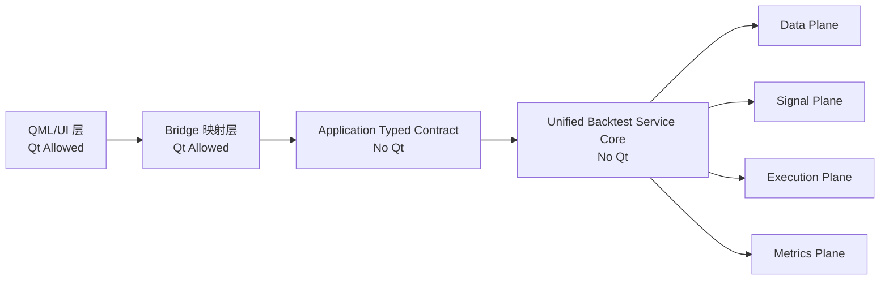

# 统一回测服务架构评审稿（修订版，2026-06-01）

## 1. 目标与范围

### 1.1 目标
- 构建单一回测服务（Backtest Service），只专注回测能力本身，不区分因子回测或策略回测语义。
- 支持全市场 5 年数据在 10 分钟内完成回测（硬性能目标）。
- 通过纯 C++ 强类型合同实现高可读性、可扩展性、可替换性。

### 1.2 当前范围
- 本稿仅覆盖回测服务架构设计与边界约束。
- 不涉及 UI 交互细节，不涉及非回测业务功能。

---

## 2. 硬性约束（评审红线）

### 2.1 Qt 边界
- Qt 只允许存在于 QML 进入时的桥接层。
- Qt 类型绝对不能向下传递到 Application/Domain/Backtest Service 层。
- 回测服务核心、领域执行模块、性能模块禁止包含任何 Qt 头文件与 Qt 类型。
- 桥接层是新旧输入格式的唯一转换点，转换失败必须直接拒绝，不得下沉到 Core。

### 2.2 禁止兼容与回退
- 不允许保留旧口径兼容字段。
- 不允许旧接口/新接口并行长期共存。
- 不允许隐式映射、兜底回退、双语义字段。
- 输入不满足新合同时，直接失败并返回 typed error code。

### 2.3 字符串约束
- 服务内部合同与核心流程不使用字符串作为业务类型口径。
- 状态、错误、阶段、模式等统一使用 enum class 与强类型值对象表达。
- 字符串仅允许在桥接层用于展示和日志文本组装，不可进入服务内核合同。
- 展示文本统一由 ErrorCatalog 或 to_string(ErrorCode) 生成，内核仅使用枚举值。

### 2.4 命名规范约束
- 类型命名必须简短、直达语义、可读可检索。
- 禁止在核心合同和核心模块类型命名中出现桥接、兼容、回退语义词。
- 禁止使用冗长的迁移期临时命名作为长期类型名。
- 命名审查不通过视为架构约束不满足，不允许合并。

---

## 3. 架构定位

统一回测服务是一个与来源解耦的执行内核：
- 不关心因子或策略标签。
- 只处理标准化输入，执行统一流水线，产出标准化输出。
- 现有因子服务作为可复用信号插件接入，避免重复造轮子。

---

## 4. 总体分层架构



### 4.1 各层职责
- QML/UI 层：用户交互、展示。
- Bridge 映射层：Qt 类型到纯 C++ typed DTO 的单向转换。
- Application 合同层：统一回测请求/结果 typed 合同。
- Service Core：执行编排、阶段调度、错误治理、预算治理。
- Data/Signal/Execution/Metrics 平面：可替换策略组件集合。

---

## 5. 统一合同设计（纯类型）

### 5.1 标识与基础值对象
- RunId
- DefinitionId
- InstrumentId
- DateKey（yyyymmdd 整型，且必须属于交易日历）
- Bps
- Quantity
- Cash
- Weight

DateKey 约束：
- 仅表示交易日，不接受非交易日。
- 提供受限转换函数与 std::chrono 互转，转换失败立即返回错误码。

### 5.2 核心输入
- BacktestRunSpec
  - mode（仅流程用途，不暴露来源语义）
  - 当前模式分实盘模式与回测模式，内部支持完全一致，区别仅在输出的结果和使用的数据不同。
  - runId
  - definitionId
  - startDate/endDate
  - RuntimeBudget
  - ChunkPolicy

mode 枚举预留值：
- SignalOnly
- FullPipeline
- Incremental

扩展规则：
- 仅允许增加枚举值，禁止通过字符串扩展模式语义。

### 5.3 核心输出
- BacktestRunResult
  - RunStatus
  - ServiceErrorCode
  - ProgressSnapshot
  - PerformanceSnapshot
  - PartialDiagnostics（预算超时时返回最佳努力诊断，不承诺完整性）

### 5.4 中间标准件
- SignalSet
- TargetSet
- OrderSet
- FillSet

SignalSet 最小字段约定：
- instrument_id
- signal_value
- confidence
- timestamp

SignalSet 语义约束：
- 支持单值和多值信号。
- 支持按时间有序批输出。

OrderSet 统一表达：
- 通过 OrderType 枚举统一表达市价、限价等订单类型。
- 禁止在 ConstructOrders 阶段使用隐式来源语义推断订单类型。

以上中间结构在服务内核统一，不包含因子专用字段或策略专用字段。

---

## 6. 统一执行流水线

1. ValidateSpec
2. LoadMarketData
3. EvaluateSignal
4. ConstructOrders
5. ExecuteOrders
6. AggregateMetrics
7. Done

### 6.1 失败策略
- 任一阶段出现合同违规或依赖错误，立即 fail-fast。
- 返回枚举错误码，不进行回退路线。

### 6.2 指标扩展策略
- AggregateMetrics 负责全链路绩效汇总。
- 允许通过 MetricsProvider 接口注册扩展指标。
- 扩展指标不得修改主合同，只能追加到扩展指标域。

---

## 7. 复用现有因子服务的方式

### 7.1 复用原则
- 保留现有因子计算能力作为信号插件。
- 不复制因子计算逻辑到新服务。
- 通过适配器将因子输出映射为统一 SignalSet。

### 7.2 关键点
- 因子模块仅作为 SignalEngine 的一个实现。
- 回测后半链路（仓位、撮合、指标）统一收敛到单服务。
- SignalEngine 接口必须支持批处理调用：输入时间区间和标的集合，输出按时间有序 SignalSet。

### 7.3 概念性数据流示例


---

## 8. 性能架构（10 分钟目标）

### 8.0 目标可达性结论
- 在 5000 标的、5 年日频、20 因子的目标规模下，10 分钟目标可达。
- 本次调整不改变架构语义，仅将性能策略从建议升级为强制执行项。

### 8.1 数据策略
- 全市场单字段优先列式存储与列式计算。
- 强制按时间窗和标的窗分块加载，避免一次性无界读入。
- 强制采用可内存映射的列式数据文件，优先零拷贝读取路径。

### 8.2 计算策略
- 日期块与标的块双维并行为必选项。
- 批处理优先，减少逐条处理。
- 复杂数值计算优先使用 Eigen（服务于吞吐与内存效率）。
- Service Core 内置并行调度器组件（Taskflow 或同等级调度器实现），统一负责二维任务切分与调度。

并行划分约束：
- 采用固定任务块大小 + 动态窃取调度。
- 避免相邻线程写同一 cache line，降低 false sharing。
- 先按日期窗对齐，再按标的分片，确保窗口一致性。

SignalEngine 批接口约束：
- SignalEngine 必须提供 evaluate_batch(time_window, instruments) 等价批接口。
- 禁止逐日逐标的同步回调路径作为主执行方式。

### 8.3 内存策略
- 容量预留与对象复用。
- 严控临时对象与不必要拷贝。
- 禁止无界缓存。
- 因子插件缓存必须限制为滑动窗口所需最小集合。
- 信号、订单、成交缓冲区必须设置最大容量上限。
- 关键循环路径采用预分配池化内存，循环内零动态分配。

### 8.4 预算闸门
- RuntimeBudget 统一采用毫秒。
- 每个阶段完成后检查预算，主循环每 N 个批次增量检查。
- 超预算直接返回 RuntimeExceeded。
- 超预算时输出 PartialDiagnostics，用于诊断与复盘。
- 支持提前终止协议：在预算逼近阈值时允许安全中止并返回 PartialResult。

### 8.5 组合优化与执行约束
- 若启用二次规划或同类优化器，必须采用批处理优化路径。
- 每次优化必须配置最大迭代数和单次求解超时上限。
- 单次求解超时时允许返回次优可行解，或按策略跳过当次再平衡，并记录诊断码。

### 8.6 日志与序列化
- 运行记录必须采用异步无锁队列或同等级低竞争实现。
- 序列化与计算应采用双缓冲重叠执行，禁止在核心计算线程同步落盘。

---

## 9. 质量门禁与治理

### 9.1 编译门禁
- 回测服务核心目标禁止链接 Qt。
- 核心目录出现 Qt 头或 Qt 类型即阻断。

### 9.2 合同门禁
- 禁止字符串业务合同。
- 禁止兼容回退字段。

### 9.3 测试门禁
- 合同测试：typed DTO、错误码、阶段机。
- 回归测试：统一链路因子接入结果一致性。
- 性能基准：5 年全市场耗时、峰值内存、吞吐。

### 9.4 CI 强制检查
- Qt 下沉扫描：扫描核心目录中的 Qt include 与 Qt 类型引用。
- 性能退化门禁：核心链路耗时超过基线 10% 即报警并阻断合并。
- 阶段预算门禁：任何阶段预算超限比例超过阈值即阻断合并。

示例检查命令：

```bash
rg "#include\s*<Qt|\bQString\b|\bQDate\b|\bQVariant\b" src/domain/backtest src/application/trading
```

---

## 10. 迁移路线与 DoD

### Phase 1：合同与编排骨架
- 落地纯类型合同与统一编排器。
- 建立无 Qt 服务核心构建目标。

DoD：
- 核心目标构建不链接 Qt。
- 关键合同类型无字符串业务字段。

### Phase 2：因子模块接入
- 用适配器接入现有因子信号输出。
- 打通统一后半链路。

DoD：
- 新旧系统对同一输入输出完全一致的订单序列。
- 新旧系统最终绩效结果一致。
- 任一差异必须完成溯源并修复。

### Phase 3：策略信号接入
- 策略模块按同一 SignalEngine 接口接入。
- 不新增第二条主执行链。

DoD：
- 策略信号批处理接口稳定。
- 统一链路无来源分支特判。

### Phase 4：性能压测与收敛
- 对齐 10 分钟目标。
- 固化预算与性能门禁。

DoD：
- 全市场 5 年数据回测在 10 分钟预算内完成。
- 性能基线归档并接入退化阻断规则。
- 二维并行、批处理信号接口、预算提前终止协议全部通过验收。

---

## 11. 评审检查清单

- Qt 是否严格停留在 QML 入口桥接层。
- 核心合同是否彻底 typed 化，去除字符串语义字段。
- 是否彻底禁止兼容回退逻辑。
- 是否只保留一条统一回测执行主链。
- 因子服务是否通过插件方式复用，而非重复实现。
- SignalSet 字段与 OrderType 语义是否已统一并固化。
- MetricsProvider 扩展机制是否清晰并可测试。
- 是否具备可执行的性能门禁与基准机制。
- 是否已将性能优化项从建议升级为强制项（二维并行、批接口、池化内存、异步记录）。

---

## 12. 风险评估与缓解

- 风险：分钟级数据会导致数据量显著放大。
- 缓解：当前目标范围限定日频；分钟级扩展单列为后续项目并单独评审。

- 风险：第三方求解器耗时波动导致阶段超时。
- 缓解：设置求解器超时和迭代上限，超时触发明确诊断码与策略化处理。

- 风险：并行累加导致结果非确定性。
- 缓解：采用固定顺序确定性归约，保证结果可复现。

---

## 13. 待评审结论项

- 是否批准统一回测服务 + 插件化信号来源作为最终目标架构。
- 是否批准零 Qt 下沉、零兼容回退、零字符串业务合同作为不可突破红线。
- 是否批准按四阶段迁移并设置阶段 DoD 与门禁。
- 是否批准将性能门槛从 40 分钟正式收紧为 10 分钟并作为 Phase 4 强制验收条件。
