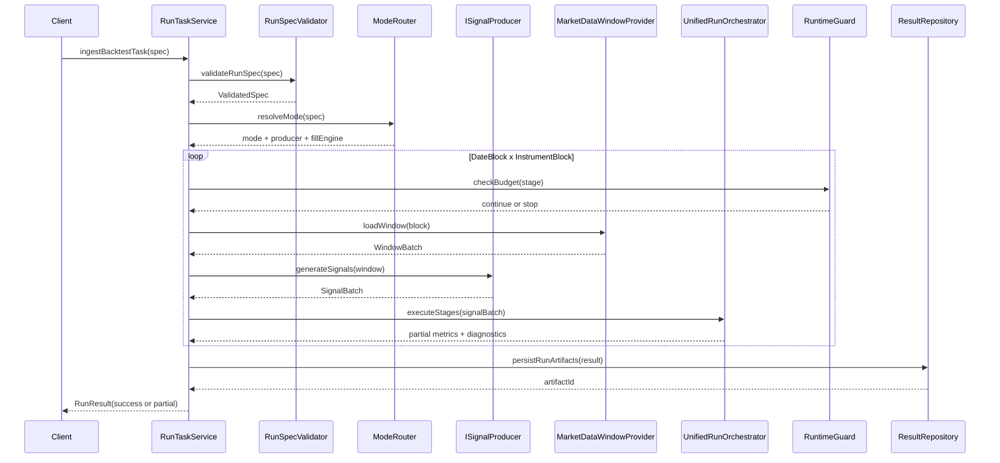
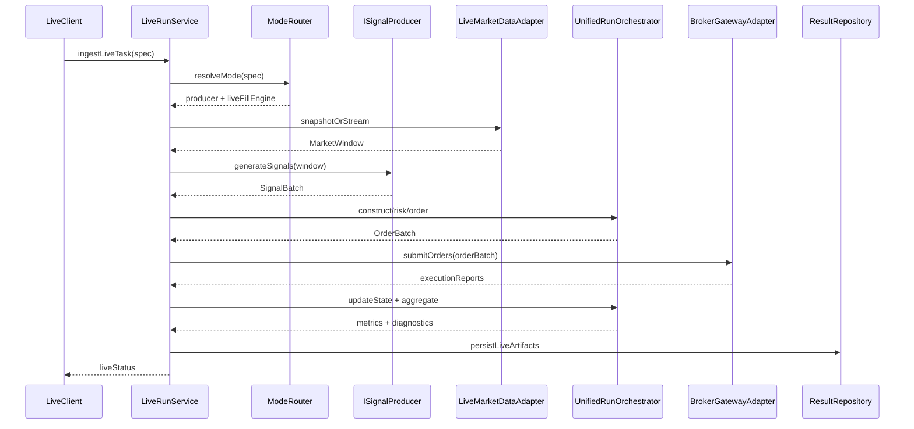

# 统一回测服务落地设计与测试计划（2026-06-02）

## 1. 文档定位

本设计只做可落地方案，不做概念堆叠。

约束口径：

- 目标必须可测、可验收。
- 不引入双主链。
- 不保留兼容回退。
- 回测与实盘共用核心执行模块。

对齐文档：

- `doc/统一回测服务实施任务清单_2026-06-01.md`
- `doc/当前项目功能完整性清单.md`
- `doc/0.10.x推进版必须完成清单.md`
- `doc/1.0.0正式版必须完成清单.md`

---

## 2. 系统目标（冻结）

### 2.1 性能目标

- 全市场 5 年日频回测任务，单任务总耗时 <= 10 分钟。

### 2.2 正确性目标

- 同输入、多次运行输出一致（订单序列、指标快照、诊断码一致）。

### 2.3 架构目标

- `runBacktest` 仅为回测任务入库入口。
- 任务进入后先分流（策略回测/因子回测），再进入统一后半链。
- 实盘复用大多数核心模块，仅替换数据适配器与执行适配器。

### 2.4 工程目标

- 核心域使用强类型合同。
- 核心层零 Qt 依赖。
- 错误处理仅用枚举码，不在核心层拼接业务字符串。

---

## 3. 总体架构

### 3.1 分层

- Ingress 层：任务接收、入库、参数校验。
- Mode Router 层：策略/因子模式分流。
- Signal Producer 层：产出统一 `SignalSet`。
- Shared Execution Core 层：后半链统一执行。
- Persistence 层：结果、诊断、快照、导出工件落库。
- Observability 层：阶段耗时、内存峰值、预算超限监控。

### 3.2 回测与实盘关系

- 共用：信号合同、构仓、风控、构单、状态机、指标、诊断、结果合同。
- 差异：
  - 回测：历史窗口数据 + 模拟成交引擎。
  - 实盘：实时数据适配器 + 交易网关执行引擎。

---

## 4. 模块划分（最小可用集合）

### 4.1 入口与编排

1. `RunTaskService`
2. `RunSpecValidator`
3. `ModeRouter`
4. `UnifiedRunOrchestrator`
5. `RuntimeGuard`

### 4.2 数据与信号

1. `MarketDataWindowProvider`（列式窗口）
2. `ISignalProducer`
3. `FactorSignalProducer`
4. `StrategySignalProducer`

### 4.3 执行与状态

1. `PortfolioConstructionEngine`
2. `RiskApprovalEngine`
3. `OrderGenerationEngine`
4. `IFillEngine`
5. `BacktestFillEngine`
6. `LiveFillEngine`
7. `PositionStateEngine`

### 4.4 结果与诊断

1. `MetricsEngine`
2. `DiagnosticsEngine`
3. `ResultRepository`
4. `ExportArtifactBuilder`

---

## 5. 核心执行顺序

## 5.1 顶层函数链

1. `ingestBacktestTask(spec)`
2. `validateRunSpec(spec)`
3. `resolveMode(spec)`
4. `buildRunContext(spec, mode)`
5. `executeUnifiedPipeline(context)`
6. `persistRunArtifacts(result)`
7. `finalizeRunTask(taskId, status)`

### 5.2 统一阶段顺序

1. `stageValidate`
2. `stagePlan`
3. `stageLoadWindowData`
4. `stageGenerateSignal`
5. `stageConstructTargetPosition`
6. `stageRiskApprove`
7. `stageGenerateOrders`
8. `stageExecuteFill`
9. `stageUpdatePositionState`
10. `stageAggregateMetrics`
11. `stageBuildDiagnostics`
12. `stagePersistArtifacts`
13. `stageFinalize`

---

## 6. 时序图（执行顺序）

### 6.1 回测时序（策略/因子共后半链）

### 6.2 实盘衔接时序（同核）

---

## 7. 性能设计（10分钟目标）

### 7.1 预算拆分

- 数据加载与切片：150 秒
- 信号生成：180 秒
- 构仓/风控/构单：90 秒
- 成交与状态更新：90 秒
- 指标与诊断聚合：60 秒
- 持久化收尾：30 秒

### 7.2 必须实现的性能能力

1. 二维并行：日期块 x 标的块。
2. 列式窗口读取：禁止无界全量加载。
3. 批量信号接口：禁止逐条主路径调用。
4. 核心循环池化：避免循环内动态分配。
5. 预算闸门：超限提前终止并返回 `PartialResult`。
6. 异步落盘：计算线程不阻塞 I/O。

### 7.3 失败策略

- 合同缺关键字段：直接失败。
- 阶段预算超限：立即停止后续阶段，返回部分结果与诊断。
- 风控拒单：不算系统失败，但必须记入诊断与统计。

---

## 8. 详细测试计划（可执行）

## 8.1 分层测试

1. 单元测试：函数边界、合同校验、错误码映射。
2. 模块测试：模块输入输出与异常路径。
3. 集成测试：13 阶段串联与模式分流正确性。
4. 端到端测试：任务入库到结果回写全链路。
5. 性能测试：10 分钟目标、峰值内存、退化门禁。
6. 可复现测试：同输入多次运行一致性。

### 8.2 阶段用例映射

#### Phase 0 旧链拆除

- 旧入口不可达。
- 旧预览链不参与构建。
- 旧兼容回退路径不可执行。

#### Phase 1 合同与编排

- 强类型合同校验通过。
- 状态机顺序固定。
- 错误码覆盖关键失败分支。
- 核心目录 Qt 扫描结果为 0。

#### Phase 2 因子信号接入

- 因子 `SignalSet` 输出正确。
- 与旧链结果差异可解释并可闭环。

#### Phase 3 策略信号接入

- 策略批接口稳定。
- 因子/策略共用后半链。

#### Phase 4 性能收敛

- 全市场 5 年任务 <= 600 秒。
- 预算闸门有效。
- 超限能返回 `PartialResult`。
- 性能退化 >10% 时触发门禁阻断。

### 8.3 关键验收指标

- 正确性：订单序列一致率 100%。
- 可复现：10 次重复运行结果一致率 100%。
- 性能：总耗时 <= 600 秒。
- 稳定性：24 小时长稳运行无崩溃。
- 可观测：阶段耗时/预算超限/诊断码均可追踪。

---

## 9. 框架构建顺序（落地路线）

1. Phase A：冻结合同与错误码。
2. Phase B：实现编排骨架与阶段状态机。
3. Phase C：接入因子/策略信号生产器。
4. Phase D：实现统一后半链。
5. Phase E：完成预算闸门与性能能力。
6. Phase F：接入实盘适配器，验证同核运行。

每阶段 DoD：

- 代码可运行。
- 用例可通过。
- 指标可观测。
- 文档与合同同步更新。

---

## 10. 最终交付清单

1. 统一合同头文件。
2. 编排器与阶段状态机实现。
3. 因子/策略双模式信号生产器。
4. 统一后半链执行模块。
5. 结果与诊断落库能力。
6. 导出工件生成能力。
7. 性能基线报告与门禁规则。
8. 回测与实盘共核验证报告。

---

## 11. 设计边界（防止过度设计）

- 不引入额外中间层用于“将来可能扩展”。
- 不提前实现暂未进入阶段清单的复杂特性。
- 每个模块只保留单一职责与最小接口。
- 先满足 10 分钟目标与单主链闭环，再考虑二次优化。
