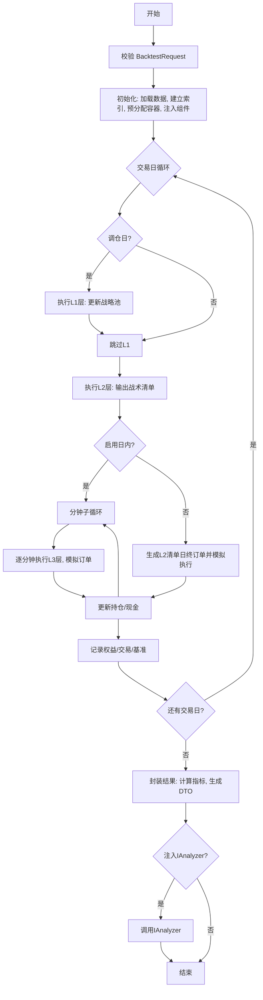
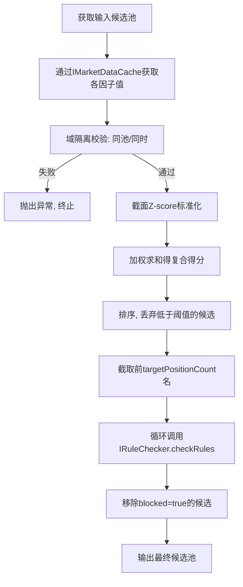

# 文档一：流程图设计（最终版）

**版本**：V1.0（已冻结）  
**日期**：2026-05-26  

> 说明：本文是冻结设计稿，不代表当前仓库实现。当前代码里旧 `StrategyBacktestService` 已删除，旧共享 `BacktestEngine` 已收紧替换为 factor/group 专用 `FactorBacktestEngine`；文中 `BacktestEngine` 表述应按目标设计概念理解。

本文档描述策略回测引擎的完整执行流程，包括主流程和分层决策漏斗内部流程。

## 1. 回测主流程

```text
开始
 |
 |- 1. 校验 BacktestRequest（完整性、引用存在、数据充足）
 |
 |- 2. 初始化
 |      |- 从 IMarketDataCache 加载预热及回测区间数据
 |      |- 建立列式视图与整数索引
 |      |- 预分配结果容器（权益曲线、交易记录等）
 |      `- 注入外部组件（IRuleChecker, IExecutionSimulator 等）
 |
 |- 3. 主循环：逐交易日迭代 ------------------------------------.
 |      |                                                   |
 |      |- 若为调仓日 -> 执行 L1 层（战略池更新）              |
 |      |- 执行 L2 层（基于战略池或全局池，输出战术清单）      |
 |      |- 若启用日内 -> 分钟子循环：                         |
 |      |      `- 逐分钟执行 L3 层（基于 L2 清单触发买卖）     |
 |      |             `- 调用 IExecutionSimulator 执行订单     |
 |      |- 若未启用日内 -> 基于 L2 清单生成日终订单并执行      |
 |      |- 更新持仓、现金、权益                               |
 |      |- 记录基准对比收益                                   |
 |      `- 可选：进度回调                                     |
 |                                                           |
 |- 4. 循环结束                                              |
 |                                                           |
 |- 5. 结果封装                                              |
 |      |- 计算绩效指标（夏普、回撤等）                        |
 |      |- 生成 LayerAttribution, RuleSummary                |
 |      `- 组装 BacktestResultDto                            |
 |                                                           |
 |- 6. 可选：调用 IAnalyzer 补充诊断                         |
 |                                                           |
结束
```

**Mermaid 流程图源码**（可直接渲染）：



## 2. 分层决策漏斗内部流程（单层执行）

```text
开始
 |- 获取输入候选池（L1来自 UniverseSpec，L2+来自上层输出）
 |- 获取因子值（IMarketDataCache）
 |- 域隔离校验：所有因子值 universeId 一致，时间戳对齐
 |- 截面标准化：Z-score
 |- 加权合成复合得分
 |- 按得分排序，低于 minimumCompositeScore 丢弃
 |- 取前 targetPositionCount 名
 |- 对每候选调用 IRuleChecker::checkRules（入场判断）
 |- 剔除 blocked=true 的候选
 |- 输出最终候选池（作为本层结果）
结束
```

**Mermaid 流程图源码**：


