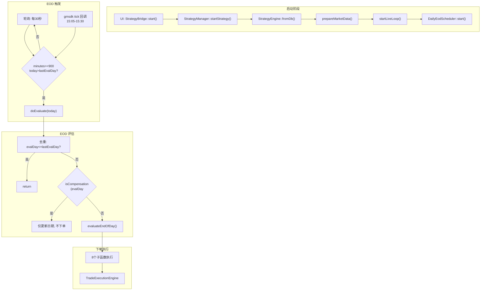
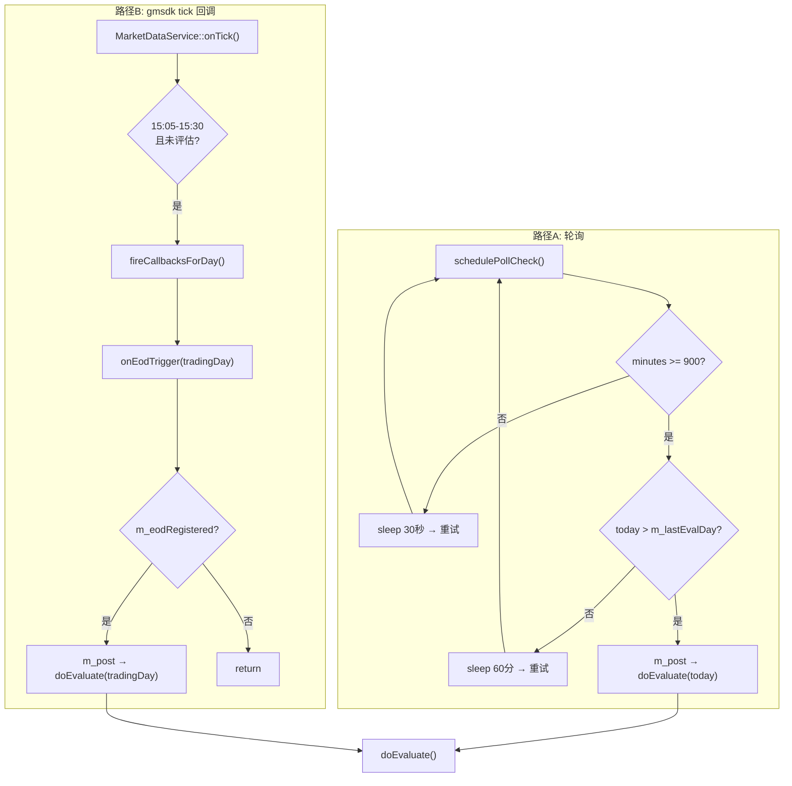
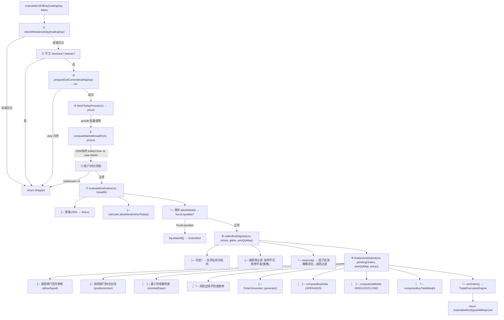
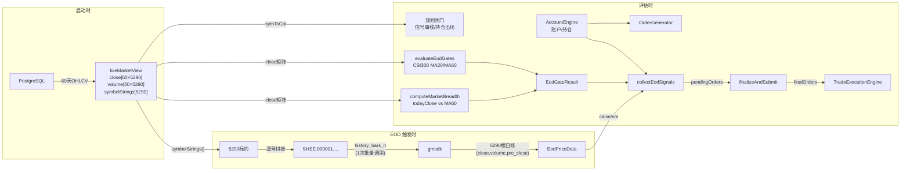
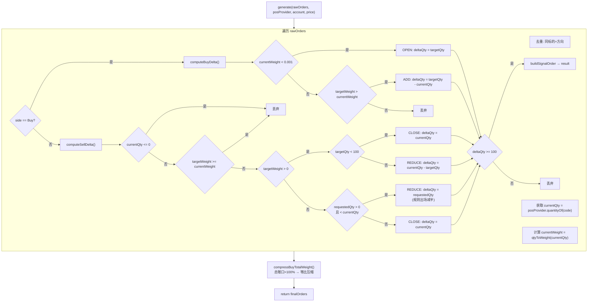

# 实盘 EOD 下单全链路 — 最终版

> 生成时间: 2026-08-07 | 包含所有重构和修复

---

## 一、全链路总览



## 二、启动阶段详细流程

```mermaid
sequenceDiagram
    participant UI as QML UI
    participant SB as StrategyBridge
    participant SM as StrategyManager
    participant PG as PostgreSQL
    participant SE as StrategyEngine
    participant DS as DailyEodScheduler
    participant MDS as MarketDataService

    UI->>SB: start(strategyId)
    SB->>SB: ThreadPoolExecutor::post(async)
    SB->>SM: startStrategy(strategyId)

    SM->>SM: getOrCreateEngine(strategyId)
    SM->>SM: createFactorService()
    SM->>SE: fromDb(strategyId, factorSvc)
    SE->>PG: SELECT metadata_json,parameters FROM strategy
    PG-->>SE: 策略配置 JSON
    SE->>SE: 解析 → StrategyCreationParams<br/>解析 → factorOverlay / ruleGate
    SE->>SE: Builder.build() → new StrategyEngine<br/>  ├─ StrategyService(factorService, ruleService)<br/>  └─ configureExecutionPlan(plan)
    SE-->>SM: unique_ptr&lt;StrategyEngine&gt;

    SM->>SE: engine->start()
    Note over SE: state_ → Running

    SM->>SE: prepareMarketData()
    SE->>PG: SELECT … FROM mkt.daily_bar<br/>WHERE trade_date BETWEEN start AND now
    PG-->>SE: 60天×5290标的 OHLCV + 因子字段
    SE->>SE: factorService_->buildLiveView(rows)
    Note over SE: liveMarketView 就绪

    SM->>SE: setOrderListener(TradeExecutionEngine)
    SM->>SE: startLiveLoop()

    SE->>DS: new DailyEodScheduler(postFn, persistPath)
    SE->>DS: setEodTriggerTime / setEvalCallback
    SE->>DS: start()
    DS->>DS: loadLastEvalDay() ← app_state.json
    DS->>DS: 轮询线程启动 (每30秒)
    DS->>MDS: registerEndOfDayCallback(onEodTrigger)
```

## 三、EOD 触发阶段



## 四、doEvaluate — 评估入口

```cpp
// DailyEodScheduler.cpp:131
void DailyEodScheduler::doEvaluate(const std::string& tradingDay) {
    auto evalDay = std::stoll(tradingDay);

    // ── 1. 去重 ──
    if (evalDay <= m_lastEvalDay.load()) return;  // 已评估

    // ── 2. 补偿判定 ──
    auto today = getCurrentTradingDay();
    bool isCompensation = (evalDay < today);

    // ── 3. 补评: 仅更新日期, 不下单 ──
    if (isCompensation) {
        INTERNAL_INFO_STREAM << "补评: 仅更新日期, 跳过评估";
        m_lastEvalDay.store(evalDay);
        persistLastEvalDay();  // → app_state.json (tmp+rename 原子写)
        return;
    }

    // ── 4. 执行评估 ──
    EodEvaluationStatus status;
    try {
        status = m_evalFn(tradingDay, false);  // → evaluateEndOfDay()
    } catch (const std::exception& e) {
        status = EodEvaluationStatus::Error;
    } catch (...) {
        status = EodEvaluationStatus::Error;
    }

    // ── 5. 持久化 ──
    if (status == Submitted || status == NoSignal) {
        m_lastEvalDay.store(evalDay);
        persistLastEvalDay();
    }
    // 其他状态不持久化, 允许下次重试
}
```

## 五、evaluateEndOfDay — 8 个子函数



## 六、关键数据结构

### EodContext — 视图/标的信息
```
struct EodContext {
    view:          IMarketDataView*      // 5290标的×60天矩阵
    symbols:       vector<string>*        // ["000001.SZ","000002.SZ",...]
    dates:         vector<DomainDate>*    // [20260701, 20260702, ...]
    numCols:       int                    // 5290
    rowStride:     int                    // ≥ numCols
    symToCol:      map<string,int>        // "000001"→0
    tradingDayInt: int32_t               // 20260806
    endDateStr:    string                // "2026-08-06"
}
```

### EodPriceData — gmsdk 价格数据
```
struct EodDayBar {
    close:    double    // 当日收盘价(adjust=true)
    volume:   double    // 成交量
    preClose: double    // 前收盘价(涨跌停计算)
}
struct EodPriceData {
    bars:              map<string,EodDayBar>  // "000001.SZ"→{close,vol,preClose}
    breadthAboveMa60:  double                 // 全市场站上MA60比例
}
```

### EodGateResult — 闸门结果
```
struct EodGateResult {
    allowNewEntries:  bool           // 是否允许开新仓
    timing:           TimingResult   // 择时结果(targetExposure,forceLiquidate,...)
}
```

### PendingOrder — 待处理订单
```
struct PendingOrder {
    order:        OrderRequest
    tickPrice:    double       // 市价
    targetWeight: double       // 目标权重
    signalScore:  double       // 信号强度
}
```

## 七、数据流图



## 八、各阶段决策点

### 8.1 跳过条件 (evaluateEndOfDay 返回 Skipped)

| # | 条件 | 位置 |
|---|------|------|
| 1 | 非调仓日 | `checkRebalanceDay()` |
| 2 | 回测模式 | L887 |
| 3 | 无订单监听器 | L891 |
| 4 | liveMarketView 为空 | `prepareEodContext()` |
| 5 | account.totalAsset ≤ 0 | L947 |

### 8.2 单标的跳过 (collectEodSignals 内 continue)

| # | 条件 |
|---|------|
| 1 | 冻结且非持仓标的 |
| 2 | 不在 gmsdk 价格表中 |
| 3 | price ≤ 0 |
| 4 | 无效 AStockSymbol |
| 5 | 事件风控封禁 |
| 6 | 涨停且 order=Buy |
| 7 | 跌停且 order=Sell (策略卖) |

### 8.3 持仓出场跳过 (finalizeAndSubmit 内)

| # | 条件 |
|---|------|
| 1 | 持仓量 ≤ 0 或成本价 ≤ 0 |
| 2 | 最小持有期未满 (`countTradingDaysBetween < minHoldDays`) |
| 3 | 规则未触发 Exit/Reduce |

## 九、OrderGenerator 加仓/减仓/清仓决策



## 十、线程模型与同步

| 线程 | 职责 | 关键数据 |
|------|------|----------|
| UI 主线程 | QML 渲染 | — |
| Bridge 工作线程 | StrategyManager::startStrategy | — |
| 策略专用线程 | evaluateEndOfDay, step, doEvaluate | — |
| Poll 线程 | 每30秒检查触发时间 | `m_lastEvalDay` (atomic) |
| gmsdk 回调线程 | onTick → MarketDataService | `m_eodRegistered` (atomic) |

### 同步机制

| 数据 | 保护方式 |
|------|----------|
| `m_loopRunning` | `std::atomic<bool>` |
| `m_lastEvalDay` | `std::atomic<int64_t>` |
| `m_eodRegistered` | `std::atomic<bool>` + acquire/release |
| `m_lastProcessedAt` | `std::atomic<int64_t>` |
| AccountEngine `m_cachedAccount` | `std::shared_mutex` |
| AccountEngine `m_cachedPositions` | `std::shared_mutex` |
| StrategyService `mutex_` | `std::mutex` (所有 public 方法持锁) |

## 十一、所有改动记录

| 日期 | 内容 |
|------|------|
| 08-07 | `evaluateEndOfDay` 拆为 8 个子函数 |
| 08-07 | `OrderGenerator` 拆为 computeBuyDelta / computeSellDelta / compressBuyTotalWeight |
| 08-07 | `liveMarketView()` 支持因子策略 (factorService_->liveView()) |
| 08-07 | 补评不下单 (doEvaluate 拦截) |
| 08-07 | 冻结不 break (blockNewBuys + 仅评估持仓标的) |
| 08-07 | 当日市场宽度替代 T-1 (gmsdk close + view MA60) |
| 08-07 | 批量 gmsdk 取价 (1次调用替代 5290 次) |
| 08-07 | 下单前重取账户快照 |
| 08-07 | `m_eodRegistered` → atomic + acquire/release |
| 08-07 | `m_lastEvalDay` → atomic |
| 08-07 | AccountEngine → shared_mutex |
| 08-07 | 涨停不买 / 跌停不卖(策略) / 风控出场不检查跌停 |
| 08-07 | 最小持有期检查 + 建仓日期记录 |
| 08-07 | Rule Reduce 尊重显式数量 (requestedQty) |
